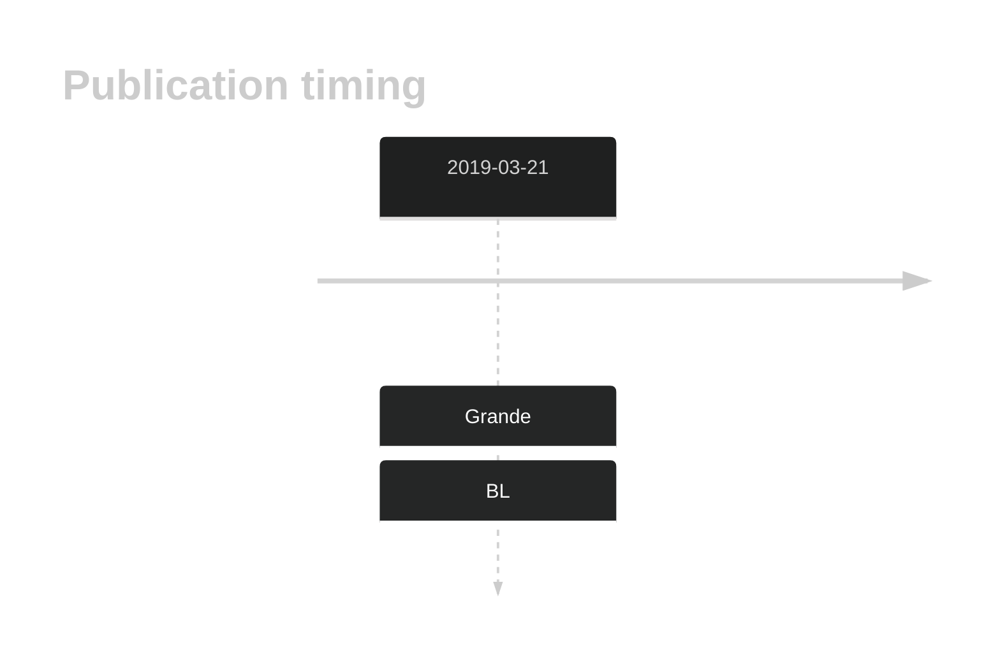
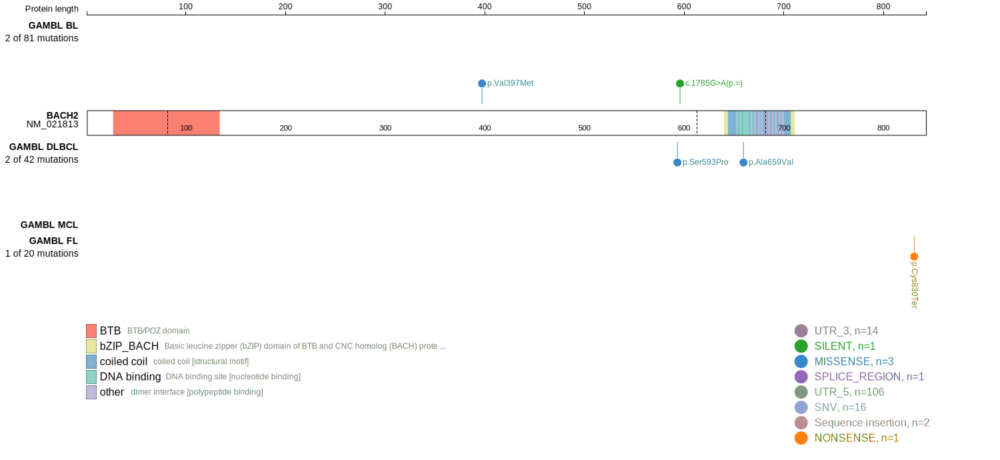
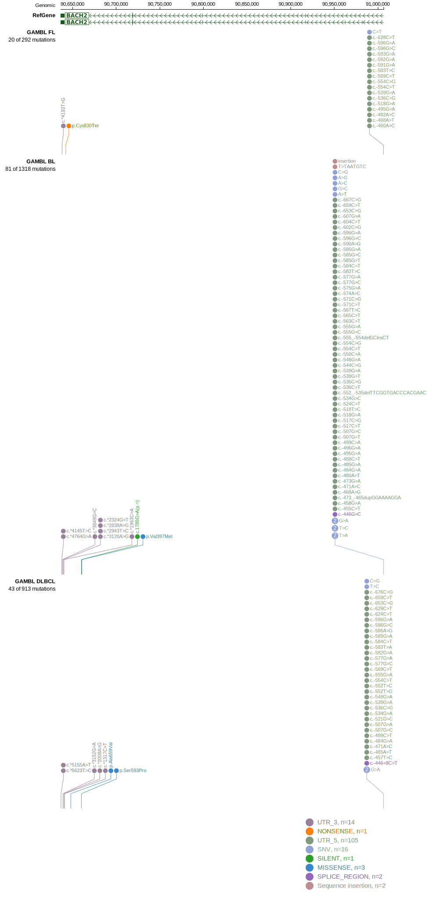
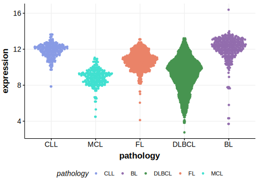

# BACH2
## History
Mutations in this gene were first described in BL in 2019 by Grande et al.1

## Relevance tier by entity

|Entity|Tier|Description                           |
|:------:|:----:|--------------------------------------|
|    |2-a | aSHM target; Although recurrent, the relevance of mutations in BL is tenuous |

## Mutation incidence in large patient cohorts (GAMBL reanalysis)

|Entity|source               |frequency (%)|
|:------:|:---------------------:|:-------------:|
|BL    |GAMBL genomes+capture|1.85         |
|BL    |Thomas cohort        |0.40         |
|BL    |Panea cohort         |5.00         |

## Mutation pattern and selective pressure estimates

|Entity|aSHM|Significant selection|dN/dS (missense)|dN/dS (nonsense)|
|:------:|:----:|:---------------------:|:----------------:|:----------------:|
|BL    |Yes |No                   |0.652           | 0.000          |
|DLBCL |Yes |No                   |0.949           | 0.000          |
|FL    |Yes |No                   |0.000           |28.997          |

## aSHM regions

|chr_name|hg19_start|hg19_end|region                                                                                   |regulatory_comment|
|:--------:|:----------:|:--------:|:-----------------------------------------------------------------------------------------:|:------------------:|
|chr6    |90981034  |91016134|[TSS](https://genome.ucsc.edu/s/rdmorin/GAMBL%20hg19?position=chr6%3A90981034%2D91016134)|NA                |

View coding variants in ProteinPaint [hg19](https://morinlab.github.io/LLMPP/GAMBL/BACH2_protein.html)  or [hg38](https://morinlab.github.io/LLMPP/GAMBL/BACH2_protein_hg38.html)

View all variants in GenomePaint [hg19](https://morinlab.github.io/LLMPP/GAMBL/BACH2.html)  or [hg38](https://morinlab.github.io/LLMPP/GAMBL/BACH2_hg38.html)

## BACH2 Expression

## References
1.  Grande BM, Gerhard DS, Jiang A, Griner NB, Abramson JS, Alexander TB, Allen H, Ayers LW, Bethony JM, Bhatia K, Bowen J, Casper C, Choi JK, Culibrk L, Davidsen TM, Dyer MA, Gastier-Foster JM, Gesuwan P, Greiner TC, Gross TG, Hanf B, Harris NL, He Y, Irvin JD, Jaffe ES, Jones SJM, Kerchan P, Knoetze N, Leal FE, Lichtenberg TM, Ma Y, Martin JP, Martin MR, Mbulaiteye SM, Mullighan CG, Mungall AJ, Namirembe C, Novik K, Noy A, Ogwang MD, Omoding A, Orem J, Reynolds SJ, Rushton CK, Sandlund JT, Schmitz R, Taylor C, Wilson WH, Wright GW, Zhao EY, Marra MA, Morin RD, Staudt LM. Genome-wide discovery of somatic coding and noncoding mutations in pediatric endemic and sporadic Burkitt lymphoma. Blood. 2019 Mar 21;133(12):1313–1324. 

<!-- ORIGIN: grandeGenomewideDiscoverySomatic2019 -->
<!-- BL: grandeGenomewideDiscoverySomatic2019 -->
