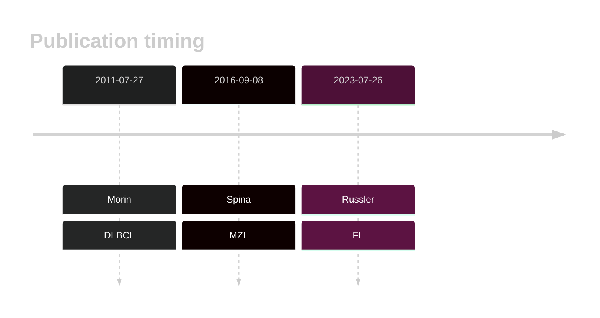
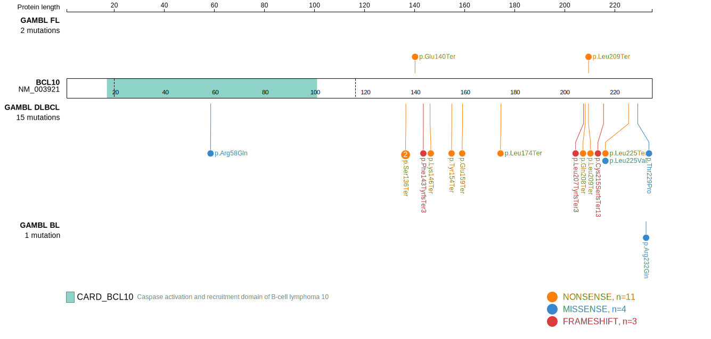
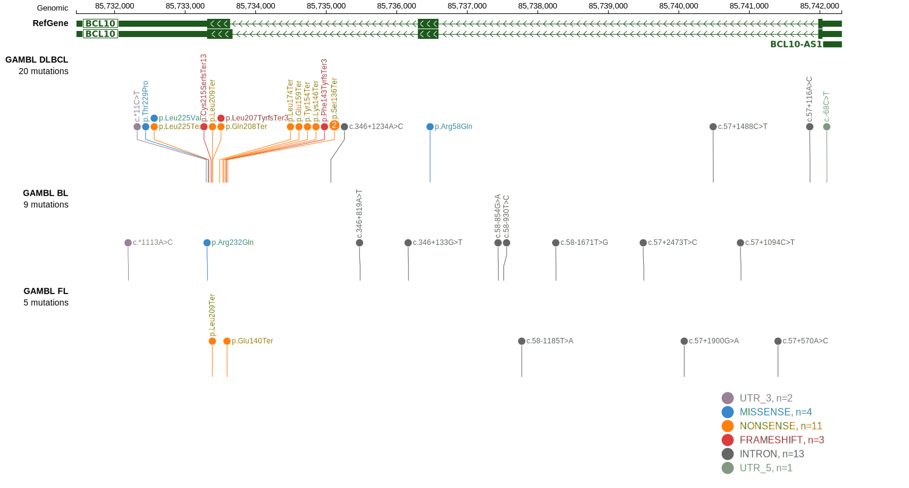
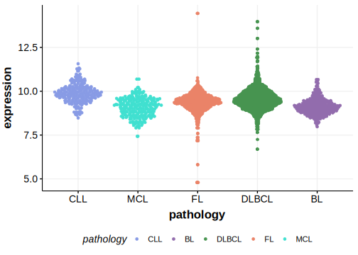

# BCL10

## Overview
BCL10 (B-cell lymphoma/leukemia 10) is a gene involved in apoptosis signaling and immune response regulation. Mutations in BCL10 have been implicated in the pathogenesis of various lymphomas, particularly mucosa-associated lymphoid tissue (MALT) lymphomas. They have also been reproducibly observed in a smaller proportion of DLBCLs with the frequency in non-MALT lymphomas under some debate.1
## History

## Relevance tier by entity

|Entity|Tier|Description                           |
|:------:|:----:|--------------------------------------|
||1|high-confidence MZL gene[@spinaGeneticsNodalMarginal2016b]|
|  |1   |high-confidence DLBCL gene[@morinFrequentMutationHistonemodifying2011]            |
|     |2   |relevance in FL not firmly established[@russler-germainMutationsAssociatedProgression2023b]|
|    |2   |relevance in BL not firmly established|

## Mutation incidence in large patient cohorts (GAMBL reanalysis)

|Entity|source               |frequency (%)|
|:------:|:---------------------:|:-------------:|
|DLBCL |GAMBL genomes        |3.82         |
|DLBCL |Schmitz cohort       |7.66         |
|DLBCL |Reddy cohort         |3.10         |
|DLBCL |Chapuy cohort        |6.41         |
|FL    |GAMBL genomes        |2.31         |
|BL    |GAMBL genomes+capture|0.23         |
|BL    |Thomas cohort        |0.40         |
|BL    |Panea cohort         |  NA         |

## Mutation pattern and selective pressure estimates

|Entity|aSHM|Significant selection|dN/dS (missense)|dN/dS (nonsense)|
|:------:|:----:|:---------------------:|:----------------:|:----------------:|
|BL    |No  |No                   | 3.224          |  0.000         |
|DLBCL |No  |Yes                  |13.754          |106.692         |
|FL    |No  |Yes                  | 0.000          |223.832         |

## BCL10 Hotspots

| Chromosome |Coordinate (hg19) | ref>alt | HGVSp | 
 | :---:| :---: | :--: | :---: |
| chr1 | 85736474 | C>T | R58Q |
| chr1 | 85733390 | G>A | Q208* |
| chr1 | 85733386 | A>C | L209* |

View coding variants in ProteinPaint [hg19](https://morinlab.github.io/LLMPP/GAMBL/BCL10_protein.html)  or [hg38](https://morinlab.github.io/LLMPP/GAMBL/BCL10_protein_hg38.html)

View all variants in GenomePaint [hg19](https://morinlab.github.io/LLMPP/GAMBL/BCL10.html)  or [hg38](https://morinlab.github.io/LLMPP/GAMBL/BCL10_hg38.html)

## BCL10 Expression

## References

<!-- ORIGIN: morinFrequentMutationHistonemodifying2011 -->
<!-- FL: russler-germainMutationsAssociatedProgression2023b -->
<!-- MZL: spinaGeneticsNodalMarginal2016b -->
<!-- DLBCL: morinFrequentMutationHistonemodifying2011 -->
