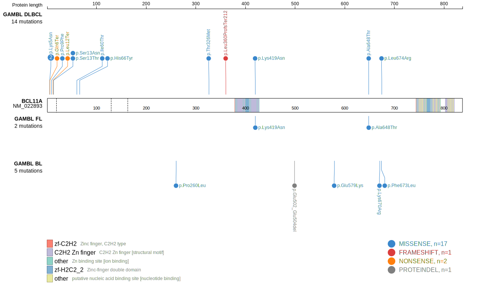
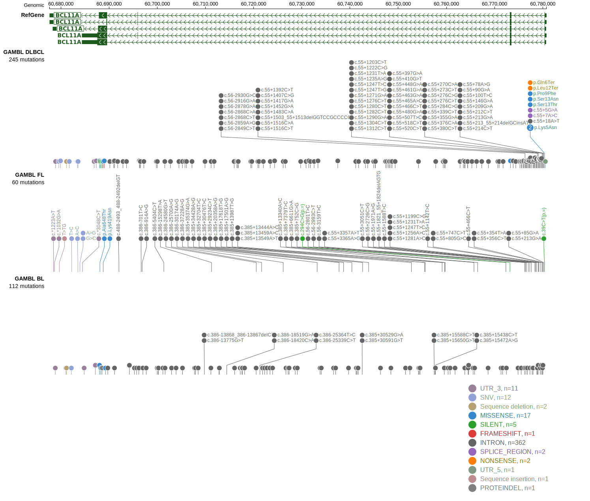

# [BCL11A]

## Mutation tier

|Entity|Tier|Description                           |
|:------:|:----:|--------------------------------------|
|BL    |2   |relevance in BL not firmly established|
|DLBCL |1   |high-confidence DLBCL gene            |
## Mutation incidence

|Entity|source               |frequency (%)|
|:------:|:---------------------:|:-------------:|
|BL    |GAMBL genomes+capture|2.54         |
|BL    |Thomas cohort        |1.70         |
|BL    |Panea cohort         |5.90         |
|DLBCL |GAMBL genomes        |4.02         |
|DLBCL |Schmitz cohort       |4.50         |
|DLBCL |Reddy cohort         |1.60         |
|DLBCL |Chapuy cohort        |3.40         |

## Mutation pattern

|Entity|aSHM|Significant selection|dN/dS (missense)|dN/dS (nonsense)|
|:------:|:----:|:---------------------:|:----------------:|:----------------:|
|BL    |Yes |No                   |4.455           | 0.000          |
|DLBCL |Yes |Yes                  |5.279           |69.578          |
|FL    |Yes |No                   |1.180           | 0.000          |

## aSHM regions

|chr_name|hg19_start|hg19_end|region                                                                                   |regulatory_comment|
|:--------:|:----------:|:--------:|:-----------------------------------------------------------------------------------------:|:------------------:|
|chr2    |60773789  |60783486|[TSS](https://genome.ucsc.edu/s/rdmorin/GAMBL%20hg19?position=chr2%3A60773789%2D60783486)|active_promoter   |

View coding variants in ProteinPaint [hg19](https://www.bcgsc.ca/downloads/morinlab/GAMBL/test/genes/BCL11A_protein.html)  or [hg38](https://www.bcgsc.ca/downloads/morinlab/GAMBL/test/genes/BCL11A_protein_hg38.html)

View all variants in GenomePaint [hg19](https://www.bcgsc.ca/downloads/morinlab/GAMBL/test/genes/BCL11A.html)  or [hg38](https://www.bcgsc.ca/downloads/morinlab/GAMBL/test/genes/BCL11A_hg38.html)

