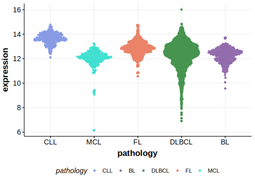

# BCL11A

## Overview
BCL11A (B-cell lymphoma/leukemia 11A) is a transcription factor involved in the regulation of gene expression, particularly in lymphoid cells. Mutations in BCL11A have been linked to various lymphoid malignancies, including B-cell lymphomas. Amplification of the 2p13 region, where BCL11A is located, has been observed in various B-cell non-Hodgkin lymphomas (B-NHL) and Hodgkin disease (HD). Although this suggests that BCL11A amplification contributes to the malignancy through increased expression, the gene is commonly co-amplified with the REL gene.1 The functional role of somatic mutations of BCL11A in B-cell lymphomas remains unclear. This is one of [a number of genes](https://github.com/morinlab/LLMPP/wiki/ashm) affected by aberrant somatic hypermutation in B-cell lymphomas, which complicates the interpretation of mutations at this locus.

## Relevance tier by entity

|Entity|Tier|Description                           |
|:------:|:----:|--------------------------------------|
| |1-a | aSHM target and high-confidence DLBCL gene            |

## Mutation incidence in large patient cohorts (GAMBL reanalysis)

|Entity|source               |frequency (%)|
|:------:|:---------------------:|:-------------:|
|BL    |GAMBL genomes+capture|2.54         |
|BL    |Thomas cohort        |1.70         |
|BL    |Panea cohort         |5.90         |
|DLBCL |GAMBL genomes        |4.02         |
|DLBCL |Schmitz cohort       |4.47         |
|DLBCL |Reddy cohort         |1.60         |
|DLBCL |Chapuy cohort        |3.42         |

## Mutation pattern and selective pressure estimates

[[include:dnds_BCL11A.md]]

## aSHM regions

|chr_name|hg19_start|hg19_end|region                                                                                   |regulatory_comment|
|:--------:|:----------:|:--------:|:-----------------------------------------------------------------------------------------:|:------------------:|
|chr2    |60773789  |60783486|[TSS](https://genome.ucsc.edu/s/rdmorin/GAMBL%20hg19?position=chr2%3A60773789%2D60783486)|active_promoter   |

## BCL11A Hotspots

| Chromosome |Coordinate (hg19) | ref>alt | HGVSp | 
 | :---:| :---: | :--: | :---: |
| chr2 | 60780391 | C>G | K5N |
| chr2 | 60780391 | C>A | K5N |
| chr2 | 60780390 | G>A | Q6* |
| chr2 | 60780380 | GG>AA | P9F |
| chr2 | 60780371 | A>T | L12* |
| chr2 | 60780368 | C>T | S13N |
| chr2 | 60780368 | C>G | S13T |

[[include:browser_BCL11A.md]]

## Expression

<!-- ORIGIN: Unknown -->

## References

