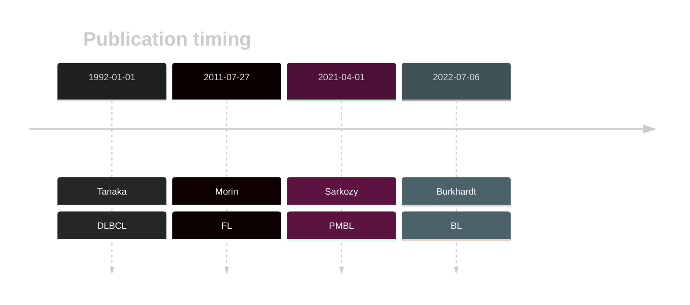

# BCL2
## Overview

BCL2 mutations are frequently found in DLBCL, particularly in the germinal center B-cell (GCB) subtype, and are often located in the flexible loop domain and outside the BCL2-homology domains. These mutations are caused by the somatic hypermutation process.1 The presence of these mutations are strongly correlated with the presence of a translocation between BCL2 and one of the immunoglobulin loci. 2 Although missense mutations may not be under positive selective pressure in the context of lymphomagenesis, some of these mutations may interfere with the function of BCL2 antagonists.3 

## Relevance tier by entity

|Entity|Tier|Description                           |
|:------:|:----:|--------------------------------------|
| |1-a   |high-confidence DLBCL gene, hypermutated            |
|    |1-a   |high-confidence FL gene, hypermutated 
||2|relevance in PMBL/cHL/GZL not firmly established|
|    |2   |relevance in BL not firmly established|
              |

## Mutation incidence in large patient cohorts (GAMBL reanalysis)

|Entity|source               |frequency (%)|
|:------:|:---------------------:|:-------------:|
|BL    |GAMBL genomes+capture| 0.46        |
|BL    |Thomas cohort        | 0.00        |
|BL    |Panea cohort         | 1.00        |
|DLBCL |GAMBL genomes        |23.71        |
|DLBCL |Schmitz cohort       |10.60        |
|DLBCL |Reddy cohort         |12.90        |
|DLBCL |Chapuy cohort        |15.80        |
|FL    |GAMBL genomes        |50.35        |

## Mutation pattern and selective pressure estimates

|Entity|aSHM|Significant selection|dN/dS (missense)|dN/dS (nonsense)|
|:------:|:----:|:---------------------:|:----------------:|:----------------:|
|BL    |Yes |No                   |0.000           |0               |
|DLBCL |Yes |Yes                  |2.645           |0               |
|FL    |Yes |No                   |1.197           |0               |

## aSHM regions

|chr_name|hg19_start|hg19_end|region                                                                                       |regulatory_comment|
|:--------:|:----------:|:--------:|:---------------------------------------------------------------------------------------------:|:------------------:|
|chr18   |60796984  |60814103|[intron](https://genome.ucsc.edu/s/rdmorin/GAMBL%20hg19?position=chr18%3A60796984%2D60814103)|strong_enhancer   |
|chr18   |60982728  |60988342|[TSS](https://genome.ucsc.edu/s/rdmorin/GAMBL%20hg19?position=chr18%3A60982728%2D60988342)   |active_promoter   |

> [!NOTE]
> First described in FL in 2011 by [Morin RD](https://pubmed.ncbi.nlm.nih.gov/21796119)

 ## BCL2 Hotspots

| Chromosome |Coordinate (hg19) | ref>alt | HGVSp | 
 | :---:| :---: | :--: | :---: |
| chr18 | 60985854 | T>C | M16V |
| chr18 | 60985854 | T>A | M16L |
| chr18 | 60985853 | A>T | M16K |
| chr18 | 60985852 | C>T | M16I |
| chr18 | 60985849 | C>G | K17N |
| chr18 | 60985842 | G>A | H20Y |
| chr18 | 60985840 | A>C | H20Q |
| chr18 | 60985838 | T>G | Y21S |
| chr18 | 60985835 | T>C | K22R |
| chr18 | 60985834 | CT>TC | K22R |

View coding variants in ProteinPaint [hg19](https://morinlab.github.io/LLMPP/GAMBL/BCL2_protein.html)  or [hg38](https://morinlab.github.io/LLMPP/GAMBL/BCL2_protein_hg38.html)

View all variants in GenomePaint [hg19](https://morinlab.github.io/LLMPP/GAMBL/BCL2.html)  or [hg38](https://morinlab.github.io/LLMPP/GAMBL/BCL2_hg38.html)

## BCL2 Expression

<!-- ORIGIN: 1339299 -->
<!-- FL: morinFrequentMutationHistonemodifying2011 -->
<!-- BL: burkhardtClinicalRelevanceMolecular2022b -->
<!-- BL: burkhardtClinicalRelevanceMolecular2022b -->
<!-- DLBCL: tanakaFrequentIncidenceSomatic1992 -->
## References
1.  Tanaka S, Louie DC, Kant JA, Reed JC. Frequent incidence of somatic mutations in translocated BCL2 oncogenes of non-Hodgkin’s lymphomas. Blood. 1992 Jan 1;79(1):229–237. PMID: 1339299
2.  Morin RD, Mendez-Lago M, Mungall AJ, Goya R, Mungall KL, Corbett RD, Johnson NA, Severson TM, Chiu R, Field M, Jackman S, Krzywinski M, Scott DW, Trinh DL, Tamura-Wells J, Li S, Firme MR, Rogic S, Griffith M, Chan S, Yakovenko O, Meyer IM, Zhao EY, Smailus D, Moksa M, Chittaranjan S, Rimsza L, Brooks-Wilson A, Spinelli JJ, Ben-Neriah S, Meissner B, Woolcock B, Boyle M, McDonald H, Tam A, Zhao Y, Delaney A, Zeng T, Tse K, Butterfield Y, Birol I, Holt R, Schein J, Horsman DE, Moore R, Jones SJM, Connors JM, Hirst M, Gascoyne RD, Marra MA. Frequent mutation of histone-modifying genes in non-Hodgkin lymphoma. Nature. 2011 Jul 27;476(7360):298–303. PMCID: PMC3210554
3.  Sarkozy C, Hung SS, Chavez EA, Duns G, Takata K, Chong LC, Aoki T, Jiang A, Miyata-Takata T, Telenius A, Slack GW, Molina TJ, Ben-Neriah S, Farinha P, Dartigues P, Damotte D, Mottok A, Salles GA, Casasnovas RO, Savage KJ, Laurent C, Scott DW, Traverse-Glehen A, Steidl C. Mutational landscape of gray zone lymphoma. Blood. 2021 Apr 1;137(13):1765–1776. PMID: 32961552
4.  Burkhardt B, Michgehl U, Rohde J, Erdmann T, Berning P, Reutter K, Rohde M, Borkhardt A, Burmeister T, Dave S, Tzankov A, Dugas M, Sandmann S, Fend F, Finger J, Mueller S, Gökbuget N, Haferlach T, Kern W, Hartmann W, Klapper W, Oschlies I, Richter J, Kontny U, Lutz M, Maecker-Kolhoff B, Ott G, Rosenwald A, Siebert R, von Stackelberg A, Strahm B, Woessmann W, Zimmermann M, Zapukhlyak M, Grau M, Lenz G. Clinical relevance of molecular characteristics in Burkitt lymphoma differs according to age. Nat Commun. 2022 Jul 6;13(1):3881. PMCID: PMC9259584
