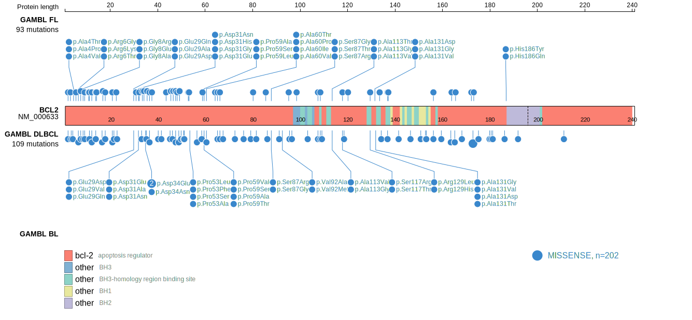
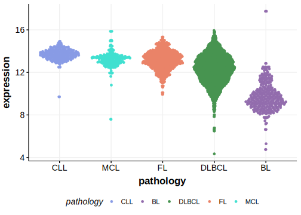

# BCL2
## Overview

BCL2 mutations are frequently found in DLBCL, particularly in the germinal center B-cell (GCB) subtype, and are often located in the flexible loop domain and outside the BCL2-homology domains. These mutations are caused by the somatic hypermutation process.1 The presence of these mutations are strongly correlated with the presence of a translocation between BCL2 and one of the immunoglobulin loci. 2 Although missense mutations may not be under positive selective pressure in the context of lymphomagenesis, some of these mutations may interfere with the function of BCL2 antagonists.3 

## Relevance tier by entity

|Entity|Tier|Description                           |
|:------:|:----:|--------------------------------------|
| |1-a   |high-confidence DLBCL gene, hypermutated            |
|    |1-a   |high-confidence FL gene, hypermutated 
||2|relevance in PMBL/cHL/GZL not firmly established|
|    |2   |relevance in BL not firmly established|
              |

## Mutation incidence in large patient cohorts (GAMBL reanalysis)

|Entity|source               |frequency (%)|
|:------:|:---------------------:|:-------------:|
|BL    |GAMBL genomes+capture| 0.46        |
|BL    |Thomas cohort        | 0.00        |
|BL    |Panea cohort         | 1.00        |
|DLBCL |GAMBL genomes        |23.71        |
|DLBCL |Schmitz cohort       |10.60        |
|DLBCL |Reddy cohort         |12.90        |
|DLBCL |Chapuy cohort        |15.80        |
|FL    |GAMBL genomes        |50.35        |

## Mutation pattern and selective pressure estimates

|Entity|aSHM|Significant selection|dN/dS (missense)|dN/dS (nonsense)|
|:------:|:----:|:---------------------:|:----------------:|:----------------:|
|BL    |Yes |No                   |0.000           |0               |
|DLBCL |Yes |Yes                  |2.645           |0               |
|FL    |Yes |No                   |1.197           |0               |

## aSHM regions

|chr_name|hg19_start|hg19_end|region                                                                                       |regulatory_comment|
|:--------:|:----------:|:--------:|:---------------------------------------------------------------------------------------------:|:------------------:|
|chr18   |60796984  |60814103|[intron](https://genome.ucsc.edu/s/rdmorin/GAMBL%20hg19?position=chr18%3A60796984%2D60814103)|strong_enhancer   |
|chr18   |60982728  |60988342|[TSS](https://genome.ucsc.edu/s/rdmorin/GAMBL%20hg19?position=chr18%3A60982728%2D60988342)   |active_promoter   |

> [!NOTE]
> First described in FL in 2011 by [Morin RD](https://pubmed.ncbi.nlm.nih.gov/21796119)

 ## BCL2 Hotspots

| Chromosome |Coordinate (hg19) | ref>alt | HGVSp | 
 | :---:| :---: | :--: | :---: |
| chr18 | 60985854 | T>C | M16V |
| chr18 | 60985854 | T>A | M16L |
| chr18 | 60985853 | A>T | M16K |
| chr18 | 60985852 | C>T | M16I |
| chr18 | 60985849 | C>G | K17N |
| chr18 | 60985842 | G>A | H20Y |
| chr18 | 60985840 | A>C | H20Q |
| chr18 | 60985838 | T>G | Y21S |
| chr18 | 60985835 | T>C | K22R |
| chr18 | 60985834 | CT>TC | K22R |

View coding variants in ProteinPaint [hg19](https://morinlab.github.io/LLMPP/GAMBL/BCL2_protein.html)  or [hg38](https://morinlab.github.io/LLMPP/GAMBL/BCL2_protein_hg38.html)

View all variants in GenomePaint [hg19](https://morinlab.github.io/LLMPP/GAMBL/BCL2.html)  or [hg38](https://morinlab.github.io/LLMPP/GAMBL/BCL2_hg38.html)

## References

1. *Schuetz JM, Johnson NA, Morin RD, Scott DW, Tan K, Ben-Nierah S, Boyle M, Slack GW, Marra MA, Connors JM, Brooks-Wilson AR, Gascoyne RD. BCL2 mutations in diffuse large B-cell lymphoma. Leukemia. 2012 Jun;26(6):1383-90. doi: 10.1038/leu.2011.378. Epub 2011 Dec 22. PMID: 22189900.*
2. *Hilton L et al. Motive and Opportunity: MYC rearrangements in high-grade B-cell lymphoma with MYC
and BCL2 rearrangements-an LLMPP study. Blood. 2024. Epub May 3.*
3. *Singh K, Briggs JM. Functional Implications of the spectrum of BCL2 mutations in Lymphoma. Mutat Res Rev Mutat Res. 2016 Jul-Sep;769:1-18. doi: 10.1016/j.mrrev.2016.06.001. Epub 2016 Jun 16. PMID: 27543313.*
## BCL2 Expression

<!-- ORIGIN: 1339299 -->
<!-- FL: morinFrequentMutationHistonemodifying2011 -->
<!-- BL: burkhardtClinicalRelevanceMolecular2022b -->
<!-- BL: burkhardtClinicalRelevanceMolecular2022b -->
<!-- DLBCL: tanakaFrequentIncidenceSomatic1992 -->
