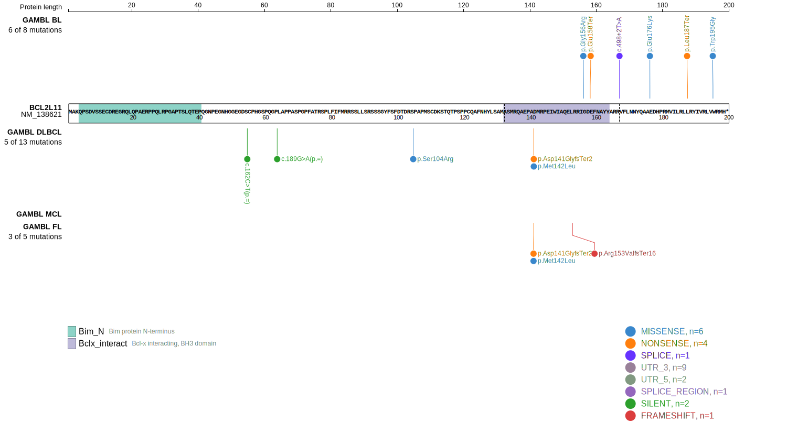
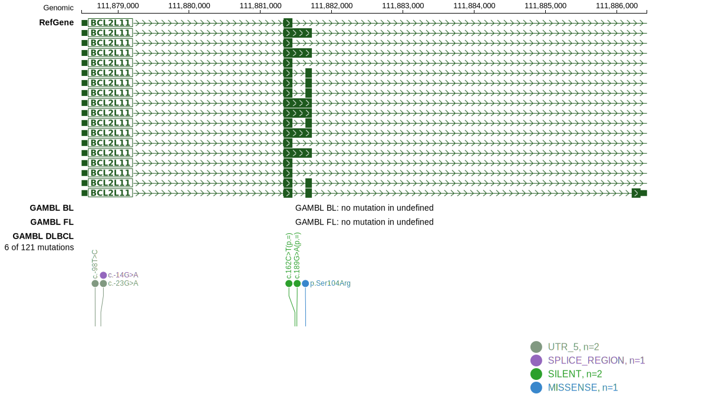

# [BCL2L11]

## Mutation tier

|Entity|Tier|Description                           |
|:------:|:----:|--------------------------------------|
|BL    |2-a | aSHM target; Although recurrent, the relevance of mutations in BL is tenuous |
## Mutation incidence

|Entity|source               |frequency (%)|
|:------:|:---------------------:|:-------------:|
|BL    |GAMBL genomes+capture|1.62         |
|BL    |Thomas cohort        |2.10         |
|BL    |Panea cohort         |1.00         |

## Mutation pattern

|Entity|aSHM|Significant selection|dN/dS (missense)|dN/dS (nonsense)|
|:------:|:----:|:---------------------:|:----------------:|:----------------:|
|BL    |Yes |Yes                  |15.763          |114.229         |
|DLBCL |Yes |No                   | 5.483          |  0.000         |
|FL    |Yes |No                   | 0.000          |  0.000         |

## aSHM regions

|chr_name|hg19_start|hg19_end |region                                                                                     |regulatory_comment|
|:--------:|:----------:|:---------:|:-------------------------------------------------------------------------------------------:|:------------------:|
|chr2    |111874854 |111882174|[TSS](https://genome.ucsc.edu/s/rdmorin/GAMBL%20hg19?position=chr2%3A111874854%2D111882174)|active_promoter   |

View coding variants in ProteinPaint [hg19](https://www.bcgsc.ca/downloads/morinlab/GAMBL/test/genes/BCL2L11_protein.html)  or [hg38](https://www.bcgsc.ca/downloads/morinlab/GAMBL/test/genes/BCL2L11_protein_hg38.html)

View all variants in GenomePaint [hg19](https://www.bcgsc.ca/downloads/morinlab/GAMBL/test/genes/BCL2L11.html)  or [hg38](https://www.bcgsc.ca/downloads/morinlab/GAMBL/test/genes/BCL2L11_hg38.html)

