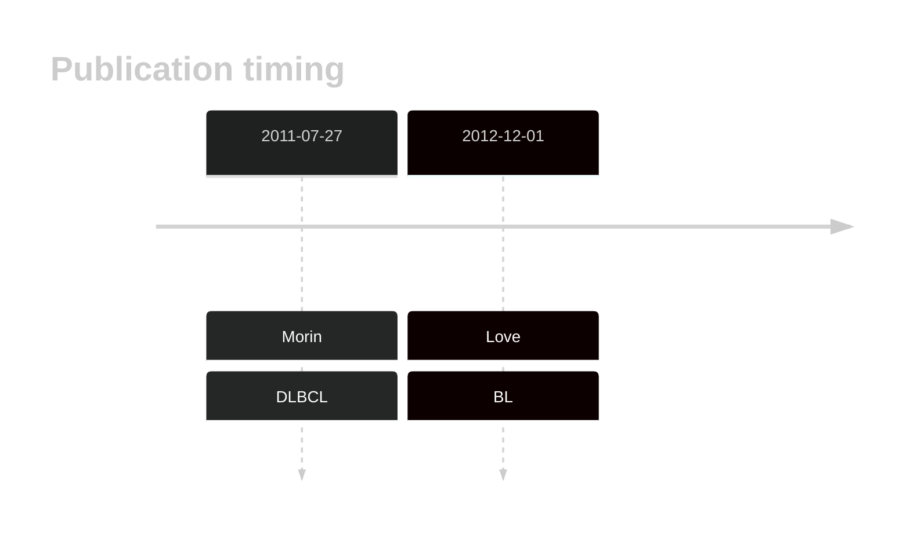
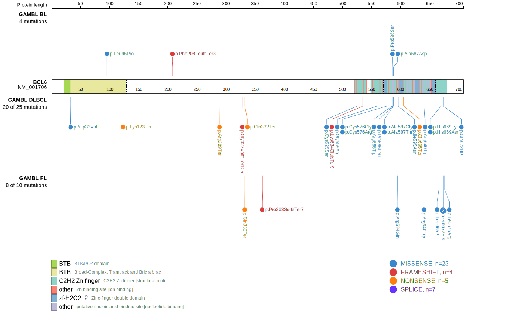
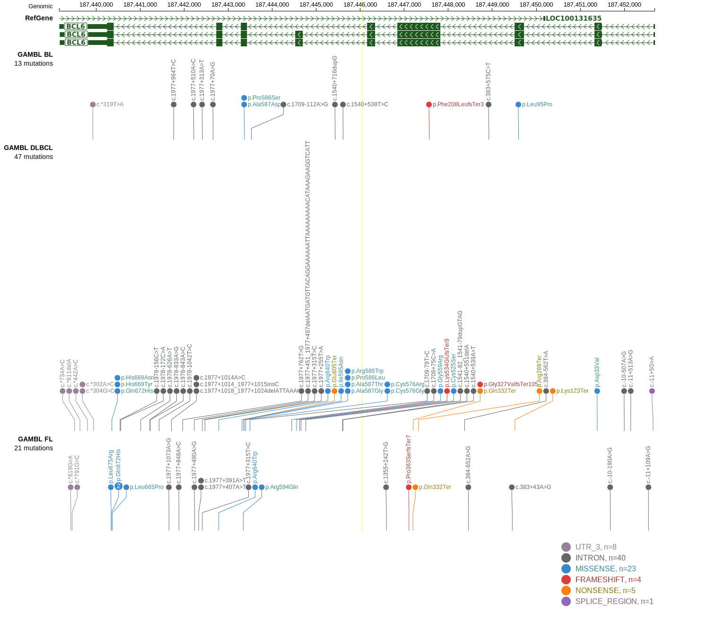
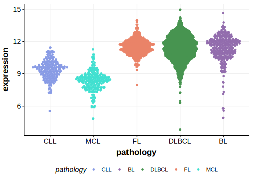
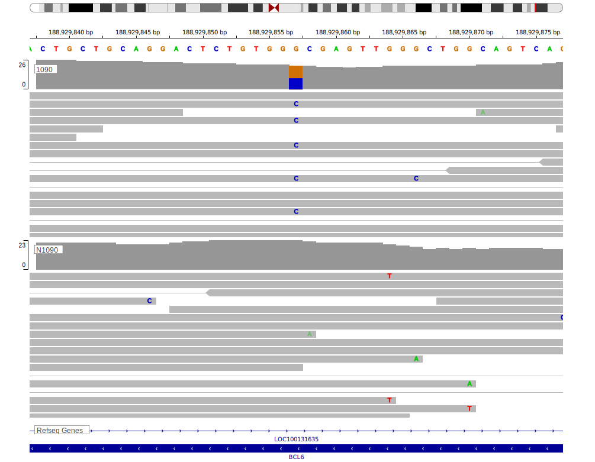

# BCL6

## Overview

BCL6 is one of [a number of genes](https://github.com/morinlab/LLMPP/wiki/ashm) affected by aberrant somatic hypermutation in B-cell lymphomas, which complicates the interpretation of mutations at this locus. Although common, particularly in DLBCL, the function of many of these mutations remains unclear but some have been shown to affect the regulation of BCL6 expression.1,2 The role of BCL6 missense mutations, seen over 9% of patients,3 remains unclear. 

## Relevance tier by entity

|Entity|Tier|Description                           |
|:------:|:----:|--------------------------------------|
|    |2-a | aSHM target; Although recurrent, the relevance of mutations in BL is tenuous |
| |1-a | aSHM target and high-confidence DLBCL gene            |
|    |1-a | aSHM target and high-confidence FL gene               |

## Mutation incidence in large patient cohorts (GAMBL reanalysis)

|Entity|source               |frequency (%)|
|:------:|:---------------------:|:-------------:|
|BL    |GAMBL genomes+capture| 5.08        |
|BL    |Thomas cohort        | 3.40        |
|BL    |Panea cohort         | 7.90        |
|DLBCL |GAMBL genomes        |11.66        |
|DLBCL |Schmitz cohort       |10.85        |
|DLBCL |Reddy cohort         | 6.41        |
|DLBCL |Chapuy cohort        | 5.13        |
|FL    |GAMBL genomes        | 5.77        |

## Mutation pattern and selective pressure estimates

|Entity|aSHM|Significant selection|dN/dS (missense)|dN/dS (nonsense)|
|:------:|:----:|:---------------------:|:----------------:|:----------------:|
|BL    |Yes |No                   | 7.427          | 0.000          |
|DLBCL |Yes |Yes                  |25.672          |60.803          |
|FL    |Yes |Yes                  |27.215          |62.162          |

## aSHM regions

|chr_name|hg19_start|hg19_end |region                                                                                              |regulatory_comment|
|:--------:|:----------:|:---------:|:----------------------------------------------------------------------------------------------------:|:------------------:|
|chr3    |187458526 |187464632|[TSS](https://genome.ucsc.edu/s/rdmorin/GAMBL%20hg19?position=chr3%3A187458526%2D187464632)         |NA                |
|chr3    |187615533 |187625659|[Intergenic-1](https://genome.ucsc.edu/s/rdmorin/GAMBL%20hg19?position=chr3%3A187615533%2D187625659)|NA                |
|chr3    |187625659 |187638101|[Intergenic-2](https://genome.ucsc.edu/s/rdmorin/GAMBL%20hg19?position=chr3%3A187625659%2D187638101)|NA                |
|chr3    |187657518 |187665996|[Intergenic-3](https://genome.ucsc.edu/s/rdmorin/GAMBL%20hg19?position=chr3%3A187657518%2D187665996)|NA                |
|chr3    |187675741 |187690717|[Intergenic-4](https://genome.ucsc.edu/s/rdmorin/GAMBL%20hg19?position=chr3%3A187675741%2D187690717)|NA                |
|chr3    |187690717 |187705000|[Intergenic-5](https://genome.ucsc.edu/s/rdmorin/GAMBL%20hg19?position=chr3%3A187690717%2D187705000)|NA                |

## BCL6 Hotspots

| Chromosome |Coordinate (hg19) | ref>alt | HGVSp | 
 | :---:| :---: | :--: | :---: |
| chr3 | 187443373 | G>A | R585W |
| chr3 | 187443370 | G>A | P586S |
| chr3 | 187443369 | G>A | P586L |
| chr3 | 187443367 | C>T | A587T |
| chr3 | 187443366 | G>T | A587D |
| chr3 | 187443366 | G>C | A587G |
| chr3 | 187443345 | C>T | R594Q |
| chr3 | 187443342 | A>T | I595N |

View coding variants in ProteinPaint [hg19](https://morinlab.github.io/LLMPP/GAMBL/BCL6_protein.html)  or [hg38](https://morinlab.github.io/LLMPP/GAMBL/BCL6_protein_hg38.html)

View all variants in GenomePaint [hg19](https://morinlab.github.io/LLMPP/GAMBL/BCL6.html)  or [hg38](https://morinlab.github.io/LLMPP/GAMBL/BCL6_hg38.html)

## BCL6 Expression

<!-- ORIGIN: 21796119 -->
<!-- BL: loveGeneticLandscapeMutations2012 -->
<!-- DLBCL: morinFrequentMutationHistonemodifying2011 -->

## Representative Mutations

### BL

**Rating** 
&starf; &starf; &starf; &starf; &star;

## All Mutations

### BL

[1090](https://www.bcgsc.ca/downloads/morinlab/GAMBL/Love/1090_reports.html)
[747](https://www.bcgsc.ca/downloads/morinlab/GAMBL/Love/747_reports.html)

## References
1.  Morin RD, Mendez-Lago M, Mungall AJ, Goya R, Mungall KL, Corbett RD, Johnson NA, Severson TM, Chiu R, Field M, Jackman S, Krzywinski M, Scott DW, Trinh DL, Tamura-Wells J, Li S, Firme MR, Rogic S, Griffith M, Chan S, Yakovenko O, Meyer IM, Zhao EY, Smailus D, Moksa M, Chittaranjan S, Rimsza L, Brooks-Wilson A, Spinelli JJ, Ben-Neriah S, Meissner B, Woolcock B, Boyle M, McDonald H, Tam A, Zhao Y, Delaney A, Zeng T, Tse K, Butterfield Y, Birol I, Holt R, Schein J, Horsman DE, Moore R, Jones SJM, Connors JM, Hirst M, Gascoyne RD, Marra MA. Frequent mutation of histone-modifying genes in non-Hodgkin lymphoma. Nature. 2011 Jul 27;476(7360):298–303. PMCID: PMC3210554
2.  Love C, Sun Z, Jima D, Li G, Zhang J, Miles R, Richards KL, Dunphy CH, Choi WWL, Srivastava G, Lugar PL, Rizzieri DA, Lagoo AS, Bernal-Mizrachi L, Mann KP, Flowers CR, Naresh KN, Evens AM, Chadburn A, Gordon LI, Czader MB, Gill JI, Hsi ED, Greenough A, Moffitt AB, McKinney M, Banerjee A, Grubor V, Levy S, Dunson DB, Dave SS. The genetic landscape of mutations in Burkitt lymphoma. Nat Genet. 2012 Dec;44(12):1321–1325. PMCID: PMC3674561
