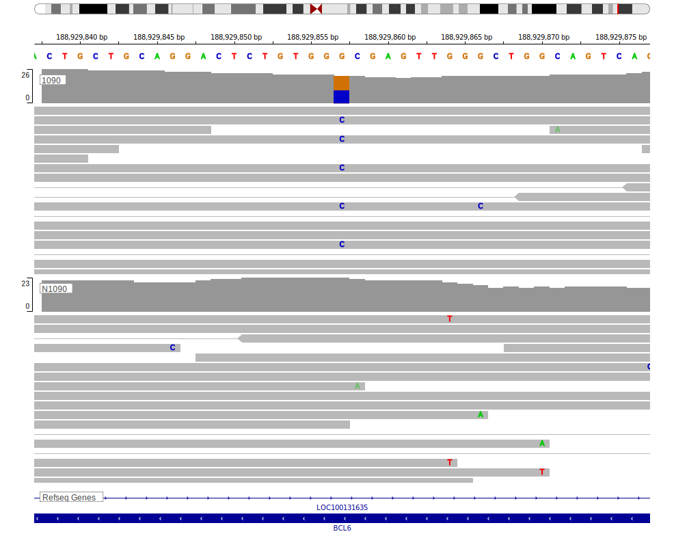

[[_TOC_]]

## Overview

BCL6 is one of [a number of genes](https://github.com/morinlab/LLMPP/wiki/ashm) affected by aberrant somatic hypermutation in B-cell lymphomas, which complicates the interpretation of mutations at this locus. 
Although common, particularly in DLBCL, the function of many of these mutations remains unclear but some have been shown to affect the regulation of BCL6 expression. The role of BCL6 missense mutations remains unclear. 

## Experimental Evidence

Driver mutations affecting this gene in BL/FL/DLBCL have been experimentally demonstrated to cause a reduction or loss of function (LOF).[@masclePointMutationsBCL62003]

## Relevance tier by entity

[[include:tables/table1_BCL6]]
           

## Mutation incidence in large patient cohorts (GAMBL reanalysis)

### DLBCL
[[include:tables/DLBCL_BCL6.md]]

### FL
[[include:tables/FL_BCL6.md]]

### BL
[[include:tables/BL_BCL6.md]]

## Mutation pattern and selective pressure estimates

[[include:tables/dnds_BCL6.md]]

## aSHM regions

|chr_name|hg19_start|hg19_end |region                                                                                              |regulatory_comment|
|:--------:|:----------:|:---------:|:----------------------------------------------------------------------------------------------------:|:------------------:|
|chr3    |187458526 |187464632|[TSS](https://genome.ucsc.edu/s/rdmorin/GAMBL%20hg19?position=chr3%3A187458526%2D187464632)         |NA                |
|chr3    |187615533 |187625659|[Intergenic-1](https://genome.ucsc.edu/s/rdmorin/GAMBL%20hg19?position=chr3%3A187615533%2D187625659)|NA                |
|chr3    |187625659 |187638101|[Intergenic-2](https://genome.ucsc.edu/s/rdmorin/GAMBL%20hg19?position=chr3%3A187625659%2D187638101)|NA                |
|chr3    |187657518 |187665996|[Intergenic-3](https://genome.ucsc.edu/s/rdmorin/GAMBL%20hg19?position=chr3%3A187657518%2D187665996)|NA                |
|chr3    |187675741 |187690717|[Intergenic-4](https://genome.ucsc.edu/s/rdmorin/GAMBL%20hg19?position=chr3%3A187675741%2D187690717)|NA                |
|chr3    |187690717 |187705000|[Intergenic-5](https://genome.ucsc.edu/s/rdmorin/GAMBL%20hg19?position=chr3%3A187690717%2D187705000)|NA                |

## BCL6 Hotspots

| Chromosome |Coordinate (hg19) | ref>alt | HGVSp | 
 | :---:| :---: | :--: | :---: |
| chr3 | 187443373 | G>A | R585W |
| chr3 | 187443370 | G>A | P586S |
| chr3 | 187443369 | G>A | P586L |
| chr3 | 187443367 | C>T | A587T |
| chr3 | 187443366 | G>T | A587D |
| chr3 | 187443366 | G>C | A587G |
| chr3 | 187443345 | C>T | R594Q |
| chr3 | 187443342 | A>T | I595N |

[[include:tables/browser_BCL6.md]]

## Expression

<!-- ORIGIN: 21796119 -->
<!-- BL: loveGeneticLandscapeMutations2012 -->
<!-- DLBCL: morinFrequentMutationHistonemodifying2011 -->

## Representative Mutations

### BL

**Rating** 
&starf; &starf; &starf; &starf; &star;

## All Mutations

### BL

[1090](https://www.bcgsc.ca/downloads/morinlab/GAMBL/Love/1090_reports.html)
[747](https://www.bcgsc.ca/downloads/morinlab/GAMBL/Love/747_reports.html)

[[include:tables/mermaid_BCL6.md]]

## References
