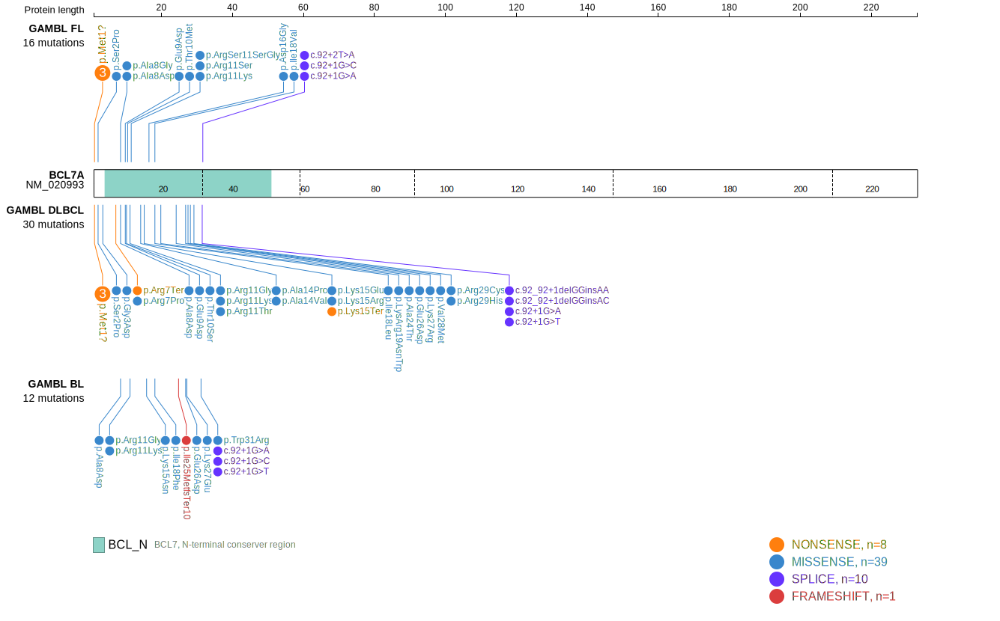
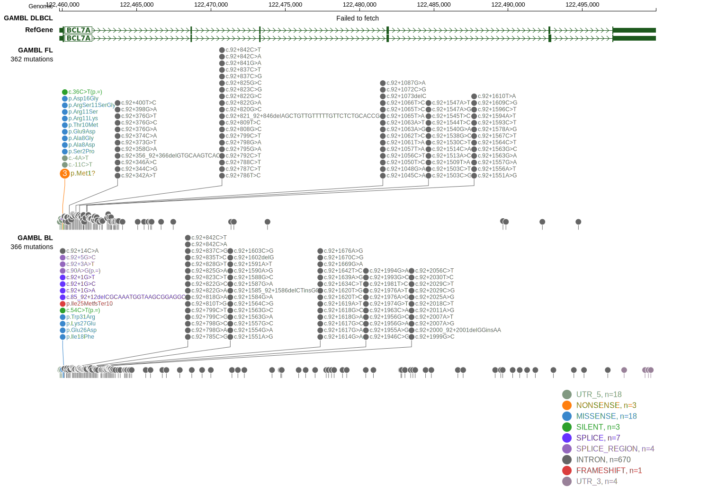

BCL7A protein interacts with components of the SWI/SNF chromatin remodeling complex, implicating it in chromatin remodeling processes essential for normal cellular function.1 Mutations in the BCL7A gene have been identified in diffuse large B-cell lymphoma (DLBCL) and other B-cell lymphomas, implicating this gene in the pathogenesis of these cancers. Importantly, BCL7A is one of [a number of genes](https://github.com/morinlab/LLMPP/wiki/ashm) affected by aberrant somatic hypermutation in B-cell lymphomas, which complicates the interpretation of mutations at this locus. Due to the presence of some loss-of-function mutations, BCL7A has been described as a tumour-suppressor gene in DLBCL.3 The rate of DLBCLs with biallelic loss of this locus remains unclear. 

## Mutation tier

|Entity|Tier|Description                           |
|:------:|:----:|--------------------------------------|
|BL    |2   |relevance in BL not firmly established|
|DLBCL |1   |high-confidence DLBCL gene            |
|FL    |1   |high-confidence FL gene               |
## Mutation incidence

|Entity|source               |frequency (%)|
|:------:|:---------------------:|:-------------:|
|BL    |GAMBL genomes+capture| 5.31        |
|BL    |Thomas cohort        | 5.50        |
|BL    |Panea cohort         | 5.00        |
|DLBCL |GAMBL genomes        | 7.65        |
|DLBCL |Schmitz cohort       |10.60        |
|DLBCL |Reddy cohort         | 8.40        |
|DLBCL |Chapuy cohort        | 6.40        |
|FL    |GAMBL genomes        |13.86        |

## Mutation pattern

|Entity|aSHM|Significant selection|dN/dS (missense)|dN/dS (nonsense)|
|:------:|:----:|:---------------------:|:----------------:|:----------------:|
|BL    |Yes |Yes                  | 9.127          | 46.248         |
|DLBCL |Yes |Yes                  |22.635          |  0.000         |
|FL    |Yes |Yes                  |55.348          |146.110         |

## aSHM regions

|chr_name|hg19_start|hg19_end |region                                                                                      |regulatory_comment|
|:--------:|:----------:|:---------:|:--------------------------------------------------------------------------------------------:|:------------------:|
|chr12   |122456912 |122464036|[TSS](https://genome.ucsc.edu/s/rdmorin/GAMBL%20hg19?position=chr12%3A122456912%2D122464036)|poised_promoter   |

> [!NOTE]
> First described in BL in 2019 by [Grande BM](https://pubmed.ncbi.nlm.nih.gov/30617194)

View coding variants in ProteinPaint [hg19](https://www.bcgsc.ca/downloads/morinlab/GAMBL/test/genes/BCL7A_protein.html)  or [hg38](https://www.bcgsc.ca/downloads/morinlab/GAMBL/test/genes/BCL7A_protein_hg38.html)

View all variants in GenomePaint [hg19](https://www.bcgsc.ca/downloads/morinlab/GAMBL/test/genes/BCL7A.html)  or [hg38](https://www.bcgsc.ca/downloads/morinlab/GAMBL/test/genes/BCL7A_hg38.html)

## References
1. *Ramos-Medina R, Montes-Moreno S, Maestre L, Cañamero M, Rodríguez-Pinilla M, Martínez-Torrecuadrada J, Piris MÁ, Majid A, Dyer MJ, Pulford K, Roncador G. BCL7A protein expression in normal and malignant lymphoid tissues. Br J Haematol. 2013 Jan;160(1):106-9. doi: 10.1111/bjh.12080. Epub 2012 Oct 9. PMID: 23043359.*
2. *Grande BM, Gerhard DS, Jiang A, Griner NB, Abramson JS, Alexander TB, Allen H, Ayers LW, Bethony JM, Bhatia K, Bowen J, Casper C, Choi JK, Culibrk L, Davidsen TM, Dyer MA, Gastier-Foster JM, Gesuwan P, Greiner TC, Gross TG, Hanf B, Harris NL, He Y, Irvin JD, Jaffe ES, Jones SJM, Kerchan P, Knoetze N, Leal FE, Lichtenberg TM, Ma Y, Martin JP, Martin MR, Mbulaiteye SM, Mullighan CG, Mungall AJ, Namirembe C, Novik K, Noy A, Ogwang MD, Omoding A, Orem J, Reynolds SJ, Rushton CK, Sandlund JT, Schmitz R, Taylor C, Wilson WH, Wright GW, Zhao EY, Marra MA, Morin RD, Staudt LM. Genome-wide discovery of somatic coding and noncoding mutations in pediatric endemic and sporadic Burkitt lymphoma. Blood. 2019 Mar 21;133(12):1313-1324. doi: 10.1182/blood-2018-09-871418. Epub 2019 Jan 7. PMID: 30617194; PMCID: PMC6428665.* 
3. *Baliñas-Gavira C, Rodríguez MI, Andrades A, Cuadros M, Álvarez-Pérez JC, Álvarez-Prado ÁF, de Yébenes VG, Sánchez-Hernández S, Fernández-Vigo E, Muñoz J, Martín F, Ramiro AR, Martínez-Climent JA, Medina PP. Frequent mutations in the amino-terminal domain of BCL7A impair its tumor suppressor role in DLBCL. Leukemia. 2020 Oct;34(10):2722-2735. doi: 10.1038/s41375-020-0919-5. Epub 2020 Jun 24. PMID: 32576963.*