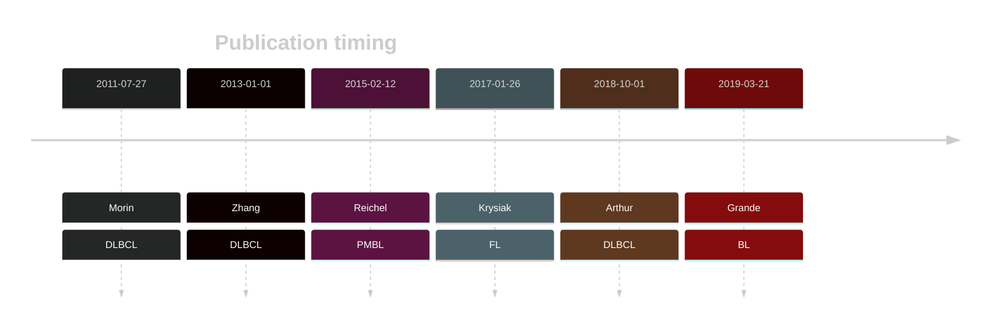

# BCL7A

## Overview

BCL7A protein interacts with components of the SWI/SNF chromatin remodeling complex, implicating it in chromatin remodeling processes essential for normal cellular function.[@reichelFlowSortingExome2015] Mutations in the BCL7A gene have been identified in diffuse large B-cell lymphoma (DLBCL) and other B-cell lymphomas, implicating this gene in the pathogenesis of these cancers. Importantly, BCL7A is one of [a number of genes](https://github.com/morinlab/LLMPP/wiki/ashm) affected by aberrant somatic hypermutation in B-cell lymphomas, which complicates the interpretation of mutations at this locus. Due to the presence of some loss-of-function mutations, BCL7A has been described as a tumour-suppressor gene in DLBCL.[@balinas-gaviraFrequentMutationsAminoterminal2020] 
The rate of DLBCLs with biallelic loss of this locus remains unclear. 

## Relevance tier by entity

|Entity|Tier|Description                           |
|:------:|:----:|--------------------------------------|
||1|high-confidence MZL gene|
||2|relevance in PMBL/cHL/GZL not firmly established[@reichelFlowSortingExome2015]|
| |1[@balinas-gaviraFrequentMutationsAminoterminal2020] | high-confidence DLBCL gene[@morinFrequentMutationHistonemodifying2011; @zhangGeneticHeterogeneityDiffuse2013; @arthurGenomewideDiscoverySomatic2018] |
|    |1 | high-confidence FL gene [@krysiakRecurrentSomaticMutations2017]              |
|    |2 | Although recurrent, the relevance of mutations in BL is tenuous [@grandeGenomewideDiscoverySomatic2019]|

## Mutation incidence in large patient cohorts (GAMBL reanalysis)

[[include:DLBCL_BCL7A.md]]
[[include:FL_BCL7A.md]]
[[include:BL_BCL7A.md]]

## Mutation pattern and selective pressure estimates

|Entity|aSHM|Significant selection|dN/dS (missense)|dN/dS (nonsense)|
|:------:|:----:|:---------------------:|:----------------:|:----------------:|
|BL    |Yes |Yes                  | 9.127          | 46.248         |
|DLBCL |Yes |Yes                  |22.635          |  0.000         |
|FL    |Yes |Yes                  |55.348          |146.110         |

## aSHM regions

|chr_name|hg19_start|hg19_end |region                                                                                      |regulatory_comment|
|:--------:|:----------:|:---------:|:--------------------------------------------------------------------------------------------:|:------------------:|
|chr12   |122456912 |122464036|[TSS](https://genome.ucsc.edu/s/rdmorin/GAMBL%20hg19?position=chr12%3A122456912%2D122464036)|poised_promoter   |

View coding variants in ProteinPaint [hg19](https://morinlab.github.io/LLMPP/GAMBL/BCL7A_protein.html)  or [hg38](https://morinlab.github.io/LLMPP/GAMBL/BCL7A_protein_hg38.html)

View all variants in GenomePaint [hg19](https://morinlab.github.io/LLMPP/GAMBL/BCL7A.html)  or [hg38](https://morinlab.github.io/LLMPP/GAMBL/BCL7A_hg38.html)

## BCL7A Expression

<!-- ORIGIN: reichelFlowSortingExome2015a -->
<!-- BL: grandeGenomewideDiscoverySomatic2019 -->
<!-- FL: krysiakRecurrentSomaticMutations2017b -->
<!-- BL: grandeGenomewideDiscoverySomatic2019 -->
<!-- DLBCL: arthurGenomewideDiscoverySomatic2018 -->

## References

<!-- PMBL: reichelFlowSortingExome2015a -->
