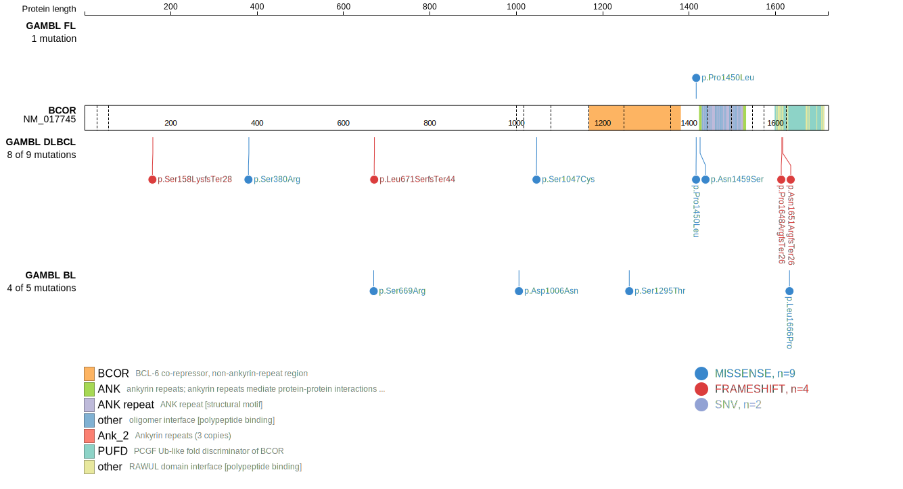
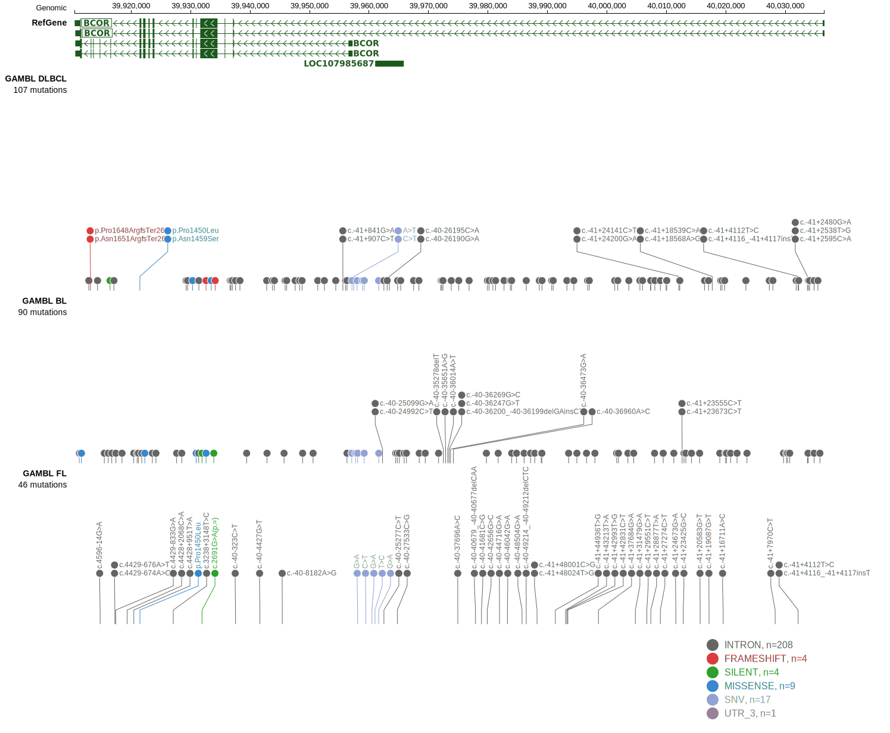
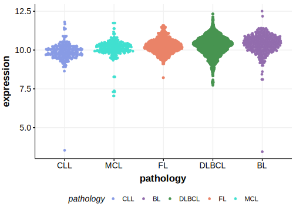

[[_TOC_]]

BCOR acts as a co-repressor of BCL6, and mutations in BCOR could impair its binding affinity to BCL6 and other partners. Overall, protein-altering mutations in BCOR seem to be rare in DLBCL and MCL.1,2 One study reported a much higher prevalence of a hot spot mutation in BCOR but this result has not been reproduced.1 

## Relevance tier by entity

|Entity|Tier|Description               |
|:------:|:----:|--------------------------|
||2|relevance in MZL not firmly established[@jalladesExomeSequencingIdentifies2017]|
| |2   |low-confidence DLBCL gene|
|   |1   |high-confidence MCL gene  [@nadeuGenomicEpigenomicInsights2020]|

## Mutation incidence in large patient cohorts (GAMBL reanalysis)

|Entity|source        |frequency (%)|
|:------:|:--------------:|:-------------:|
|DLBCL |GAMBL genomes |3.82         |
|DLBCL |Schmitz cohort|7.66         |
|DLBCL |Reddy cohort  |2.50         |
|DLBCL |Chapuy cohort |2.56         |
|MCL   |GAMBL genomes |3.79         |

## Mutation pattern and selective pressure estimates

|Entity|aSHM|Significant selection|dN/dS (missense)|dN/dS (nonsense)|
|:------:|:----:|:---------------------:|:----------------:|:----------------:|
|BL    |No  |No                   |1.341           |0               |
|DLBCL |No  |No                   |2.471           |0               |
|FL    |No  |No                   |1.743           |0               |

## BCOR Hotspots

| Chromosome |Coordinate (hg19) | ref>alt | HGVSp | 
 | :---:| :---: | :--: | :---: |
| chrX | 39921444 | T>C | N1459S |

View coding variants in ProteinPaint [hg19](https://morinlab.github.io/LLMPP/GAMBL/BCOR_protein.html)  or [hg38](https://morinlab.github.io/LLMPP/GAMBL/BCOR_protein_hg38.html)

View all variants in GenomePaint [hg19](https://morinlab.github.io/LLMPP/GAMBL/BCOR.html)  or [hg38](https://morinlab.github.io/LLMPP/GAMBL/BCOR_hg38.html)

## BCOR Expression

<!-- ORIGIN: jalladesExomeSequencingIdentifies2017 -->
<!-- MCL: nadeuGenomicEpigenomicInsights2020a -->
<!-- MZL: jalladesExomeSequencingIdentifies2017 -->

[[include:mermaid_BCOR.md]]

## References

