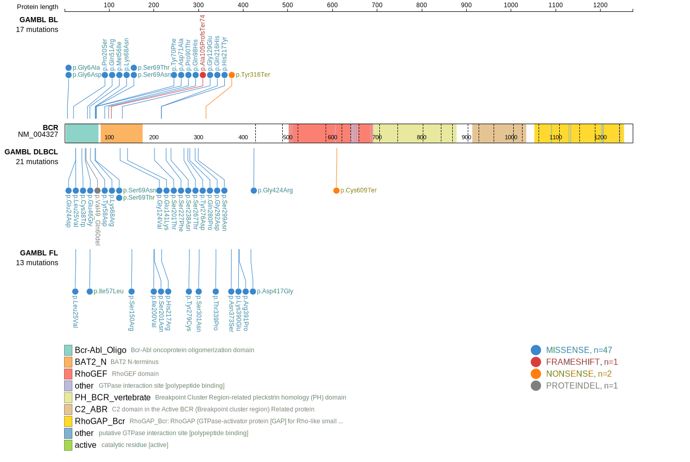
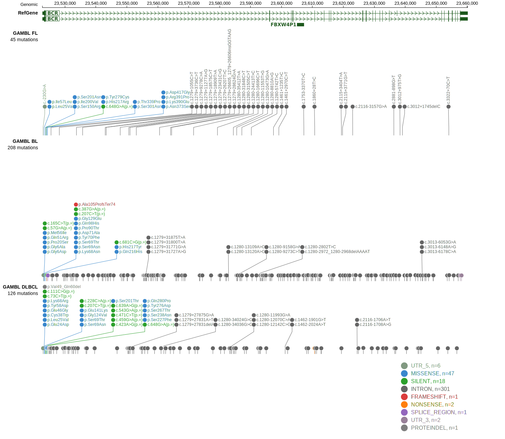

# [BCR]

## Mutation tier

|Entity|Tier|Description                           |
|:------:|:----:|--------------------------------------|
|BL    |2   |relevance in BL not firmly established|
|DLBCL |1   |high-confidence DLBCL gene            |
## Mutation incidence

|Entity|source               |frequency (%)|
|:------:|:---------------------:|:-------------:|
|BL    |GAMBL genomes+capture| 6.00        |
|BL    |Thomas cohort        | 6.40        |
|BL    |Panea cohort         |10.90        |
|DLBCL |GAMBL genomes        | 4.97        |
|DLBCL |Schmitz cohort       | 6.40        |
|DLBCL |Reddy cohort         | 3.90        |
|DLBCL |Chapuy cohort        | 4.30        |

## Mutation pattern

|Entity|aSHM|Significant selection|dN/dS (missense)|dN/dS (nonsense)|
|:------:|:----:|:---------------------:|:----------------:|:----------------:|
|BL    |Yes |No                   |2.733           |2.641           |
|DLBCL |Yes |No                   |1.249           |3.642           |
|FL    |Yes |No                   |7.439           |0.000           |

## aSHM regions

|chr_name|hg19_start|hg19_end|region                                                                                    |regulatory_comment|
|:--------:|:----------:|:--------:|:------------------------------------------------------------------------------------------:|:------------------:|
|chr22   |23522060  |23528313|[TSS](https://genome.ucsc.edu/s/rdmorin/GAMBL%20hg19?position=chr22%3A23522060%2D23528313)|NA                |

> [!NOTE]
> First described in BL in 2019 by [Panea RI](https://pubmed.ncbi.nlm.nih.gov/31558468)

View coding variants in ProteinPaint [hg19](https://www.bcgsc.ca/downloads/morinlab/GAMBL/test/genes/BCR_protein.html)  or [hg38](https://www.bcgsc.ca/downloads/morinlab/GAMBL/test/genes/BCR_protein_hg38.html)

View all variants in GenomePaint [hg19](https://www.bcgsc.ca/downloads/morinlab/GAMBL/test/genes/BCR.html)  or [hg38](https://www.bcgsc.ca/downloads/morinlab/GAMBL/test/genes/BCR_hg38.html)

