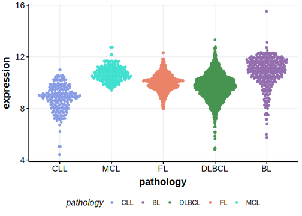

BCR (Breakpoint Cluster Region Protein) is one of [a number of genes](https://github.com/morinlab/LLMPP/wiki/ashm) affected by aberrant somatic hypermutation in B-cell lymphomas, which complicates the interpretation of mutations at this locus. This gene has some recurrent sites of mutations (hot spots). 

## Relevance tier by entity

|Entity|Tier|Description                           |
|:------:|:----:|--------------------------------------|
|DLBCL |1-a | aSHM target and high-confidence DLBCL gene            |
|BL    |2-a | aSHM target; Although recurrent, the relevance of mutations in BL is tenuous |

## Mutation incidence in large patient cohorts (GAMBL reanalysis)

|Entity|source               |frequency (%)|
|:------:|:---------------------:|:-------------:|
|BL    |GAMBL genomes+capture| 6.00        |
|BL    |Thomas cohort        | 6.40        |
|BL    |Panea cohort         |10.90        |
|DLBCL |GAMBL genomes        | 4.97        |
|DLBCL |Schmitz cohort       | 6.38        |
|DLBCL |Reddy cohort         | 3.90        |
|DLBCL |Chapuy cohort        | 4.27        |

## Mutation pattern and selective pressure estimates

|Entity|aSHM|Significant selection|dN/dS (missense)|dN/dS (nonsense)|
|:------:|:----:|:---------------------:|:----------------:|:----------------:|
|BL    |Yes |No                   |2.733           |2.641           |
|DLBCL |Yes |No                   |1.249           |3.642           |
|FL    |Yes |No                   |7.439           |0.000           |

## aSHM regions

|chr_name|hg19_start|hg19_end|region                                                                                    |regulatory_comment|
|:--------:|:----------:|:--------:|:------------------------------------------------------------------------------------------:|:------------------:|
|chr22   |23522060  |23528313|[TSS](https://genome.ucsc.edu/s/rdmorin/GAMBL%20hg19?position=chr22%3A23522060%2D23528313)|NA                |

> [!NOTE]
> First described in BL in 2019 by [Panea RI](https://pubmed.ncbi.nlm.nih.gov/31558468)

 ## BCR Hotspots

| Chromosome |Coordinate (hg19) | ref>alt | HGVSp | 
 | :---:| :---: | :--: | :---: |
| chr22 | 23523350 | A>G | K68R |
| chr22 | 23523351 | G>T | K68N |
| chr22 | 23523353 | G>A | S69N |
| chr22 | 23523353 | G>C | S69T |
| chr22 | 23523356 | A>T | Y70F |
| chr22 | 23523359 | A>C | D71A |
| chr22 | 23523374 | G>A | G76D |

View coding variants in ProteinPaint [hg19](https://morinlab.github.io/LLMPP/GAMBL/BCR_protein.html)  or [hg38](https://morinlab.github.io/LLMPP/GAMBL/BCR_protein_hg38.html)

View all variants in GenomePaint [hg19](https://morinlab.github.io/LLMPP/GAMBL/BCR.html)  or [hg38](https://morinlab.github.io/LLMPP/GAMBL/BCR_hg38.html)

## BCR Expression

