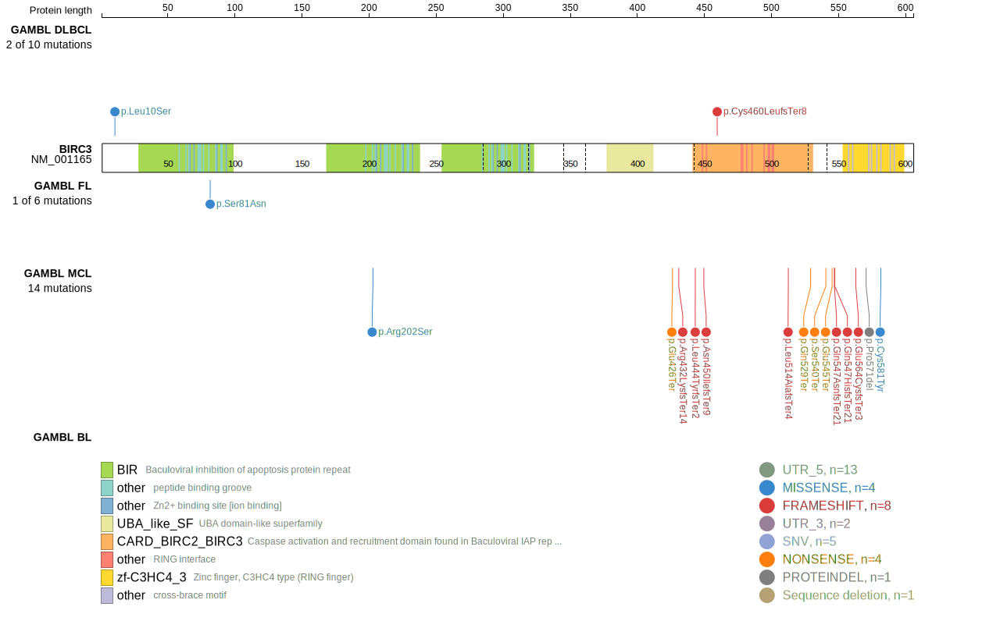
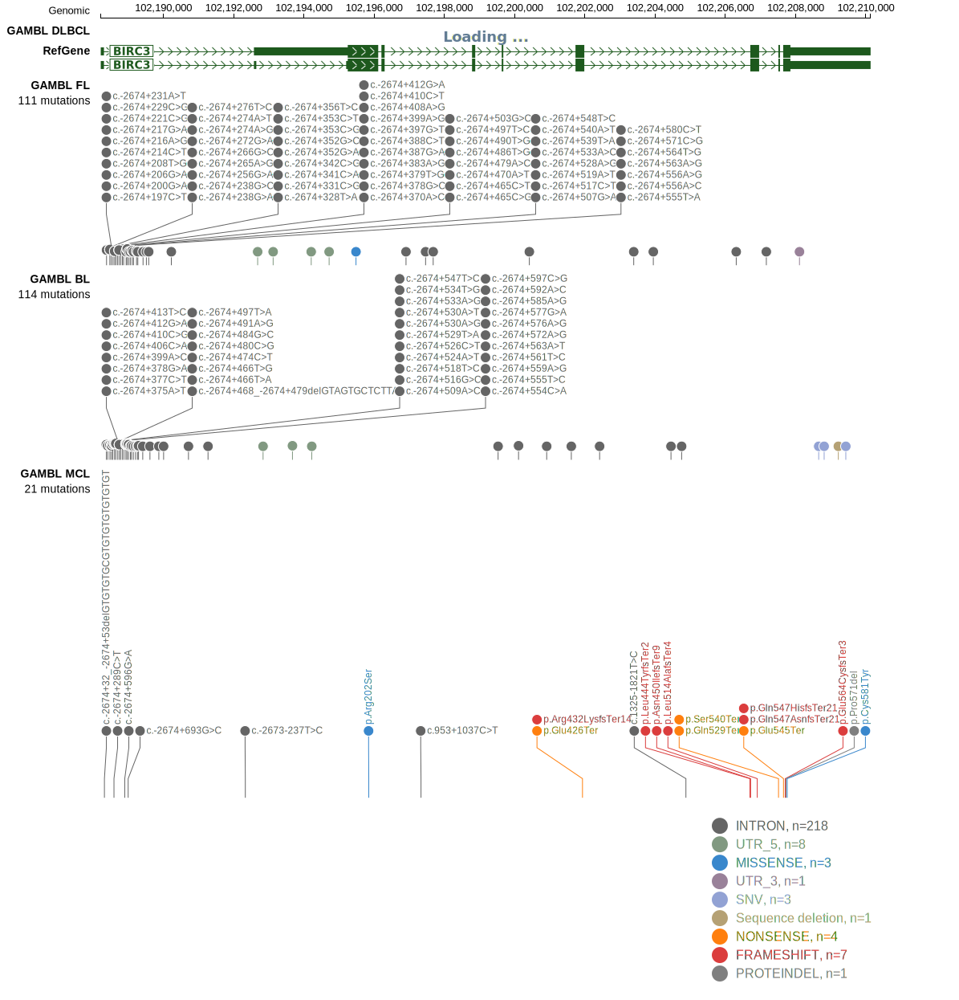
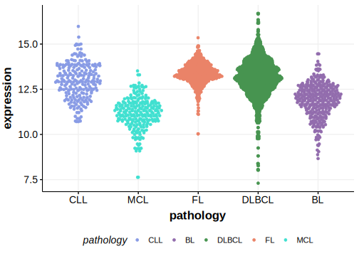

# BIRC3

## Relevance tier by entity

|Entity|Tier|Description                              |
|:------:|:----:|-----------------------------------------|
| |2-a | aSHM target; Although recurrent, the relevance of mutations in DLBCL is tenuous |
|   |1-a | aSHM target and high-confidence MCL gene                 |

## Mutation incidence in large patient cohorts (GAMBL reanalysis)

|Entity|source        |frequency (%)|
|:------:|:--------------:|:-------------:|
|DLBCL |GAMBL genomes |1.53         |
|DLBCL |Schmitz cohort|1.91         |
|DLBCL |Reddy cohort  |1.30         |
|DLBCL |Chapuy cohort |1.71         |
|MCL   |GAMBL genomes |7.11         |

## Mutation pattern and selective pressure estimates

|Entity|aSHM|Significant selection|dN/dS (missense)|dN/dS (nonsense)|
|:------:|:----:|:---------------------:|:----------------:|:----------------:|
|BL    |Yes |No                   |0.000           |0               |
|DLBCL |Yes |No                   |1.404           |0               |
|FL    |Yes |No                   |2.427           |0               |

## aSHM regions

|chr_name|hg19_start|hg19_end |region                                                                                      |regulatory_comment|
|:--------:|:----------:|:---------:|:--------------------------------------------------------------------------------------------:|:------------------:|
|chr11   |102188170 |102190077|[TSS](https://genome.ucsc.edu/s/rdmorin/GAMBL%20hg19?position=chr11%3A102188170%2D102190077)|active_promoter   |

> [!NOTE]
> First described in DLBCL in 2018 by [Arthur SE](https://pubmed.ncbi.nlm.nih.gov/30275490). First described in MCL in 2013 by [Beà S](https://pubmed.ncbi.nlm.nih.gov/24145436)

View coding variants in ProteinPaint [hg19](https://morinlab.github.io/LLMPP/GAMBL/BIRC3_protein.html)  or [hg38](https://morinlab.github.io/LLMPP/GAMBL/BIRC3_protein_hg38.html)

View all variants in GenomePaint [hg19](https://morinlab.github.io/LLMPP/GAMBL/BIRC3.html)  or [hg38](https://morinlab.github.io/LLMPP/GAMBL/BIRC3_hg38.html)

## BIRC3 Expression

<!-- ORIGIN: rossiAlterationBIRC3Multiple2011a -->
<!-- PMBL: dunsCharacterizationDLBCLPMBL2021b -->
<!-- MZL: rossiAlterationBIRC3Multiple2011a -->
<!-- MCL: beaLandscapeSomaticMutations2013 -->
<!-- DLBCL: arthurGenomewideDiscoverySomatic2018 -->
