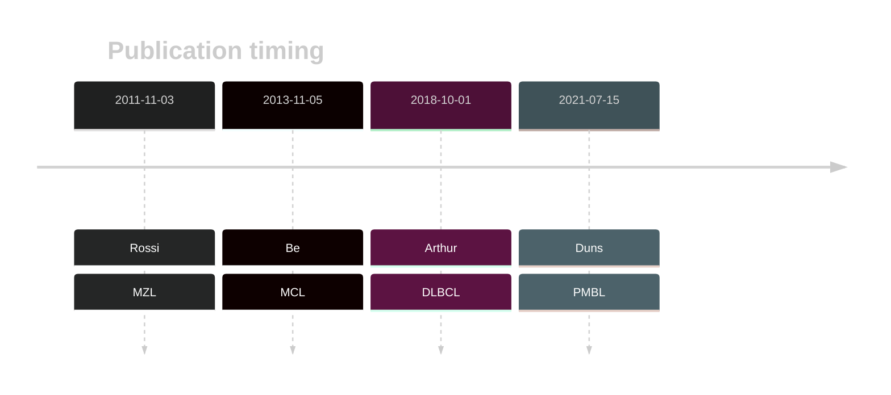

# BIRC3
## History

## Relevance tier by entity

|Entity|Tier|Description                              |
|:------:|:----:|-----------------------------------------|
||2|relevance in PMBL/cHL/GZL not firmly established|
||1|high-confidence MZL gene|
| |2-a | aSHM target; Although recurrent, the relevance of mutations in DLBCL is tenuous |
|   |1-a | aSHM target and high-confidence MCL gene                 |

## Mutation incidence in large patient cohorts (GAMBL reanalysis)

|Entity|source        |frequency (%)|
|:------:|:--------------:|:-------------:|
|DLBCL |GAMBL genomes |1.53         |
|DLBCL |Schmitz cohort|1.91         |
|DLBCL |Reddy cohort  |1.30         |
|DLBCL |Chapuy cohort |1.71         |
|MCL   |GAMBL genomes |7.11         |

## Mutation pattern and selective pressure estimates

|Entity|aSHM|Significant selection|dN/dS (missense)|dN/dS (nonsense)|
|:------:|:----:|:---------------------:|:----------------:|:----------------:|
|BL    |Yes |No                   |0.000           |0               |
|DLBCL |Yes |No                   |1.404           |0               |
|FL    |Yes |No                   |2.427           |0               |

## aSHM regions

|chr_name|hg19_start|hg19_end |region                                                                                      |regulatory_comment|
|:--------:|:----------:|:---------:|:--------------------------------------------------------------------------------------------:|:------------------:|
|chr11   |102188170 |102190077|[TSS](https://genome.ucsc.edu/s/rdmorin/GAMBL%20hg19?position=chr11%3A102188170%2D102190077)|active_promoter   |

> [!NOTE]
> First described in DLBCL in 2018 by [Arthur SE](https://pubmed.ncbi.nlm.nih.gov/30275490). First described in MCL in 2013 by [Beà S](https://pubmed.ncbi.nlm.nih.gov/24145436)

View coding variants in ProteinPaint [hg19](https://morinlab.github.io/LLMPP/GAMBL/BIRC3_protein.html)  or [hg38](https://morinlab.github.io/LLMPP/GAMBL/BIRC3_protein_hg38.html)

View all variants in GenomePaint [hg19](https://morinlab.github.io/LLMPP/GAMBL/BIRC3.html)  or [hg38](https://morinlab.github.io/LLMPP/GAMBL/BIRC3_hg38.html)

## BIRC3 Expression

<!-- ORIGIN: rossiAlterationBIRC3Multiple2011a -->
<!-- PMBL: dunsCharacterizationDLBCLPMBL2021b -->
<!-- MZL: rossiAlterationBIRC3Multiple2011a -->
<!-- MCL: beaLandscapeSomaticMutations2013 -->
<!-- DLBCL: arthurGenomewideDiscoverySomatic2018 -->
## References
1.  Rossi D, Deaglio S, Dominguez-Sola D, Rasi S, Vaisitti T, Agostinelli C, Spina V, Bruscaggin A, Monti S, Cerri M, Cresta S, Fangazio M, Arcaini L, Lucioni M, Marasca R, Thieblemont C, Capello D, Facchetti F, Kwee I, Pileri SA, Foà R, Bertoni F, Dalla-Favera R, Pasqualucci L, Gaidano G. Alteration of BIRC3 and multiple other NF-κB pathway genes in splenic marginal zone lymphoma. Blood. 2011 Nov 3;118(18):4930–4934. PMID: 21881048
2.  Beà S, Valdés-Mas R, Navarro A, Salaverria I, Martín-Garcia D, Jares P, Giné E, Pinyol M, Royo C, Nadeu F, Conde L, Juan M, Clot G, Vizán P, Croce LD, Puente DA, López-Guerra M, Moros A, Roue G, Aymerich M, Villamor N, Colomo L, Martínez A, Valera A, Martín-Subero JI, Amador V, Hernández L, Rozman M, Enjuanes A, Forcada P, Muntañola A, Hartmann EM, Calasanz MJ, Rosenwald A, Ott G, Hernández-Rivas JM, Klapper W, Siebert R, Wiestner A, Wilson WH, Colomer D, López-Guillermo A, López-Otín C, Puente XS, Campo E. Landscape of somatic mutations and clonal evolution in mantle cell lymphoma. PNAS. 2013 Nov 5;110(45):18250–18255. PMID: 24145436
3.  Arthur SE, Jiang A, Grande BM, Alcaide M, Cojocaru R, Rushton CK, Mottok A, Hilton LK, Lat PK, Zhao EY, Culibrk L, Ennishi D, Jessa S, Chong L, Thomas N, Pararajalingam P, Meissner B, Boyle M, Davidson J, Bushell KR, Lai D, Farinha P, Slack GW, Morin GB, Shah S, Sen D, Jones SJM, Mungall AJ, Gascoyne RD, Audas TE, Unrau P, Marra MA, Connors JM, Steidl C, Scott DW, Morin RD. Genome-wide discovery of somatic regulatory variants in diffuse large B-cell lymphoma. Nat Commun. 2018 Oct 1;9(1):4001. PMCID: PMC6167379
4.  Duns G, Viganò E, Ennishi D, Sarkozy C, Hung SS, Chavez E, Takata K, Rushton C, Jiang A, Ben-Neriah S, Woolcock BW, Slack GW, Hsi ED, Craig JW, Hilton LK, Shah SP, Farinha P, Mottok A, Gascoyne RD, Morin RD, Savage KJ, Scott DW, Steidl C. Characterization of DLBCL with a PMBL gene expression signature. Blood. 2021 Jul 15;138(2):136–148. PMID: 33684939
