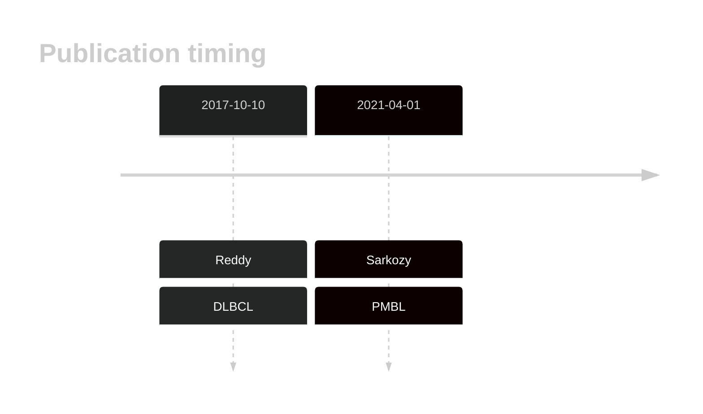

# BIRC6

## Overview
BIRC6, as a negative regulator of non-canonical NF-κB signaling, is implicated in lymphomagenesis. Mutations in the BIRC6 have been found in DLBCL and grey zone lymphoma (GZL).1,2 
## History

## Relevance tier by entity

|Entity|Tier|Description                           |
|:------:|:----:|--------------------------------------|
||1|high-confidence PMBL/cHL/GZL gene|
|   |1   |high-confidence DLBCL gene            |
|      |1   |high-confidence FL gene               |
|    |2   |relevance in BL not firmly established|

## Mutation incidence in large patient cohorts (GAMBL reanalysis)

|Entity|source               |frequency (%)|
|:------:|:---------------------:|:-------------:|
|DLBCL |GAMBL genomes        | 7.27        |
|DLBCL |Schmitz cohort       |10.00        |
|DLBCL |Reddy cohort         | 6.41        |
|DLBCL |Chapuy cohort        | 4.70        |
|FL    |GAMBL genomes        | 3.70        |
|BL    |GAMBL genomes+capture| 6.00        |
|BL    |Thomas cohort        | 3.80        |
|BL    |Panea cohort         |14.90        |

## Mutation pattern and selective pressure estimates

|Entity|aSHM|Significant selection|dN/dS (missense)|dN/dS (nonsense)|
|:------:|:----:|:---------------------:|:----------------:|:----------------:|
|BL    |No  |No                   |0.862           |1.339           |
|DLBCL |No  |No                   |1.795           |5.011           |
|FL    |No  |No                   |2.997           |7.132           |

 ## BIRC6 Hotspots

| Chromosome |Coordinate (hg19) | ref>alt | HGVSp | 
 | :---:| :---: | :--: | :---: |
| chr2 | 32740138 | T>A | C3550* |

View coding variants in ProteinPaint [hg19](https://morinlab.github.io/LLMPP/GAMBL/BIRC6_protein.html)  or [hg38](https://morinlab.github.io/LLMPP/GAMBL/BIRC6_protein_hg38.html)

View all variants in GenomePaint [hg19](https://morinlab.github.io/LLMPP/GAMBL/BIRC6.html)  or [hg38](https://morinlab.github.io/LLMPP/GAMBL/BIRC6_hg38.html)

## References
1. *Reddy A, Zhang J, Davis NS, Moffitt AB, Love CL, Waldrop A, Leppa S, Pasanen A, Meriranta L, Karjalainen-Lindsberg ML, Nørgaard P, Pedersen M, Gang AO, Høgdall E, Heavican TB, Lone W, Iqbal J, Qin Q, Li G, Kim SY, Healy J, Richards KL, Fedoriw Y, Bernal-Mizrachi L, Koff JL, Staton AD, Flowers CR, Paltiel O, Goldschmidt N, Calaminici M, Clear A, Gribben J, Nguyen E, Czader MB, Ondrejka SL, Collie A, Hsi ED, Tse E, Au-Yeung RKH, Kwong YL, Srivastava G, Choi WWL, Evens AM, Pilichowska M, Sengar M, Reddy N, Li S, Chadburn A, Gordon LI, Jaffe ES, Levy S, Rempel R, Tzeng T, Happ LE, Dave T, Rajagopalan D, Datta J, Dunson DB, Dave SS. Genetic and Functional Drivers of Diffuse Large B Cell Lymphoma. Cell. 2017 Oct;171(2):481-494.e15.* 

2. *Sarkozy C, Hung SS, Chavez EA, Duns G, Takata K, Chong LC, Aoki T, Jiang A, Miyata-Takata T, Telenius A, Slack GW, Molina TJ, Ben-Neriah S, Farinha P, Dartigues P, Damotte D, Mottok A, Salles GA, Casasnovas RO, Savage KJ, Laurent C, Scott DW, Traverse-Glehen A, Steidl C. Mutational landscape of gray zone lymphoma. Blood. 2021 Apr 1;137(13):1765-1776. doi: 10.1182/blood.2020007507. PMID: 32961552.*

## BIRC6 Expression

<!-- ORIGIN: reddyGeneticFunctionalDrivers2017 -->
<!-- DLBCL: reddyGeneticFunctionalDrivers2017 -->
<!-- PMBL: sarkozyMutationalLandscapeGray2021a -->
