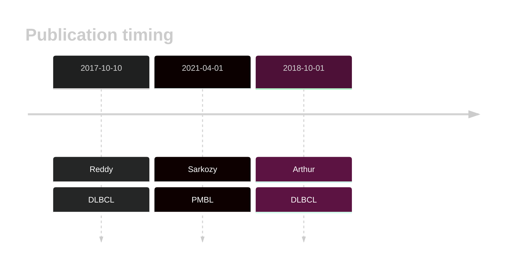
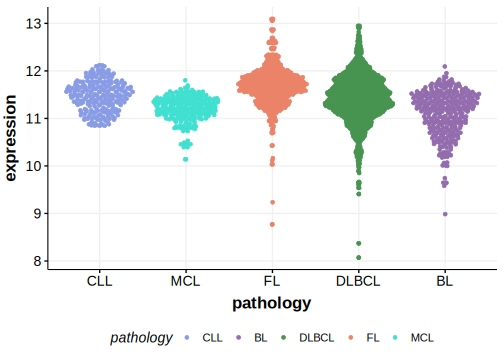

# BIRC6

## Overview
BIRC6, as a negative regulator of non-canonical NF-κB signaling, is implicated in lymphomagenesis. Mutations in the BIRC6 have been found in DLBCL and grey zone lymphoma (GZL).1,2 

## History

## Relevance tier by entity

|Entity|Tier|Description                           |
|:------:|:----:|--------------------------------------|
||1|high-confidence PMBL/cHL/GZL gene [@sarkozyMutationalLandscapeGray2021]|
|   |1   |high-confidence DLBCL gene          [@reddyGeneticFunctionalDrivers2017; @arthurGenomewideDiscoverySomatic2018]|
|      |1   |high-confidence FL gene               |

## Mutation incidence in large patient cohorts (GAMBL reanalysis)

|Entity|source               |frequency (%)|
|:------:|:---------------------:|:-------------:|
|DLBCL |GAMBL genomes        | 7.27        |
|DLBCL |Schmitz cohort       |10.00        |
|DLBCL |Reddy cohort         | 6.41        |
|DLBCL |Chapuy cohort        | 4.70        |
|FL    |GAMBL genomes        | 3.70        |
|BL    |GAMBL genomes+capture| 6.00        |
|BL    |Thomas cohort        | 3.80        |
|BL    |Panea cohort         |14.90        |

## Mutation pattern and selective pressure estimates

|Entity|aSHM|Significant selection|dN/dS (missense)|dN/dS (nonsense)|
|:------:|:----:|:---------------------:|:----------------:|:----------------:|
|BL    |No  |No                   |0.862           |1.339           |
|DLBCL |No  |No                   |1.795           |5.011           |
|FL    |No  |No                   |2.997           |7.132           |

## BIRC6 Hotspots

| Chromosome |Coordinate (hg19) | ref>alt | HGVSp | 
 | :---:| :---: | :--: | :---: |
| chr2 | 32740138 | T>A | C3550* |

View coding variants in ProteinPaint [hg19](https://morinlab.github.io/LLMPP/GAMBL/BIRC6_protein.html)  or [hg38](https://morinlab.github.io/LLMPP/GAMBL/BIRC6_protein_hg38.html)

View all variants in GenomePaint [hg19](https://morinlab.github.io/LLMPP/GAMBL/BIRC6.html)  or [hg38](https://morinlab.github.io/LLMPP/GAMBL/BIRC6_hg38.html)

## BIRC6 Expression

<!-- ORIGIN: reddyGeneticFunctionalDrivers2017 -->
<!-- DLBCL: reddyGeneticFunctionalDrivers2017 -->
<!-- PMBL: sarkozyMutationalLandscapeGray2021a -->

## References

