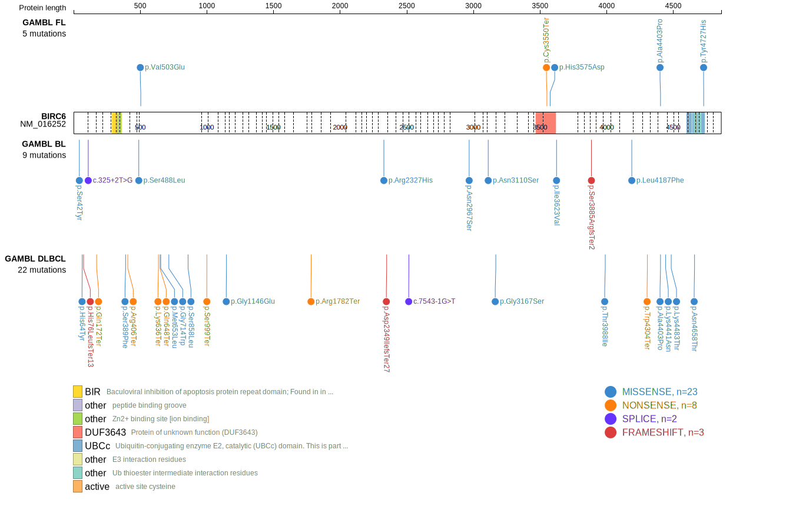
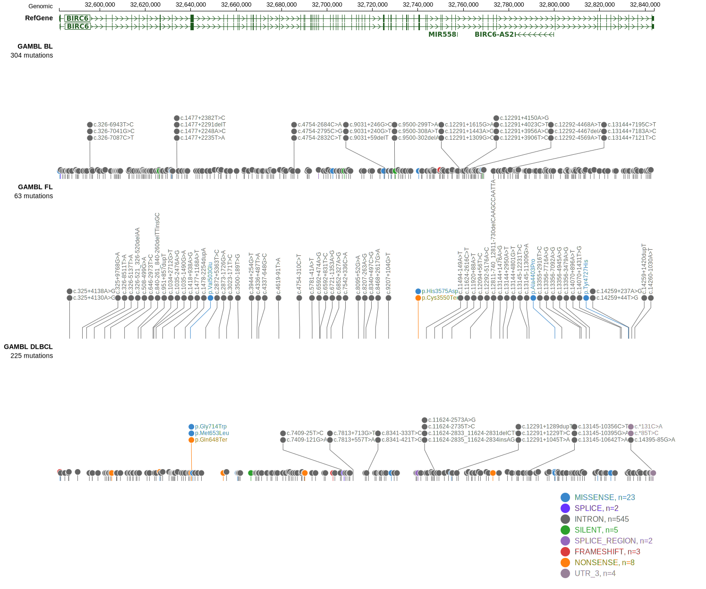

# [BIRC6]

## Mutation tier

|Entity|Tier|Description                           |
|:------:|:----:|--------------------------------------|
|BL    |2   |relevance in BL not firmly established|
|DLBCL |1   |high-confidence DLBCL gene            |
|FL    |1   |high-confidence FL gene               |
## Mutation incidence

|Entity|source               |frequency (%)|
|:------:|:---------------------:|:-------------:|
|BL    |GAMBL genomes+capture| 6.00        |
|BL    |Thomas cohort        | 3.80        |
|BL    |Panea cohort         |14.90        |
|DLBCL |GAMBL genomes        | 7.27        |
|DLBCL |Schmitz cohort       |10.00        |
|DLBCL |Reddy cohort         | 6.40        |
|DLBCL |Chapuy cohort        | 4.70        |
|FL    |GAMBL genomes        | 3.70        |

## Mutation pattern

|Entity|aSHM|Significant selection|dN/dS (missense)|dN/dS (nonsense)|
|:------:|:----:|:---------------------:|:----------------:|:----------------:|
|BL    |No  |No                   |0.862           |1.339           |
|DLBCL |No  |No                   |1.795           |5.011           |
|FL    |No  |No                   |2.997           |7.132           |

View coding variants in ProteinPaint [hg19](https://www.bcgsc.ca/downloads/morinlab/GAMBL/test/genes/BIRC6_protein.html)  or [hg38](https://www.bcgsc.ca/downloads/morinlab/GAMBL/test/genes/BIRC6_protein_hg38.html)

View all variants in GenomePaint [hg19](https://www.bcgsc.ca/downloads/morinlab/GAMBL/test/genes/BIRC6.html)  or [hg38](https://www.bcgsc.ca/downloads/morinlab/GAMBL/test/genes/BIRC6_hg38.html)

