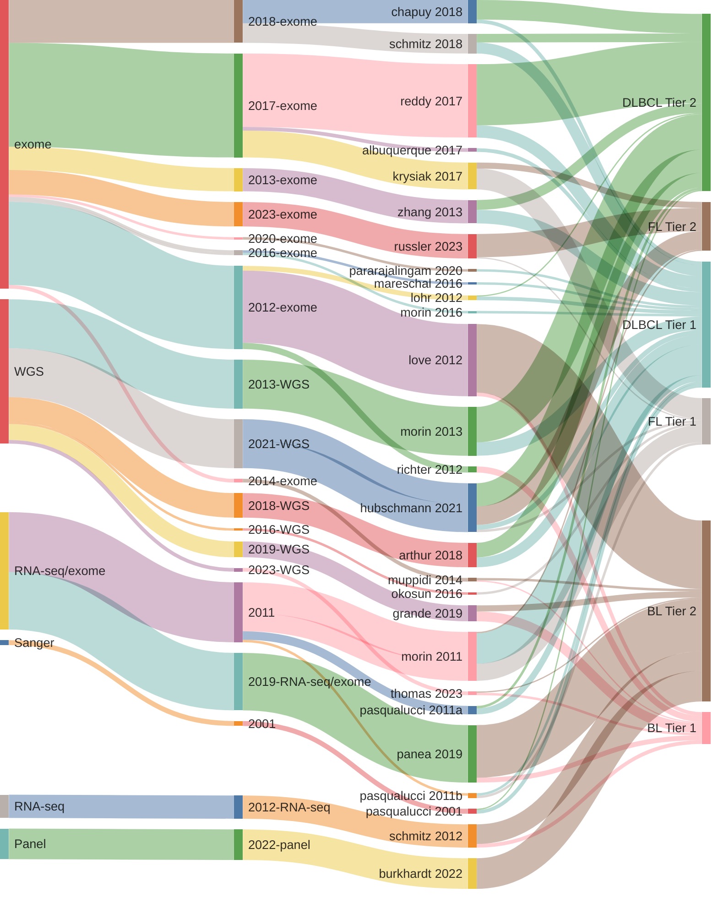

```mermaid


---
config:
  sankey:
    showValues: false
    linkColor: target
    width: 800
    height: 1000
    nodeAlignment: right
---
sankey-beta
Sanger, 2001, 4
2001, pasqualucci 2001, 4
pasqualucci 2001, DLBCL Tier 1, 3
pasqualucci 2001, DLBCL Tier 2, 1

RNA-seq/exome, 2011, 49
2011, morin 2011, 25
morin 2011, DLBCL Tier 1, 25
2011, morin 2011, 15
morin 2011, FL Tier 2, 1
morin 2011, FL Tier 1, 14
2011, pasqualucci 2011a, 7
pasqualucci 2011a, DLBCL Tier 1, 5
pasqualucci 2011a, DLBCL Tier 2, 2
2011, pasqualucci 2011b, 2
pasqualucci 2011b, FL Tier 1, 2
pasqualucci 2011b, DLBCL Tier 1, 2

exome, 2012-exome, 68
2012-exome, richter 2012, 5
2012-exome, lohr 2012, 4
2012-exome, love 2012, 59

richter 2012, BL Tier 1, 5
lohr 2012, DLBCL Tier 2, 1
lohr 2012, DLBCL Tier 1, 3
love 2012, BL Tier 1, 3
love 2012, BL Tier 2, 56

RNA-seq, 2012-RNA-seq, 19
2012-RNA-seq, schmitz 2012, 19
schmitz 2012, BL Tier 1, 3
schmitz 2012, BL Tier 2, 16

WGS, 2013-WGS, 40
2013-WGS, morin 2013, 40
morin 2013, DLBCL Tier 2, 29
morin 2013, DLBCL Tier 1, 11

exome, 2013-exome, 19
2013-exome, zhang 2013, 19
zhang 2013, DLBCL Tier 1, 11
zhang 2013, DLBCL Tier 2, 8

exome, 2014-exome, 3
2014-exome, muppidi 2014, 3
muppidi 2014, BL Tier 1, 1
muppidi 2014, BL Tier 2, 2

exome, 2016-exome, 2
2016-exome, mareschal 2016, 2
mareschal 2016, DLBCL Tier 1, 2

WGS, 2016-WGS, 2
2016-WGS, okosun 2016, 2
okosun 2016, FL Tier 1, 2

exome, 2016-exome, 2
2016-exome, morin 2016, 2
morin 2016, DLBCL Tier 1, 2

exome, 2017-exome, 85
2017-exome, krysiak 2017, 22
krysiak 2017, FL Tier 2, 5
krysiak 2017, FL Tier 1, 17

2017-exome, albuquerque 2017, 3
albuquerque 2017, DLBCL Tier 1, 3

2017-exome, reddy 2017, 60
reddy 2017, DLBCL Tier 2, 50
reddy 2017, DLBCL Tier 1, 10

exome, 2018-exome, 35
2018-exome, schmitz 2018, 16
schmitz 2018, DLBCL Tier 2, 7
schmitz 2018, DLBCL Tier 1, 9

2018-exome, chapuy 2018, 19
chapuy 2018, DLBCL Tier 2, 16
chapuy 2018, DLBCL Tier 1, 3

WGS, 2018-WGS, 20
2018-WGS, arthur 2018, 20
arthur 2018, DLBCL Tier 2, 12
arthur 2018, DLBCL Tier 1, 8

RNA-seq/exome,2019-RNA-seq/exome,47
2019-RNA-seq/exome, panea 2019, 47
panea 2019, BL Tier 2, 43
panea 2019, BL Tier 1, 4

WGS,2019-WGS,13
2019-WGS, grande 2019, 13
grande 2019, BL Tier 1, 8
grande 2019, BL Tier 2, 5

exome, 2020-exome, 2
2020-exome, pararajalingam 2020, 2
pararajalingam 2020, DLBCL Tier 1, 2

WGS, 2021-WGS, 40
2021-WGS, hubschmann 2021, 17
2021-WGS, hubschmann 2021, 23
hubschmann 2021, FL Tier 2, 15
hubschmann 2021, FL Tier 1, 2
hubschmann 2021, DLBCL Tier 1, 4
hubschmann 2021, DLBCL Tier 2, 19

exome, 2023-exome, 20
2023-exome, russler 2023, 20
russler 2023, FL Tier 1, 1
russler 2023, FL Tier 2, 19

Panel, 2022-panel, 25
2022-panel, burkhardt 2022, 25
burkhardt 2022, BL Tier 2, 25

WGS, 2023-WGS, 3
2023-WGS, thomas 2023, 3
thomas 2023, BL Tier 2, 1
thomas 2023, BL Tier 1, 2
```