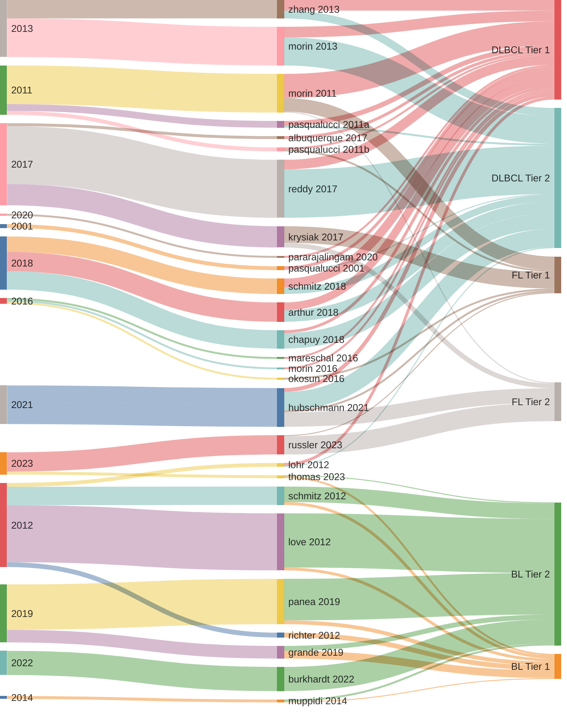

```mermaid


---
config:
  sankey:
    showValues: false
    linkColor: target
    width: 800
    height: 1000
---
sankey-beta

2001, pasqualucci 2001, 4
pasqualucci 2001, DLBCL Tier 1, 3
pasqualucci 2001, DLBCL Tier 2, 1

2011, morin 2011, 25
2011, pasqualucci 2011a, 7
2011, pasqualucci 2011b, 2
morin 2011, DLBCL Tier 1, 25
pasqualucci 2011b, FL Tier 1, 2

pasqualucci 2011a, DLBCL Tier 1, 5
pasqualucci 2011a, DLBCL Tier 2, 2
2011, morin 2011, 15
morin 2011, FL Tier 2, 1
morin 2011, FL Tier 1, 14

pasqualucci 2011b, DLBCL Tier 1, 2
2011, pasqualucci 2011b, 2
richter 2012, BL Tier 1, 5

2012, schmitz 2012, 19
schmitz 2012, BL Tier 1, 3
schmitz 2012, BL Tier 2, 16
lohr 2012, DLBCL Tier 2, 1
lohr 2012, DLBCL Tier 1, 3

2012, richter 2012, 5
2012, love 2012, 59
love 2012, BL Tier 1, 3
love 2012, BL Tier 2, 56
2012, lohr 2012, 4

morin 2013, DLBCL Tier 2, 29
morin 2013, DLBCL Tier 1, 11
zhang 2013, DLBCL Tier 1, 11
zhang 2013, DLBCL Tier 2, 8
2013, zhang 2013, 19
2013, morin 2013, 40

2014, muppidi 2014, 3
muppidi 2014, BL Tier 1, 1
muppidi 2014, BL Tier 2, 2
2016, morin 2016, 2
mareschal 2016, DLBCL Tier 1, 2
2016, mareschal 2016, 2
2016, okosun 2016, 2
okosun 2016, FL Tier 1, 2

morin 2016, DLBCL Tier 1, 2

krysiak 2017, FL Tier 2, 5
krysiak 2017, FL Tier 1, 17
2017, krysiak 2017, 22

albuquerque 2017, DLBCL Tier 1, 3
2017, albuquerque 2017, 3
2017, reddy 2017, 60
reddy 2017, DLBCL Tier 2, 50
reddy 2017, DLBCL Tier 1, 10

2018, schmitz 2018, 16
2018, arthur 2018, 20

2018, chapuy 2018, 19
chapuy 2018, DLBCL Tier 2, 16
chapuy 2018, DLBCL Tier 1, 3


schmitz 2018, DLBCL Tier 2, 7
schmitz 2018, DLBCL Tier 1, 9


arthur 2018, DLBCL Tier 2, 12
arthur 2018, DLBCL Tier 1, 8

2019, panea 2019, 47
panea 2019, BL Tier 2, 43
panea 2019, BL Tier 1, 4
2019, grande 2019, 13
grande 2019, BL Tier 1, 8
grande 2019, BL Tier 2, 5
2020, pararajalingam 2020, 2


pararajalingam 2020, DLBCL Tier 1, 2
2021, hubschmann 2021, 17
2023, russler 2023, 20
hubschmann 2021, FL Tier 2, 15
hubschmann 2021, FL Tier 1, 2
hubschmann 2021, DLBCL Tier 1, 4
hubschmann 2021, DLBCL Tier 2, 19


2021, hubschmann 2021, 23

russler 2023, FL Tier 1, 1
russler 2023, FL Tier 2, 19

2022, burkhardt 2022, 25


2023, thomas 2023, 3


burkhardt 2022, BL Tier 2, 25

thomas 2023, BL Tier 2, 1
thomas 2023, BL Tier 1, 2
```