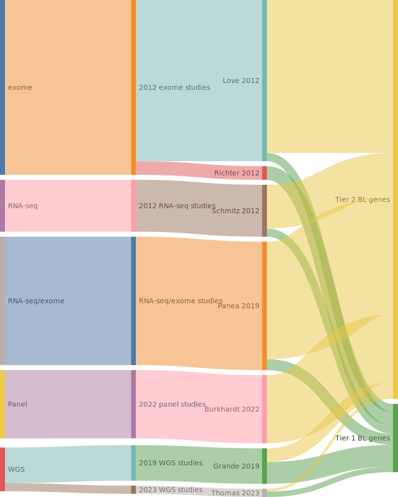

## Origins of BL genes

## Tier 1, high-confidence BL genes

### *32 total*

|Gene|Summary| First BL study | Other entities | QC result |
|:-:|:--:|:-:|:-|:-|
|[ARID1A](ARID1A)|Tier 1 GE[@loveGeneticLandscapeMutations2012], FE[@barisicARID1AOrchestratesSWI2024]|[Love et al](papers/loveGeneticLandscapeMutations2012)|[@krysiakRecurrentSomaticMutations2017; @rossiCodingGenomeSplenic2012; @wienandGenomicAnalysesFlowsorted2019; @zhangGeneticHeterogeneityDiffuse2013]||
|[BACH2](BACH2)|Tier 1 GE[@grandeGenomewideDiscoverySomatic2019]|[Grande et al](papers/grandeGenomewideDiscoverySomatic2019)|||
|[BCL6](BCL6)|Tier 1 GE[@loveGeneticLandscapeMutations2012], FE[@masclePointMutationsBCL62003], aSHM|[Love et al](papers/loveGeneticLandscapeMutations2012)|[@drevalGeneticSubdivisionsFollicular2023; @morinFrequentMutationHistonemodifying2011]|PASS|
|[BCL7A](BCL7A)|Tier 1 GE[@grandeGenomewideDiscoverySomatic2019], FE[@balinas-gaviraFrequentMutationsAminoterminal2020], aSHM|[Grande et al](papers/grandeGenomewideDiscoverySomatic2019)|[@krysiakRecurrentSomaticMutations2017; @morinFrequentMutationHistonemodifying2011; @reichelFlowSortingExome2015]||
|[BMP7](BMP7)|Tier 1 GE[@paneaWholeGenomeLandscape2019]|[Panea et al](papers/paneaWholeGenomeLandscape2019)|||
|[CCND3](CCND3)|Tier 1 GE[@richterRecurrentMutationID32012], FE[@schmitzBurkittLymphomaPathogenesis2012]|[Richter et al](papers/richterRecurrentMutationID32012)|[@deschGenotypingCirculatingTumor2020; @jalladesExomeSequencingIdentifies2017; @morinFrequentMutationHistonemodifying2011]||
|[CHD8](CHD8)|Tier 1 GE[@grandeGenomewideDiscoverySomatic2019]|[Grande et al](papers/grandeGenomewideDiscoverySomatic2019)|||
|[CREBBP](CREBBP)|Tier 1 GE[@loveGeneticLandscapeMutations2012], FE[@pasqualucciInactivatingMutationsAcetyltransferase2011]|[Love et al](papers/loveGeneticLandscapeMutations2012)|[@dunsCharacterizationDLBCLPMBL2021; @parryWholeExomeSequencing2013; @pasqualucciInactivatingMutationsAcetyltransferase2011]|PASS|
|[DDX3X](DDX3X)|Tier 1 GE[@schmitzBurkittLymphomaPathogenesis2012], FE[@gongSequentialInverseDysregulation2021]|[Schmitz et al](papers/schmitzBurkittLymphomaPathogenesis2012)|[@mottokIntegrativeGenomicAnalysis2019; @reddyGeneticFunctionalDrivers2017]||
|[FBXO11](FBXO11)|Tier 1 GE[@richterRecurrentMutationID32012], FE[@duanFBXO11TargetsBCL62011]|[Richter et al](papers/richterRecurrentMutationID32012)|[@arthurGenomewideDiscoverySomatic2018; @parryWholeExomeSequencing2013]||
|[FOXO1](FOXO1)|Tier 1 GE[@schmitzBurkittLymphomaPathogenesis2012], FE[@trinhAnalysisFOXO1Mutations]|[Schmitz et al](papers/schmitzBurkittLymphomaPathogenesis2012)|[@dunsCharacterizationDLBCLPMBL2021; @morinFrequentMutationHistonemodifying2011]||
|[GNA13](GNA13)|Tier 1 GE[@loveGeneticLandscapeMutations2012], FE[@muppidiLossSignalingGa132014]|[Love et al](papers/loveGeneticLandscapeMutations2012)|[@morinFrequentMutationHistonemodifying2011; @reichelFlowSortingExome2015]||
|[GNAI2](GNAI2)|Tier 1 GE[@grandeGenomewideDiscoverySomatic2019], FE[@muppidiLossSignalingGa132014]|[Grande et al](papers/grandeGenomewideDiscoverySomatic2019)|[@drevalGeneticSubdivisionsFollicular2023; @morinMutationalStructuralAnalysis2013]||
|[HIST1H1E](HIST1H1E)|Tier 1 GE[@grandeGenomewideDiscoverySomatic2019], aSHM|[Grande et al](papers/grandeGenomewideDiscoverySomatic2019)|[@krysiakRecurrentSomaticMutations2017; @lohrDiscoveryPrioritizationSomatic2012; @reichelFlowSortingExome2015]||
|[HNRNPU](HNRNPU)|Tier 1 GE[@paneaWholeGenomeLandscape2019]|[Panea et al](papers/paneaWholeGenomeLandscape2019)|[@reddyGeneticFunctionalDrivers2017]||
|[ID3](ID3)|Tier 1 GE[@richterRecurrentMutationID32012]|[Richter et al](papers/richterRecurrentMutationID32012)|[@schmitzGeneticsPathogenesisDiffuse2018; @spinaGeneticsNodalMarginal2016]||
|[KMT2D](KMT2D)|Tier 1 GE[@grandeGenomewideDiscoverySomatic2019], FE[@zhangDisruptionKMT2DPerturbs2015]|[Grande et al](papers/grandeGenomewideDiscoverySomatic2019)|[@beaLandscapeSomaticMutations2013; @deschGenotypingCirculatingTumor2020; @morinFrequentMutationHistonemodifying2011; @rossiCodingGenomeSplenic2012]||
|[MYC](MYC)|Tier 1 GE[@johnstonCmycHypermutationBurkitt1992], FE[@freieGermlinePointMutation2024], aSHM|[Johnston et al](papers/johnstonCmycHypermutationBurkitt1992)|[@dunsCharacterizationDLBCLPMBL2021; @jalladesExomeSequencingIdentifies2017; @pasqualucciHypermutationMultipleProtooncogenes2001]||
|[P2RY8](P2RY8)|Tier 1 GE[@muppidiLossSignalingGa132014], FE[@muppidiLossSignalingGa132014]|[Muppidi et al](papers/muppidiLossSignalingGa132014)|[@drevalGeneticSubdivisionsFollicular2023; @lohrDiscoveryPrioritizationSomatic2012]||
|[PCBP1](PCBP1)|Tier 1 GE[@schmitzBurkittLymphomaPathogenesis2012]|[Schmitz et al](papers/schmitzBurkittLymphomaPathogenesis2012)|||
|[PHF6](PHF6)|Tier 1 GE[@thomasGeneticSubgroupsInform2023]|[Thomas et al](papers/thomasGeneticSubgroupsInform2023)|[@reddyGeneticFunctionalDrivers2017]||
|[PTEN](PTEN)|Tier 1 GE[@loveGeneticLandscapeMutations2012], FE[@pfeiferPTENLossDefines2013]|[Love et al](papers/loveGeneticLandscapeMutations2012)|[@reddyGeneticFunctionalDrivers2017]||
|[RFX7](RFX7)|Tier 1 GE[@grandeGenomewideDiscoverySomatic2019], FE[@weberPiggyBacTransposonTools2019]|[Grande et al](papers/grandeGenomewideDiscoverySomatic2019)|[@arthurGenomewideDiscoverySomatic2018]||
|[RHOA](RHOA)|Tier 1 GE[@richterRecurrentMutationID32012], FE[@ohayreInactivatingMutationsGNA132016]|[Richter et al](papers/richterRecurrentMutationID32012)|[@zhangGeneticHeterogeneityDiffuse2013]||
|[SIN3A](SIN3A)|Tier 1 GE[@grandeGenomewideDiscoverySomatic2019]|[Grande et al](papers/grandeGenomewideDiscoverySomatic2019)|[@chapuyMolecularSubtypesDiffuse2018; @rossiCodingGenomeSplenic2012]||
|[SMARCA4](SMARCA4)|Tier 1 GE[@richterRecurrentMutationID32012], FE[@fernandoFunctionalCharacterizationSMARCA42020]|[Richter et al](papers/richterRecurrentMutationID32012)|[@krysiakRecurrentSomaticMutations2017; @nadeuGenomicEpigenomicInsights2020b; @reddyGeneticFunctionalDrivers2017]||
|[TCF3](TCF3)|Tier 1 GE[@schmitzBurkittLymphomaPathogenesis2012]|[Schmitz et al](papers/schmitzBurkittLymphomaPathogenesis2012)|||
|[TCL1A](TCL1A)|Tier 1 GE[@grandeGenomewideDiscoverySomatic2019], aSHM|[Grande et al](papers/grandeGenomewideDiscoverySomatic2019)|[@reddyGeneticFunctionalDrivers2017]||
|[TFAP4](TFAP4)|Tier 1 GE[@grandeGenomewideDiscoverySomatic2019]|[Grande et al](papers/grandeGenomewideDiscoverySomatic2019)|||
|[TP53](TP53)|Tier 1 GE[@wildaInactivationARFMDM2p53Pathway2004], FE[@katoUnderstandingFunctionstructureFunctionmutation2003]|[Wilda et al](papers/wildaInactivationARFMDM2p53Pathway2004)|[@beaLandscapeSomaticMutations2013; @morinFrequentMutationHistonemodifying2011; @rossiCodingGenomeSplenic2012; @tiacciPervasiveMutationsJAKSTAT2018]||
|[USP7](USP7)|Tier 1 GE[@grandeGenomewideDiscoverySomatic2019]|[Grande et al](papers/grandeGenomewideDiscoverySomatic2019)|[@arthurGenomewideDiscoverySomatic2018]||
|[WNK1](WNK1)|Tier 1 GE[@thomasGeneticSubgroupsInform2023]|[Thomas et al](papers/thomasGeneticSubgroupsInform2023)|[@hubschmannMutationalMechanismsShaping2021; @jalladesExomeSequencingIdentifies2017]||

## Tier 2, low-confidence BL genes

### *72 total*

|Gene|Summary| First BL study | Other entities | QC result |
|:-:|:--:|:-:|:-|:-|
|[ADAMTS5](ADAMTS5)|Tier 2 GE[@burkhardtClinicalRelevanceMolecular2022]|[Burkhardt et al](papers/burkhardtClinicalRelevanceMolecular2022)|||
|[ADNP](ADNP)|Tier 2 GE[@burkhardtClinicalRelevanceMolecular2022]|[Burkhardt et al](papers/burkhardtClinicalRelevanceMolecular2022)|||
|[AGO4](AGO4)|Tier 2 GE[@burkhardtClinicalRelevanceMolecular2022]|[Burkhardt et al](papers/burkhardtClinicalRelevanceMolecular2022)|||
|[ARHGEF1](ARHGEF1)|Tier 2 GE[@muppidiLossSignalingGa132014]|[Muppidi et al](papers/muppidiLossSignalingGa132014)|||
|[BCL2](BCL2)|Tier 2 GE[@burkhardtClinicalRelevanceMolecular2022], aSHM|[Burkhardt et al](papers/burkhardtClinicalRelevanceMolecular2022)|[@morinFrequentMutationHistonemodifying2011; @sarkozyMutationalLandscapeGray2021; @tanakaFrequentIncidenceSomatic1992]||
|[BTG1](BTG1)|Tier 2 GE[@burkhardtClinicalRelevanceMolecular2022], FE[@almasmoumFrequentLossBTG12021], aSHM|[Burkhardt et al](papers/burkhardtClinicalRelevanceMolecular2022)|[@drevalGeneticSubdivisionsFollicular2023; @morinFrequentMutationHistonemodifying2011; @sarkozyMutationalLandscapeGray2021]||
|[C16orf48](C16orf48)|Tier 2 GE[@schmitzBurkittLymphomaPathogenesis2012]|[Schmitz et al](papers/schmitzBurkittLymphomaPathogenesis2012)|||
|[CARD4](CARD4)|Tier 2 GE[@loveGeneticLandscapeMutations2012]|[Love et al](papers/loveGeneticLandscapeMutations2012)||PASS|
|[CCNF](CCNF)|Tier 2 GE[@abateDistinctViralMutational2015]|[Abate et al](papers/abateDistinctViralMutational2015)|[@zhangGeneticHeterogeneityDiffuse2013]||
|[CD79A](CD79A)|Tier 2 GE[@burkhardtClinicalRelevanceMolecular2022]|[Burkhardt et al](papers/burkhardtClinicalRelevanceMolecular2022)|[@rossiCodingGenomeSplenic2012]||
|[CD83](CD83)|Tier 2 GE[@paneaWholeGenomeLandscape2019], aSHM|[Panea et al](papers/paneaWholeGenomeLandscape2019)|[@dunsCharacterizationDLBCLPMBL2021; @morinMutationalStructuralAnalysis2013; @russler-germainMutationsAssociatedProgression2023]|PASS|
|[CDC73](CDC73)|Tier 2 GE[@loveGeneticLandscapeMutations2012]|[Love et al](papers/loveGeneticLandscapeMutations2012)|[@reddyGeneticFunctionalDrivers2017]|PASS|
|[CDKN2A](CDKN2A)|Tier 2 GE[@grandeGenomewideDiscoverySomatic2019], FE[@kannengiesserFunctionalStructuralGenetic2009]|[Grande et al](papers/grandeGenomewideDiscoverySomatic2019)|[@morinMutationalStructuralAnalysis2013; @spinaGeneticsNodalMarginal2016]||
|[CDKN2C](CDKN2C)|Tier 2 GE[@thomasGeneticSubgroupsInform2023]|[Thomas et al](papers/thomasGeneticSubgroupsInform2023)|||
|[CHD4](CHD4)|Tier 2 GE[@burkhardtClinicalRelevanceMolecular2022]|[Burkhardt et al](papers/burkhardtClinicalRelevanceMolecular2022)|||
|[CPXM2](CPXM2)|Tier 2 GE[@burkhardtClinicalRelevanceMolecular2022]|[Burkhardt et al](papers/burkhardtClinicalRelevanceMolecular2022)|||
|[CXCR4](CXCR4)|Tier 2 GE[@paneaWholeGenomeLandscape2019], FE[@zmajkovicovaGenotypephenotypeCorrelationsWHIM2022], aSHM|[Panea et al](papers/paneaWholeGenomeLandscape2019)|[@khodabakhshiRecurrentTargetsAberrant2012; @krysiakRecurrentSomaticMutations2017]|PASS|
|[DHCR7](DHCR7)|Tier 2 GE[@schmitzBurkittLymphomaPathogenesis2012]|[Schmitz et al](papers/schmitzBurkittLymphomaPathogenesis2012)|||
|[E2F2](E2F2)|Tier 2 GE[@burkhardtClinicalRelevanceMolecular2022]|[Burkhardt et al](papers/burkhardtClinicalRelevanceMolecular2022)|||
|[EBF1](EBF1)|Tier 2 GE[@thomasGeneticSubgroupsInform2023], FE[@ramirez-komoSpontaneousLossLineage2017], aSHM|[Thomas et al](papers/thomasGeneticSubgroupsInform2023)|[@bohleRoleEarlyBcell2013; @drevalGeneticSubdivisionsFollicular2023; @reichelFlowSortingExome2015]||
|[EDNRB](EDNRB)|Tier 2 GE[@burkhardtClinicalRelevanceMolecular2022]|[Burkhardt et al](papers/burkhardtClinicalRelevanceMolecular2022)|||
|[EHD1](EHD1)|Tier 2 GE[@thomasGeneticSubgroupsInform2023]|[Thomas et al](papers/thomasGeneticSubgroupsInform2023)|||
|[EIF4A1](EIF4A1)|Tier 2 GE[@paneaWholeGenomeLandscape2019]|[Panea et al](papers/paneaWholeGenomeLandscape2019)|||
|[ELP2](ELP2)|Tier 2 GE[@schmitzBurkittLymphomaPathogenesis2012]|[Schmitz et al](papers/schmitzBurkittLymphomaPathogenesis2012)|||
|[EPPK1](EPPK1)|Tier 2 GE[@paneaWholeGenomeLandscape2019]|[Panea et al](papers/paneaWholeGenomeLandscape2019)|||
|[ERAP1](ERAP1)|Tier 2 GE[@burkhardtClinicalRelevanceMolecular2022]|[Burkhardt et al](papers/burkhardtClinicalRelevanceMolecular2022)|||
|[EXOSC6](EXOSC6)|Tier 2 GE[@schmitzBurkittLymphomaPathogenesis2012]|[Schmitz et al](papers/schmitzBurkittLymphomaPathogenesis2012)|||
|[EZH2](EZH2)|Tier 2 GE[@loveGeneticLandscapeMutations2012], FE[@sneeringerCoordinatedActivitiesWildtype2010]|[Love et al](papers/loveGeneticLandscapeMutations2012)|[@morinSomaticMutationsAltering2010; @mottokIntegrativeGenomicAnalysis2019]|PASS|
|[FLYWCH1](FLYWCH1)|Tier 2 GE[@schmitzBurkittLymphomaPathogenesis2012]|[Schmitz et al](papers/schmitzBurkittLymphomaPathogenesis2012)|||
|[GGTLA4](GGTLA4)|Tier 2 GE[@loveGeneticLandscapeMutations2012]|[Love et al](papers/loveGeneticLandscapeMutations2012)||PASS|
|[GTSE1](GTSE1)|Tier 2 GE[@schmitzBurkittLymphomaPathogenesis2012]|[Schmitz et al](papers/schmitzBurkittLymphomaPathogenesis2012)|||
|[HIST1H3D](HIST1H3D)|Tier 2 GE[@paneaWholeGenomeLandscape2019]|[Panea et al](papers/paneaWholeGenomeLandscape2019)||PASS|
|[HIST1H3I](HIST1H3I)|Tier 2 GE[@paneaWholeGenomeLandscape2019]|[Panea et al](papers/paneaWholeGenomeLandscape2019)|[@krysiakRecurrentSomaticMutations2017]|PASS|
|[HIST1H4J](HIST1H4J)|Tier 2 GE[@paneaWholeGenomeLandscape2019]|[Panea et al](papers/paneaWholeGenomeLandscape2019)|[@mottokIntegrativeGenomicAnalysis2019]|PASS|
|[HLA-DQB1](HLA-DQB1)|Tier 2 GE[@burkhardtClinicalRelevanceMolecular2022]|[Burkhardt et al](papers/burkhardtClinicalRelevanceMolecular2022)|||
|[IGLL5](IGLL5)|Tier 2 GE[@paneaWholeGenomeLandscape2019], aSHM|[Panea et al](papers/paneaWholeGenomeLandscape2019)|[@chapuyMolecularSubtypesDiffuse2018; @deschGenotypingCirculatingTumor2020; @russler-germainMutationsAssociatedProgression2023]|PASS|
|[IKZF3](IKZF3)|Tier 2 GE[@paneaWholeGenomeLandscape2019], FE[@lazarianHotspotMutationTranscription2021]|[Panea et al](papers/paneaWholeGenomeLandscape2019)|[@morinFrequentMutationHistonemodifying2011]|PASS|
|[IRF8](IRF8)|Tier 2 GE[@paneaWholeGenomeLandscape2019], FE[@qiuIRF8mutantCellLymphoma2024], aSHM|[Panea et al](papers/paneaWholeGenomeLandscape2019)|[@morinFrequentMutationHistonemodifying2011; @mottokIntegrativeGenomicAnalysis2019]|PASS|
|[KANK2](KANK2)|Tier 2 GE[@schmitzBurkittLymphomaPathogenesis2012]|[Schmitz et al](papers/schmitzBurkittLymphomaPathogenesis2012)|||
|[KLHL26](KLHL26)|Tier 2 GE[@burkhardtClinicalRelevanceMolecular2022]|[Burkhardt et al](papers/burkhardtClinicalRelevanceMolecular2022)|||
|[KMT2C](KMT2C)|Tier 2 GE[@zhouSporadicEndemicBurkitt2019]|[Zhou et al](papers/zhouSporadicEndemicBurkitt2019)|[@sarkozyMutationalLandscapeGray2021; @zhangGeneticHeterogeneityDiffuse2013; @zhangGenomicLandscapeMantle2014]||
|[MCL1](MCL1)|Tier 2 GE[@paneaWholeGenomeLandscape2019]|[Panea et al](papers/paneaWholeGenomeLandscape2019)|[@dunsCharacterizationDLBCLPMBL2021; @reddyGeneticFunctionalDrivers2017]|PASS|
|[MIR142](MIR142)|Tier 2 GE[@grandeGenomewideDiscoverySomatic2019], FE[@trissalMIR142LossofFunctionMutations2018], aSHM|[Grande et al](papers/grandeGenomewideDiscoverySomatic2019)|[@kwanhianMicroRNA142Mutated202012]||
|[MKI67](MKI67)|Tier 2 GE[@schmitzBurkittLymphomaPathogenesis2012]|[Schmitz et al](papers/schmitzBurkittLymphomaPathogenesis2012)|[@russler-germainMutationsAssociatedProgression2023]||
|[MYO18A](MYO18A)|Tier 2 GE[@schmitzBurkittLymphomaPathogenesis2012]|[Schmitz et al](papers/schmitzBurkittLymphomaPathogenesis2012)|||
|[NBEAL1](NBEAL1)|Tier 2 GE[@loveGeneticLandscapeMutations2012]|[Love et al](papers/loveGeneticLandscapeMutations2012)||PASS|
|[NCOR2](NCOR2)|Tier 2 GE[@schmitzBurkittLymphomaPathogenesis2012]|[Schmitz et al](papers/schmitzBurkittLymphomaPathogenesis2012)|[@sarkozyMutationalLandscapeGray2021; @spinaGeneticsNodalMarginal2016]||
|[NOA1](NOA1)|Tier 2 GE[@burkhardtClinicalRelevanceMolecular2022b]|[Burkhardt et al](papers/burkhardtClinicalRelevanceMolecular2022b)|||
|[P2RY2](P2RY2)|Tier 2 GE[@loveGeneticLandscapeMutations2012]|[Love et al](papers/loveGeneticLandscapeMutations2012)||PASS|
|[PDCD11](PDCD11)|Tier 2 GE[@schmitzBurkittLymphomaPathogenesis2012]|[Schmitz et al](papers/schmitzBurkittLymphomaPathogenesis2012)|||
|[PIM1](PIM1)|Tier 2 GE[@burkhardtClinicalRelevanceMolecular2022], FE[@kuoRolePIM1Ibrutinibresistant2016], aSHM|[Burkhardt et al](papers/burkhardtClinicalRelevanceMolecular2022)|[@drevalGeneticSubdivisionsFollicular2023; @dunsCharacterizationDLBCLPMBL2021; @pasqualucciHypermutationMultipleProtooncogenes2001]||
|[PLCG2](PLCG2)|Tier 2 GE[@paneaWholeGenomeLandscape2019]|[Panea et al](papers/paneaWholeGenomeLandscape2019)|[@fanComprehensiveCharacterizationDriver2020]|PASS|
|[PPP6R2](PPP6R2)|Tier 2 GE[@burkhardtClinicalRelevanceMolecular2022]|[Burkhardt et al](papers/burkhardtClinicalRelevanceMolecular2022)|||
|[PREX1](PREX1)|Tier 2 GE[@burkhardtClinicalRelevanceMolecular2022]|[Burkhardt et al](papers/burkhardtClinicalRelevanceMolecular2022)|||
|[RANBP6](RANBP6)|Tier 2 GE[@loveGeneticLandscapeMutations2012]|[Love et al](papers/loveGeneticLandscapeMutations2012)||PASS|
|[REV3L](REV3L)|Tier 2 GE[@burkhardtClinicalRelevanceMolecular2022]|[Burkhardt et al](papers/burkhardtClinicalRelevanceMolecular2022)|||
|[RNF144B](RNF144B)|Tier 2 GE[@paneaWholeGenomeLandscape2019]|[Panea et al](papers/paneaWholeGenomeLandscape2019)||PASS|
|[RPL10](RPL10)|Tier 2 GE[@burkhardtClinicalRelevanceMolecular2022]|[Burkhardt et al](papers/burkhardtClinicalRelevanceMolecular2022)|||
|[S1PR2](S1PR2)|Tier 2 GE[@muppidiLossSignalingGa132014], FE[@muppidiLossSignalingGa132014], aSHM|[Muppidi et al](papers/muppidiLossSignalingGa132014)|[@drevalGeneticSubdivisionsFollicular2023; @morinFrequentMutationHistonemodifying2011]||
|[SAL3](SAL3)|Tier 2 GE[@burkhardtClinicalRelevanceMolecular2022]|[Burkhardt et al](papers/burkhardtClinicalRelevanceMolecular2022)|||
|[TET2](TET2)|Tier 2 GE[@thomasGeneticSubgroupsInform2023], FE[@asmarGenomewideProfilingIdentifies2013]|[Thomas et al](papers/thomasGeneticSubgroupsInform2023)|[@albuquerqueEnhancingKnowledgeDiscovery2017]||
|[TOP2A](TOP2A)|Tier 2 GE[@schmitzBurkittLymphomaPathogenesis2012]|[Schmitz et al](papers/schmitzBurkittLymphomaPathogenesis2012)|||
|[TTN](TTN)|Tier 2 GE[@burkhardtClinicalRelevanceMolecular2022]|[Burkhardt et al](papers/burkhardtClinicalRelevanceMolecular2022)|||
|[VWA7](VWA7)|Tier 2 GE[@burkhardtClinicalRelevanceMolecular2022]|[Burkhardt et al](papers/burkhardtClinicalRelevanceMolecular2022)|||
|[WDR90](WDR90)|Tier 2 GE[@schmitzBurkittLymphomaPathogenesis2012]|[Schmitz et al](papers/schmitzBurkittLymphomaPathogenesis2012)|||
|[WHAMM](WHAMM)|Tier 2 GE[@schmitzBurkittLymphomaPathogenesis2012]|[Schmitz et al](papers/schmitzBurkittLymphomaPathogenesis2012)|||
|[WNK2](WNK2)|Tier 2 GE[@paneaWholeGenomeLandscape2019]|[Panea et al](papers/paneaWholeGenomeLandscape2019)||PASS|
|[YY1AP1](YY1AP1)|Tier 2 GE[@schmitzBurkittLymphomaPathogenesis2012]|[Schmitz et al](papers/schmitzBurkittLymphomaPathogenesis2012)|||
|[ZAN](ZAN)|Tier 2 GE[@burkhardtClinicalRelevanceMolecular2022]|[Burkhardt et al](papers/burkhardtClinicalRelevanceMolecular2022)|||
|[ZBTB7A](ZBTB7A)|Tier 2 GE[@burkhardtClinicalRelevanceMolecular2022]|[Burkhardt et al](papers/burkhardtClinicalRelevanceMolecular2022)|[@reddyGeneticFunctionalDrivers2017]||
|[ZFP36L1](ZFP36L1)|Tier 2 GE[@paneaWholeGenomeLandscape2019], aSHM|[Panea et al](papers/paneaWholeGenomeLandscape2019)|[@morinFrequentMutationHistonemodifying2011; @reichelFlowSortingExome2015]|PASS|
|[ZNF85](ZNF85)|Tier 2 GE[@burkhardtClinicalRelevanceMolecular2022]|[Burkhardt et al](papers/burkhardtClinicalRelevanceMolecular2022)|||

## Tier 3, retired BL genes

### *70 total*

|Gene|Summary| First BL study | Other entities | QC result |
|:-:|:--:|:-:|:-|:-|
|[ACAD9](ACAD9)|Tier 3 GE[@loveGeneticLandscapeMutations2012]|[Love et al](papers/loveGeneticLandscapeMutations2012)||FAIL|
|[ACE](ACE)|Tier 3 GE[@loveGeneticLandscapeMutations2012]|[Love et al](papers/loveGeneticLandscapeMutations2012)|[@zhangGeneticHeterogeneityDiffuse2013]|FAIL|
|[ALPK2](ALPK2)|Tier 3 GE[@paneaWholeGenomeLandscape2019]|[Panea et al](papers/paneaWholeGenomeLandscape2019)||FAIL|
|[ATP2C2](ATP2C2)|Tier 3 GE[@loveGeneticLandscapeMutations2012]|[Love et al](papers/loveGeneticLandscapeMutations2012)||FAIL|
|[BRAF](BRAF)|Tier 3 GE[@loveGeneticLandscapeMutations2012], FE[@wanMechanismActivationRAFERK2004]|[Love et al](papers/loveGeneticLandscapeMutations2012)|[@tiacciBRAFMutationsHairycell2011]|FAIL|
|[BRD4](BRD4)|Tier 3 GE[@loveGeneticLandscapeMutations2012]|[Love et al](papers/loveGeneticLandscapeMutations2012)|[@zhangGeneticHeterogeneityDiffuse2013]|FAIL|
|[BTG2](BTG2)|Tier 3 GE[@loveGeneticLandscapeMutations2012], aSHM|[Love et al](papers/loveGeneticLandscapeMutations2012)|[@drevalGeneticSubdivisionsFollicular2023; @morinFrequentMutationHistonemodifying2011]|FAIL|
|[C6orf27](C6orf27)|Tier 3 GE[@loveGeneticLandscapeMutations2012]|[Love et al](papers/loveGeneticLandscapeMutations2012)||FAIL|
|[CAD](CAD)|Tier 3 GE[@loveGeneticLandscapeMutations2012]|[Love et al](papers/loveGeneticLandscapeMutations2012)|[@zhangGeneticHeterogeneityDiffuse2013]|FAIL|
|[CCT6B](CCT6B)|Tier 3 GE[@loveGeneticLandscapeMutations2012]|[Love et al](papers/loveGeneticLandscapeMutations2012)||FAIL|
|[CD79B](CD79B)|Tier 3 GE[@paneaWholeGenomeLandscape2019], FE[@davisChronicActiveBcellreceptor2010]|[Panea et al](papers/paneaWholeGenomeLandscape2019)|[@davisChronicActiveBcellreceptor2010; @drevalGeneticSubdivisionsFollicular2023]|FAIL|
|[CDH17](CDH17)|Tier 3 GE[@loveGeneticLandscapeMutations2012]|[Love et al](papers/loveGeneticLandscapeMutations2012)||FAIL|
|[COL4A2](COL4A2)|Tier 3 GE[@loveGeneticLandscapeMutations2012]|[Love et al](papers/loveGeneticLandscapeMutations2012)||FAIL|
|[CTCF](CTCF)|Tier 3 GE[@paneaWholeGenomeLandscape2019]|[Panea et al](papers/paneaWholeGenomeLandscape2019)||FAIL|
|[CYB5D1](CYB5D1)|Tier 3 GE[@loveGeneticLandscapeMutations2012]|[Love et al](papers/loveGeneticLandscapeMutations2012)||FAIL|
|[CYP4F22](CYP4F22)|Tier 3 GE[@loveGeneticLandscapeMutations2012]|[Love et al](papers/loveGeneticLandscapeMutations2012)||FAIL|
|[DLGAP1](DLGAP1)|Tier 3 GE[@loveGeneticLandscapeMutations2012]|[Love et al](papers/loveGeneticLandscapeMutations2012)|[@zhangGeneticHeterogeneityDiffuse2013]|FAIL|
|[DNMT1](DNMT1)|Tier 3 GE[@paneaWholeGenomeLandscape2019]|[Panea et al](papers/paneaWholeGenomeLandscape2019)||FAIL|
|[DTX1](DTX1)|Tier 3 GE[@loveGeneticLandscapeMutations2012], aSHM|[Love et al](papers/loveGeneticLandscapeMutations2012)|[@gomezUltraDeepSequencingReveals2023; @rossiCodingGenomeSplenic2012; @zhangGeneticHeterogeneityDiffuse2013]|FAIL|
|[EIF2C4](EIF2C4)|Tier 3 GE[@loveGeneticLandscapeMutations2012]|[Love et al](papers/loveGeneticLandscapeMutations2012)||FAIL|
|[EML2](EML2)|Tier 3 GE[@loveGeneticLandscapeMutations2012]|[Love et al](papers/loveGeneticLandscapeMutations2012)||FAIL|
|[ENTPD3](ENTPD3)|Tier 3 GE[@loveGeneticLandscapeMutations2012]|[Love et al](papers/loveGeneticLandscapeMutations2012)||FAIL|
|[EPHB2](EPHB2)|Tier 3 GE[@loveGeneticLandscapeMutations2012]|[Love et al](papers/loveGeneticLandscapeMutations2012)||FAIL|
|[ETS1](ETS1)|Tier 3 GE[@paneaWholeGenomeLandscape2019], aSHM|[Panea et al](papers/paneaWholeGenomeLandscape2019)|[@morinFrequentMutationHistonemodifying2011]|FAIL|
|[FAM129B](FAM129B)|Tier 3 GE[@loveGeneticLandscapeMutations2012]|[Love et al](papers/loveGeneticLandscapeMutations2012)||FAIL|
|[FGFR3](FGFR3)|Tier 3 GE[@loveGeneticLandscapeMutations2012]|[Love et al](papers/loveGeneticLandscapeMutations2012)||FAIL|
|[FTCD](FTCD)|Tier 3 GE[@loveGeneticLandscapeMutations2012]|[Love et al](papers/loveGeneticLandscapeMutations2012)||FAIL|
|[FZD3](FZD3)|Tier 3 GE[@paneaWholeGenomeLandscape2019]|[Panea et al](papers/paneaWholeGenomeLandscape2019)||FAIL|
|[GRIK5](GRIK5)|Tier 3 GE[@loveGeneticLandscapeMutations2012]|[Love et al](papers/loveGeneticLandscapeMutations2012)||FAIL|
|[HIST1H1C](HIST1H1C)|Tier 3 GE[@paneaWholeGenomeLandscape2019], aSHM|[Panea et al](papers/paneaWholeGenomeLandscape2019)|[@morinFrequentMutationHistonemodifying2011]|FAIL|
|[HIST1H2AG](HIST1H2AG)|Tier 3 GE[@paneaWholeGenomeLandscape2019]|[Panea et al](papers/paneaWholeGenomeLandscape2019)|[@krysiakRecurrentSomaticMutations2017; @morinMutationalStructuralAnalysis2013; @rossiCodingGenomeSplenic2012]|FAIL|
|[HIST1H2AM](HIST1H2AM)|Tier 3 GE[@paneaWholeGenomeLandscape2019], aSHM|[Panea et al](papers/paneaWholeGenomeLandscape2019)|[@chapuyMolecularSubtypesDiffuse2018; @krysiakRecurrentSomaticMutations2017]|FAIL|
|[HIST1H2BK](HIST1H2BK)|Tier 3 GE[@paneaWholeGenomeLandscape2019], aSHM|[Panea et al](papers/paneaWholeGenomeLandscape2019)|[@rossiCodingGenomeSplenic2012; @zhangGeneticHeterogeneityDiffuse2013]|FAIL|
|[HIST1H3H](HIST1H3H)|Tier 3 GE[@paneaWholeGenomeLandscape2019]|[Panea et al](papers/paneaWholeGenomeLandscape2019)||FAIL|
|[HIST1H3J](HIST1H3J)|Tier 3 GE[@paneaWholeGenomeLandscape2019]|[Panea et al](papers/paneaWholeGenomeLandscape2019)||FAIL|
|[ICK](ICK)|Tier 3 GE[@loveGeneticLandscapeMutations2012]|[Love et al](papers/loveGeneticLandscapeMutations2012)||FAIL|
|[ITPR3](ITPR3)|Tier 3 GE[@loveGeneticLandscapeMutations2012]|[Love et al](papers/loveGeneticLandscapeMutations2012)|[@tiacciPervasiveMutationsJAKSTAT2018]|FAIL|
|[KCNK10](KCNK10)|Tier 3 GE[@paneaWholeGenomeLandscape2019]|[Panea et al](papers/paneaWholeGenomeLandscape2019)||FAIL|
|[KIFC3](KIFC3)|Tier 3 GE[@loveGeneticLandscapeMutations2012]|[Love et al](papers/loveGeneticLandscapeMutations2012)||FAIL|
|[MAP3K6](MAP3K6)|Tier 3 GE[@loveGeneticLandscapeMutations2012]|[Love et al](papers/loveGeneticLandscapeMutations2012)||FAIL|
|[MME](MME)|Tier 3 GE[@paneaWholeGenomeLandscape2019]|[Panea et al](papers/paneaWholeGenomeLandscape2019)||FAIL|
|[MTOR](MTOR)|Tier 3 GE[@paneaWholeGenomeLandscape2019], FE[@grabinerDiverseArrayCancerassociated2014]|[Panea et al](papers/paneaWholeGenomeLandscape2019)|[@zhangGeneticHeterogeneityDiffuse2013]|FAIL|
|[MYH10](MYH10)|Tier 3 GE[@loveGeneticLandscapeMutations2012]|[Love et al](papers/loveGeneticLandscapeMutations2012)||FAIL|
|[NOTCH1](NOTCH1)|Tier 3 GE[@loveGeneticLandscapeMutations2012], FE[@ryanCellRegulomeLinks2017]|[Love et al](papers/loveGeneticLandscapeMutations2012)|[@beaLandscapeSomaticMutations2013; @pasqualucciAnalysisCodingGenome2011; @rossiCodingGenomeSplenic2012]|FAIL|
|[NRXN2](NRXN2)|Tier 3 GE[@loveGeneticLandscapeMutations2012]|[Love et al](papers/loveGeneticLandscapeMutations2012)|[@zhangGeneticHeterogeneityDiffuse2013]|FAIL|
|[PABPC4L](PABPC4L)|Tier 3 GE[@paneaWholeGenomeLandscape2019]|[Panea et al](papers/paneaWholeGenomeLandscape2019)||FAIL|
|[PC](PC)|Tier 3 GE[@loveGeneticLandscapeMutations2012]|[Love et al](papers/loveGeneticLandscapeMutations2012)||FAIL|
|[PCDHA11](PCDHA11)|Tier 3 GE[@paneaWholeGenomeLandscape2019]|[Panea et al](papers/paneaWholeGenomeLandscape2019)||FAIL|
|[PDZRN3](PDZRN3)|Tier 3 GE[@paneaWholeGenomeLandscape2019]|[Panea et al](papers/paneaWholeGenomeLandscape2019)|[@zhangGeneticHeterogeneityDiffuse2013]|FAIL|
|[PIK3R1](PIK3R1)|Tier 3 GE[@paneaWholeGenomeLandscape2019]|[Panea et al](papers/paneaWholeGenomeLandscape2019)|[@zhangGeneticHeterogeneityDiffuse2013]|FAIL|
|[POLRMT](POLRMT)|Tier 3 GE[@loveGeneticLandscapeMutations2012]|[Love et al](papers/loveGeneticLandscapeMutations2012)||FAIL|
|[POR](POR)|Tier 3 GE[@loveGeneticLandscapeMutations2012]|[Love et al](papers/loveGeneticLandscapeMutations2012)||FAIL|
|[PRSS22](PRSS22)|Tier 3 GE[@loveGeneticLandscapeMutations2012]|[Love et al](papers/loveGeneticLandscapeMutations2012)||FAIL|
|[PTPRN](PTPRN)|Tier 3 GE[@loveGeneticLandscapeMutations2012]|[Love et al](papers/loveGeneticLandscapeMutations2012)||FAIL|
|[PXDNL](PXDNL)|Tier 3 GE[@paneaWholeGenomeLandscape2019]|[Panea et al](papers/paneaWholeGenomeLandscape2019)||FAIL|
|[RBP3](RBP3)|Tier 3 GE[@loveGeneticLandscapeMutations2012]|[Love et al](papers/loveGeneticLandscapeMutations2012)|[@lohrDiscoveryPrioritizationSomatic2012]|FAIL|
|[RET](RET)|Tier 3 GE[@loveGeneticLandscapeMutations2012]|[Love et al](papers/loveGeneticLandscapeMutations2012)|[@fanComprehensiveCharacterizationDriver2020]|FAIL|
|[SALL3](SALL3)|Tier 3 GE[@loveGeneticLandscapeMutations2012]|[Love et al](papers/loveGeneticLandscapeMutations2012)|[@zhangGenomicLandscapeMantle2014]|FAIL|
|[SAPS2](SAPS2)|Tier 3 GE[@loveGeneticLandscapeMutations2012]|[Love et al](papers/loveGeneticLandscapeMutations2012)||FAIL|
|[SBF1](SBF1)|Tier 3 GE[@loveGeneticLandscapeMutations2012]|[Love et al](papers/loveGeneticLandscapeMutations2012)||FAIL|
|[SF3B1](SF3B1)|Tier 3 GE[@loveGeneticLandscapeMutations2012], FE[@cazzolaBiologicClinicalSignificance2013]|[Love et al](papers/loveGeneticLandscapeMutations2012)|[@reddyGeneticFunctionalDrivers2017]|FAIL|
|[SHANK1](SHANK1)|Tier 3 GE[@loveGeneticLandscapeMutations2012]|[Love et al](papers/loveGeneticLandscapeMutations2012)||FAIL|
|[SLC29A2](SLC29A2)|Tier 3 GE[@loveGeneticLandscapeMutations2012]|[Love et al](papers/loveGeneticLandscapeMutations2012)||FAIL|
|[SNTB2](SNTB2)|Tier 3 GE[@paneaWholeGenomeLandscape2019]|[Panea et al](papers/paneaWholeGenomeLandscape2019)||FAIL|
|[SYNGAP1](SYNGAP1)|Tier 3 GE[@loveGeneticLandscapeMutations2012]|[Love et al](papers/loveGeneticLandscapeMutations2012)||FAIL|
|[TBC1D9B](TBC1D9B)|Tier 3 GE[@loveGeneticLandscapeMutations2012]|[Love et al](papers/loveGeneticLandscapeMutations2012)||FAIL|
|[TIGD6](TIGD6)|Tier 3 GE[@loveGeneticLandscapeMutations2012]|[Love et al](papers/loveGeneticLandscapeMutations2012)||FAIL|
|[TPST2](TPST2)|Tier 3 GE[@loveGeneticLandscapeMutations2012]|[Love et al](papers/loveGeneticLandscapeMutations2012)||FAIL|
|[WDR7](WDR7)|Tier 3 GE[@paneaWholeGenomeLandscape2019]|[Panea et al](papers/paneaWholeGenomeLandscape2019)||FAIL|
|[ZNF229](ZNF229)|Tier 3 GE[@loveGeneticLandscapeMutations2012]|[Love et al](papers/loveGeneticLandscapeMutations2012)||FAIL|

# References
