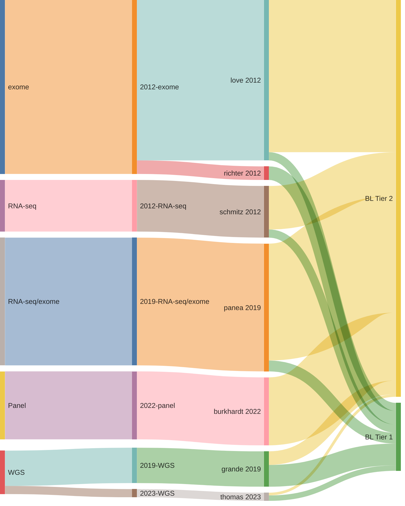

```mermaid


---
config:
  sankey:
    showValues: false
    linkColor: target
    width: 800
    height: 1000
    nodeAlignment: right
---
sankey-beta

exome, 2012-exome, 64
2012-exome, richter 2012, 5
2012-exome, love 2012, 59

richter 2012, BL Tier 1, 5

love 2012, BL Tier 1, 3
love 2012, BL Tier 2, 56

RNA-seq, 2012-RNA-seq, 19
2012-RNA-seq, schmitz 2012, 19
schmitz 2012, BL Tier 1, 3
schmitz 2012, BL Tier 2, 16


RNA-seq/exome,2019-RNA-seq/exome,47
2019-RNA-seq/exome, panea 2019, 47
panea 2019, BL Tier 2, 43
panea 2019, BL Tier 1, 4

WGS,2019-WGS,13
2019-WGS, grande 2019, 13
grande 2019, BL Tier 1, 8
grande 2019, BL Tier 2, 5


Panel, 2022-panel, 25
2022-panel, burkhardt 2022, 25
burkhardt 2022, BL Tier 2, 25

WGS, 2023-WGS, 3
2023-WGS, thomas 2023, 3
thomas 2023, BL Tier 2, 1
thomas 2023, BL Tier 1, 2
```