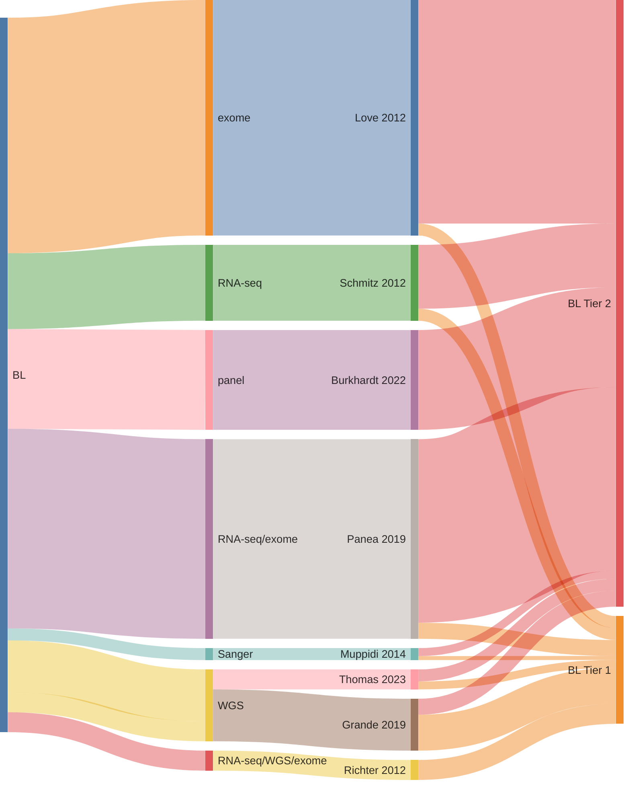

```mermaid
---
config:
  sankey:
    showValues: false
    linkColor: target
    width: 800
    height: 1000
    nodeAlignment: right
---
sankey-beta
Love 2012, BL Tier 1, 3
Love 2012, BL Tier 2, 56
Muppidi 2014, BL Tier 1, 1
Muppidi 2014, BL Tier 2, 2
Schmitz 2012, BL Tier 1, 3
Schmitz 2012, BL Tier 2, 16
Richter 2012, BL Tier 1, 5
Burkhardt 2022, BL Tier 2, 25
Thomas 2023, BL Tier 1, 2
Thomas 2023, BL Tier 2, 3
Grande 2019, BL Tier 1, 9
Grande 2019, BL Tier 2, 4
Panea 2019, BL Tier 1, 4
Panea 2019, BL Tier 2, 46
BL, exome, 59
exome, Love 2012, 59
BL, RNA-seq/WGS/exome, 5
RNA-seq/WGS/exome, Richter 2012, 5
BL, Sanger, 3
Sanger, Muppidi 2014, 3
BL, RNA-seq, 19
RNA-seq, Schmitz 2012, 19
BL, WGS, 13
WGS, Grande 2019, 13
BL, RNA-seq/exome, 50
RNA-seq/exome, Panea 2019, 50
BL, panel, 25
panel, Burkhardt 2022, 25
BL, WGS, 5
WGS, Thomas 2023, 5
```
