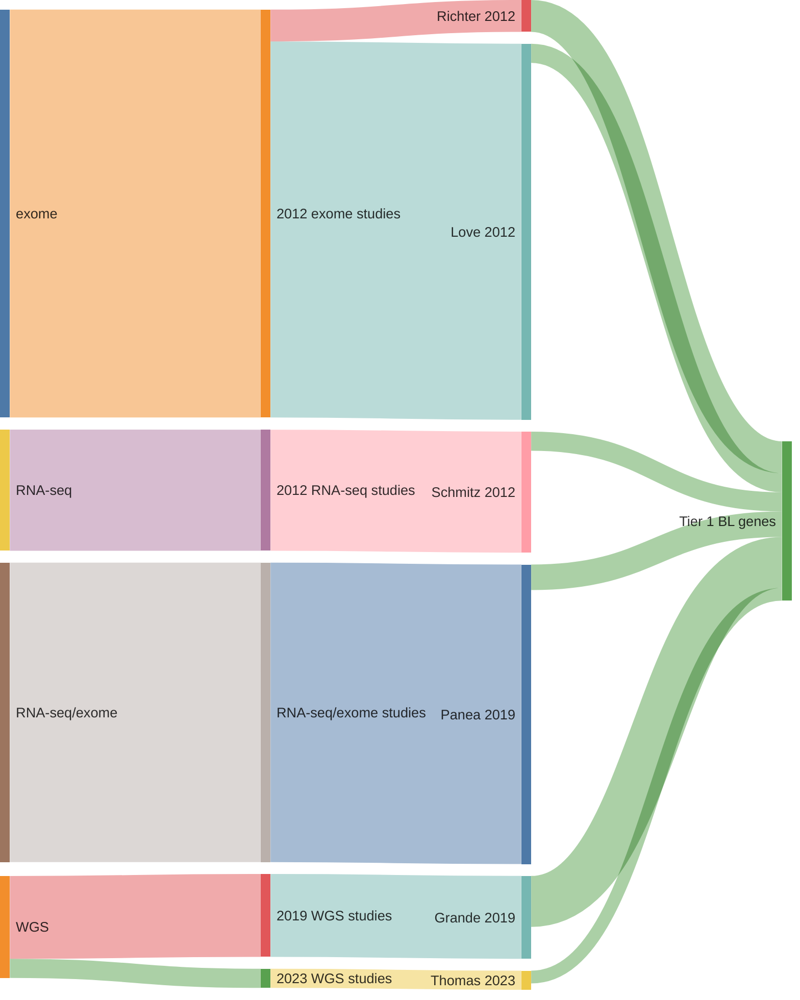

```mermaid


---
config:
  sankey:
    showValues: false
    linkColor: target
    width: 800
    height: 1000
    nodeAlignment: right
---
sankey-beta

exome, 2012 exome studies, 64
2012 exome studies, Richter 2012, 5
2012 exome studies, Love 2012, 59

Richter 2012, Tier 1 BL genes, 5

Love 2012, Tier 1 BL genes, 3

RNA-seq, 2012 RNA-seq studies, 19
2012 RNA-seq studies, Schmitz 2012, 19
Schmitz 2012, Tier 1 BL genes, 3


RNA-seq/exome, RNA-seq/exome studies,47
RNA-seq/exome studies, Panea 2019, 47

Panea 2019, Tier 1 BL genes, 4

WGS,2019 WGS studies,13
2019 WGS studies, Grande 2019, 13
Grande 2019, Tier 1 BL genes, 8

WGS, 2023 WGS studies, 3
2023 WGS studies, Thomas 2023, 3

Thomas 2023, Tier 1 BL genes, 2
```