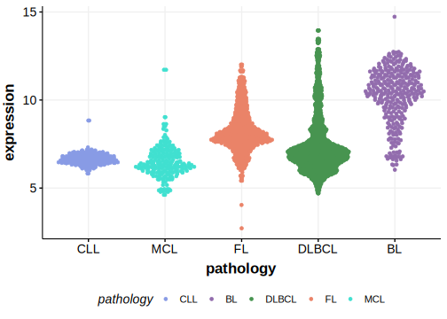

[[_TOC_]]

## Relevance tier by entity

[[include:tables/table1_BMP7]]

## Mutation incidence in large patient cohorts (GAMBL reanalysis)

### BL
[[include:tables/BL_BMP7.md]]

## Mutation pattern and selective pressure estimates

[[include:tables/dnds_BMP7.md]]

## BMP7 Hotspots

| Chromosome |Coordinate (hg19) | ref>alt | HGVSp | 
 | :---:| :---: | :--: | :---: |
| chr20 | 55841157 | C>T | A8T |
| chr20 | 55841157 | C>G | A8P |
| chr20 | 55841156 | G>C | A8G |
| chr20 | 55841155 | AG>TA | A8V |
| chr20 | 55840966 | G>T | H71Q |
| chr20 | 55840965 | G>C | L72V |
| chr20 | 55840962 | G>C | Q73E |
| chr20 | 55840958 | C>T | G74D |
| chr20 | 55840954 | C>A | K75N |
| chr20 | 55840953 | G>T | H76N |
| chr20 | 55840953 | G>C | H76D |
| chr20 | 55840953 | G>A | H76Y |
| chr20 | 55840944 | C>G | A79P |
| chr20 | 55840935 | A>G | F82L |
| chr20 | 55840918 | G>C | Y87* |
| chr20 | 55840913 | G>T | A89D |

[[include:tables/browser_BMP7.md]]

## Expression

<!-- ORIGIN: paneaWholeGenomeLandscape2019 -->
<!-- BL: paneaWholeGenomeLandscape2019 -->

[[include:tables/mermaid_BMP7.md]]

## References
