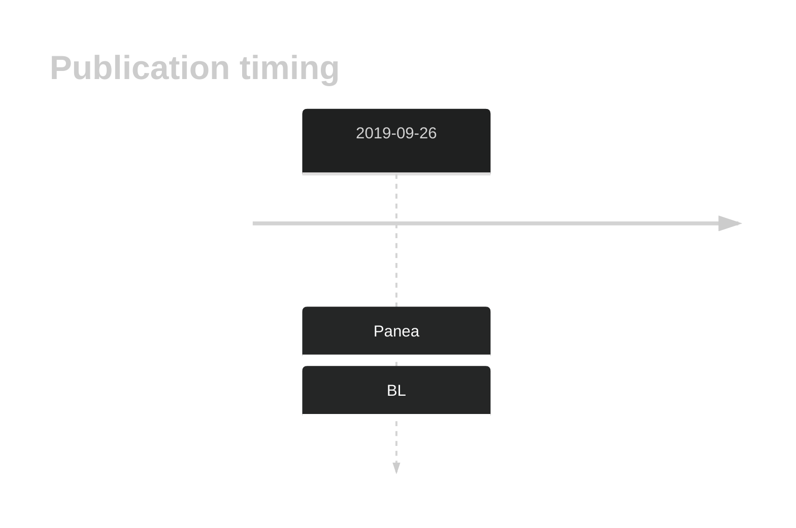

# BMP7

## History

## Relevance tier by entity

|Entity|Tier|Description            |
|:------:|:----:|-----------------------|
|    |1   |high-confidence BL gene|

## Mutation incidence in large patient cohorts (GAMBL reanalysis)

|Entity|source               |frequency (%)|
|:------:|:---------------------:|:-------------:|
|BL    |GAMBL genomes+capture|6.47         |
|BL    |Thomas cohort        |8.90         |
|BL    |Panea cohort         |5.00         |

## Mutation pattern and selective pressure estimates

|Entity|aSHM|Significant selection|dN/dS (missense)|dN/dS (nonsense)|
|:------:|:----:|:---------------------:|:----------------:|:----------------:|
|BL    |No  |Yes                  |5.863           |16.044          |
|DLBCL |No  |No                   |6.236           |10.787          |
|FL    |No  |No                   |1.371           | 0.000          |

 ## BMP7 Hotspots

| Chromosome |Coordinate (hg19) | ref>alt | HGVSp | 
 | :---:| :---: | :--: | :---: |
| chr20 | 55841157 | C>T | A8T |
| chr20 | 55841157 | C>G | A8P |
| chr20 | 55841156 | G>C | A8G |
| chr20 | 55841155 | AG>TA | A8V |
| chr20 | 55840966 | G>T | H71Q |
| chr20 | 55840965 | G>C | L72V |
| chr20 | 55840962 | G>C | Q73E |
| chr20 | 55840958 | C>T | G74D |
| chr20 | 55840954 | C>A | K75N |
| chr20 | 55840953 | G>T | H76N |
| chr20 | 55840953 | G>C | H76D |
| chr20 | 55840953 | G>A | H76Y |
| chr20 | 55840944 | C>G | A79P |
| chr20 | 55840935 | A>G | F82L |
| chr20 | 55840918 | G>C | Y87* |
| chr20 | 55840913 | G>T | A89D |

View coding variants in ProteinPaint [hg19](https://morinlab.github.io/LLMPP/GAMBL/BMP7_protein.html)  or [hg38](https://morinlab.github.io/LLMPP/GAMBL/BMP7_protein_hg38.html)

View all variants in GenomePaint [hg19](https://morinlab.github.io/LLMPP/GAMBL/BMP7.html)  or [hg38](https://morinlab.github.io/LLMPP/GAMBL/BMP7_hg38.html)

## BMP7 Expression

<!-- ORIGIN: paneaWholeGenomeLandscape2019 -->
<!-- BL: paneaWholeGenomeLandscape2019 -->

## References
1.  Panea R, Love C, Shingleton JR, Reddy A, Bailey J, Moormann A, Otieno J, Ong’echa J, Oduor C, Schroêder K, Masalu N, Chao N, Agajanian M, Major M, Fedoriw Y, Richards K, Rymkiewicz G, Miles R, Alobeid B, Bhagat G, Flowers C, Ondrejka S, Hsi E, Choi W, Au-Yeung R, Hartmann W, Lenz G, Meyerson H, Lin YY, Zhuang Y, Luftig M, Waldrop A, Dave T, Thakkar D, Sahay H, Li G, Palus B, Seshadri V, Kim S, Gascoyne R, Levy S, Mukhopadhyay M, Dunson D, Dave S. The whole genome landscape of Burkitt lymphoma subtypes. Blood. 2019; 
