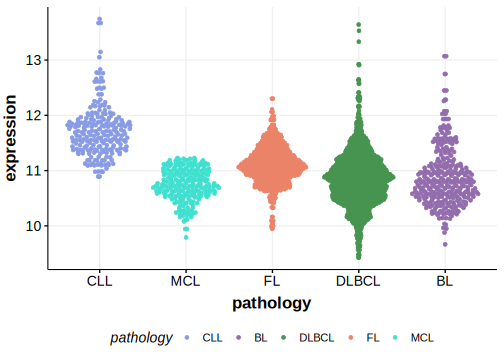
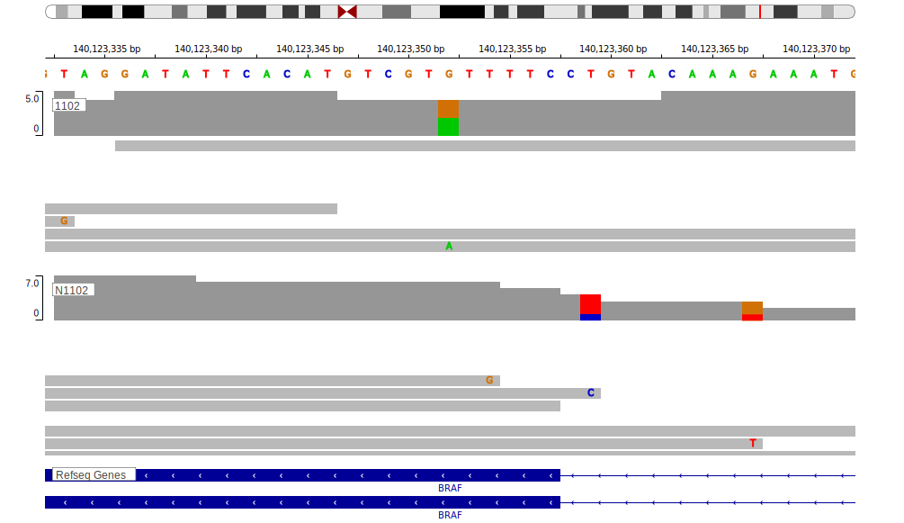

[[_TOC_]]

## Overview

BRAF mutations, particularly the BRAF V600E hot spot mutation, are primarily associated with hairy cell leukemia and are rare in other B-cell lymphomas. These mutations play a crucial role in the pathogenesis of HCL and have important diagnostic and therapeutic implications. Although they are rare, mutations in BRAF are reproducibly observed in some DLBCLs. Another hot spot, D594A, occurs in DLBCL. The role of these in lymphomagenesis remains poorly understood but functional evidence suggests they may contribute to aneuploidy.[@tiacciBRAFMutationsHairycell2011] 
Although mutations have also been reported in BL, due to [minimal support](BRAF#representative-mutation) in the original primary data and very few mutations reported in subsequent studies, this gene is very unlikely to be relevant in BL. 

## Experimental Evidence

Driver mutations affecting this gene in DLBCL have been experimentally demonstrated to cause a reduction or loss of function (LOF).[@wanMechanismActivationRAFERK2004]

## Relevance tier by entity

[[include:tables/table1_BRAF.md]]

## Warnings

<<Warn("The variants reported in this gene in BL failed QC")>>

## Mutation incidence in large patient cohorts (GAMBL reanalysis)

### DLBCL
[[include:tables/DLBCL_BRAF.md]]

## Mutation pattern and selective pressure estimates

[[include:tables/dnds_BRAF.md]]

## BRAF Hotspots

**V600E** The V600E mutation, which is common in other cancers including hairy cell leukemia, is observed in some DLBCL patients. This mutation mimics phosphorylation and leads to constitutive activation of the BRAF kinase. As a result, the V600E mutant continuously activates the MAPK/ERK signaling pathway, promoting cell proliferation and survival even in the absence of growth signals. 

**D594** Mutations of this residue have a distinct function than V600E. In particular, D594A results in a kinase-inactive form of BRAF. Unlike the V600E mutation, D594A does not directly activate the MAPK/ERK pathway. Instead, it induces aneuploidy and contributes to cancer progression through the activation of the related gene product CRAF. This activation leads to the downstream activation of the MEK/ERK pathway via CRAF, rather than BRAF.

| Chromosome |Coordinate (hg19) | ref>alt | HGVSp | 
 | :---:| :---: | :--: | :---: |
| chr7 | 140453155 | C>T | D594N |
| chr7 | 140453154 | T>G | D594A |
| chr7 | 140453154 | T>C | D594G |
| chr7 | 140453145 | A>T | L597Q |
| chr7 | 140453136 | A>T | V600E |
| chr7 | 140453132 | T>G | K601N |

[[include:tables/browser_BRAF.md]]

## Expression

## Representative Mutations

### BL[@loveGeneticLandscapeMutations2012]

**Rating** 
&starf; &star; &star; &star; &star;

## All Mutations

### BL

[1102](https://www.bcgsc.ca/downloads/morinlab/GAMBL/Love/1102_reports.html)
[673](https://www.bcgsc.ca/downloads/morinlab/GAMBL/Love/673_reports.html)

[[include:tables/mermaid_BRAF.md]]

## References

<!-- ORIGIN: tiacciBRAFMutationsHairycell2011a -->
<!-- DLBCL: tiacciBRAFMutationsHairycell2011a -->
<!-- BL: loveGeneticLandscapeMutations2012 -->
