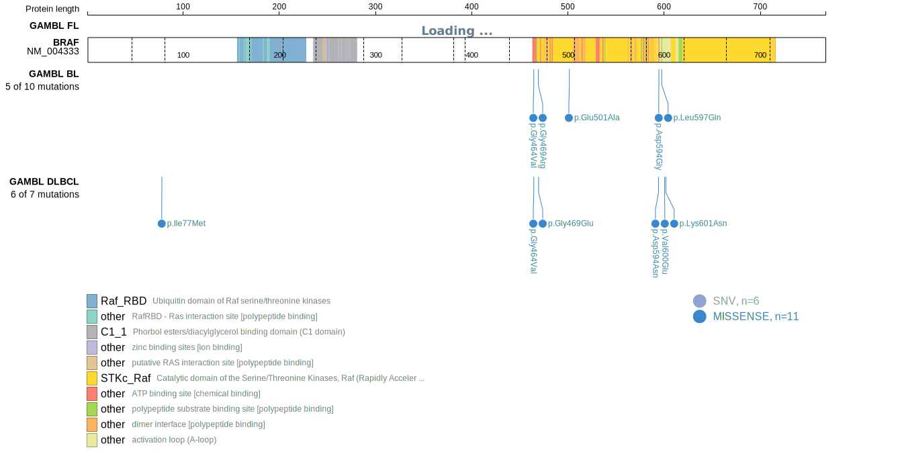
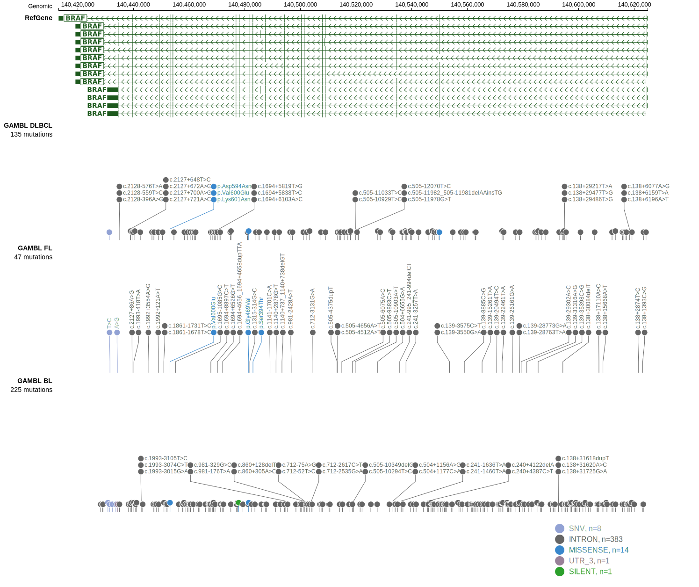

# BRAF

## Relevance tier by entity

|Entity|Tier|Description                           |
|:------:|:----:|--------------------------------------|
|BL    |2   |relevance in BL not firmly established|
|DLBCL |1   |high-confidence DLBCL gene            |

## Mutation incidence in large patient cohorts (GAMBL reanalysis)

|Entity|source               |frequency (%)|
|:------:|:---------------------:|:-------------:|
|BL    |GAMBL genomes+capture|2.77         |
|BL    |Thomas cohort        |  NA         |
|BL    |Panea cohort         |  NA         |
|DLBCL |GAMBL genomes        |2.29         |
|DLBCL |Schmitz cohort       |3.40         |
|DLBCL |Reddy cohort         |2.00         |
|DLBCL |Chapuy cohort        |5.56         |

## Mutation pattern and selective pressure estimates

|Entity|aSHM|Significant selection|dN/dS (missense)|dN/dS (nonsense)|
|:------:|:----:|:---------------------:|:----------------:|:----------------:|
|BL    |No  |No                   |4.754           |0               |
|DLBCL |No  |No                   |5.565           |0               |
|FL    |No  |No                   |4.680           |0               |

> [!NOTE]
> First described in BL in 2012 by [Love C](https://pubmed.ncbi.nlm.nih.gov/23143597). First described in DLBCL in 2012 by [Lohr JG](https://pubmed.ncbi.nlm.nih.gov/22343534)

 ## BRAF Hotspots

| Chromosome |Coordinate (hg19) | ref>alt | HGVSp | 
 | :---:| :---: | :--: | :---: |
| chr7 | 140453155 | C>T | D594N |
| chr7 | 140453154 | T>G | D594A |
| chr7 | 140453154 | T>C | D594G |
| chr7 | 140453145 | A>T | L597Q |
| chr7 | 140453136 | A>T | V600E |
| chr7 | 140453132 | T>G | K601N |

View coding variants in ProteinPaint [hg19](https://www.bcgsc.ca/downloads/morinlab/GAMBL/test/genes/BRAF_protein.html)  or [hg38](https://www.bcgsc.ca/downloads/morinlab/GAMBL/test/genes/BRAF_protein_hg38.html)

View all variants in GenomePaint [hg19](https://www.bcgsc.ca/downloads/morinlab/GAMBL/test/genes/BRAF.html)  or [hg38](https://www.bcgsc.ca/downloads/morinlab/GAMBL/test/genes/BRAF_hg38.html)

