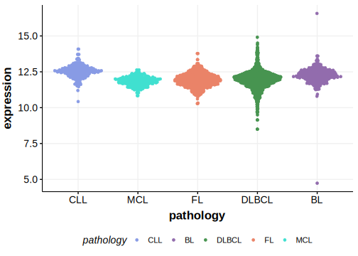

[[_TOC_]]

## Overview

Due to [minimal support](BRD4#representative-mutation) in the original primary data and very few mutations reported in subsequent studies, this gene is very unlikely to be relevant in BL. 

## Relevance tier by entity

[[include:table1_BRD4.md]]

## Warnings

<<Warn("The variants reported in this gene in BL failed QC")>>

## Mutation incidence in large patient cohorts (GAMBL reanalysis)

|Entity|source               |frequency (%)|
|:------:|:---------------------:|:-------------:|
|BL    |GAMBL genomes+capture|2.08         |
|BL    |Thomas cohort        |  NA         |
|BL    |Panea cohort         |  NA         |

## Mutation pattern and selective pressure estimates

[[include:tables/dnds_BRD4.md]]

[[include:browser_BRD4.md]]

## Expression

<!-- ORIGIN: loveGeneticLandscapeMutations2012 -->
<!-- BL: loveGeneticLandscapeMutations2012 -->

## Representative Mutation

**Rating**
&starf; &star; &star; &star; &star;

## All Mutations

[1061](https://www.bcgsc.ca/downloads/morinlab/GAMBL/Love/1061_reports.html)
[676](https://www.bcgsc.ca/downloads/morinlab/GAMBL/Love/676_reports.html)
[698](https://www.bcgsc.ca/downloads/morinlab/GAMBL/Love/698_reports.html)
[747](https://www.bcgsc.ca/downloads/morinlab/GAMBL/Love/747_reports.html)

[[include:mermaid_BRD4.md]]

## References
