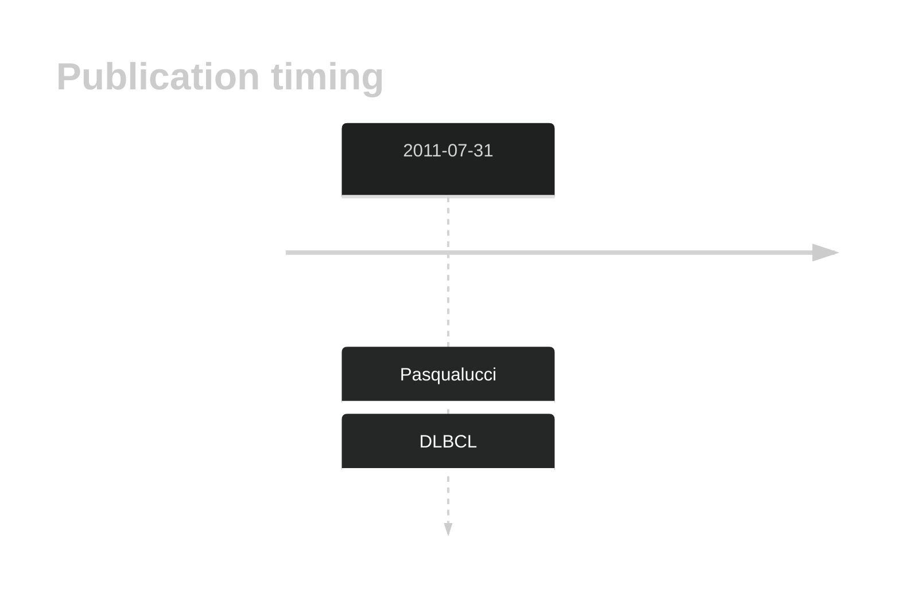

# BRSK1

## History

## Relevance tier by entity

|Entity|Tier|Description|
|:------:|:----:|--------------------------------------|
||2|relevance in DLBCL not firmly established[@pasqualucciAnalysisCodingGenome2011]|

## References

