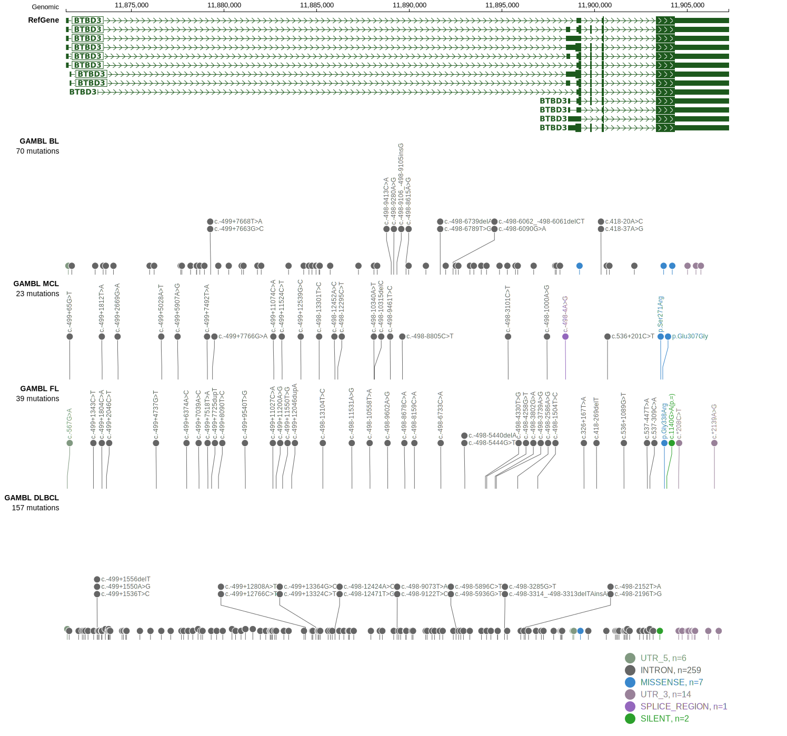

# BTBD3

## History
Mutations in this gene were first described in DLBCL in 2013[@zhangGeneticHeterogeneityDiffuse2013] and by the same group in a subsequent study.[@reddyGeneticFunctionalDrivers2017] It remains in Tier 2 because other exome and genome-wide studies of DLBCL did not reproduce this observation. 

## Relevance tier by entity

|Entity|Tier|Description                              |
|:------:|:----:|-----------------------------------------|
| |2   |relevance in DLBCL not firmly established|

## Mutation incidence in large patient cohorts (GAMBL reanalysis)

|Entity|source        |frequency (%)|
|:------:|:--------------:|:-------------:|
|DLBCL |GAMBL genomes |0.57         |
|DLBCL |Schmitz cohort|1.91         |
|DLBCL |Reddy cohort  |1.80         |
|DLBCL |Chapuy cohort |0.85         |

## Mutation pattern and selective pressure estimates

|Entity|aSHM|Significant selection|dN/dS (missense)|dN/dS (nonsense)|
|:------:|:----:|:---------------------:|:----------------:|:----------------:|
|BL    |No  |No                   |5.604           |0               |
|DLBCL |No  |No                   |0.722           |0               |
|FL    |No  |No                   |2.655           |0               |

View coding variants in ProteinPaint [hg19](https://morinlab.github.io/LLMPP/GAMBL/BTBD3_protein.html)  or [hg38](https://morinlab.github.io/LLMPP/GAMBL/BTBD3_protein_hg38.html)

View all variants in GenomePaint [hg19](https://morinlab.github.io/LLMPP/GAMBL/BTBD3.html)  or [hg38](https://morinlab.github.io/LLMPP/GAMBL/BTBD3_hg38.html)

## BTBD3 Expression

## Representative Mutations

**Rating**
&starf; &starf; &star; &star; &star; 

## All Mutations

[Reddy_2193T](https://www.bcgsc.ca/downloads/morinlab/GAMBL/Reddy/igv_reports/Reddy_2193T.html)
[Reddy_2219T](https://www.bcgsc.ca/downloads/morinlab/GAMBL/Reddy/igv_reports/Reddy_2219T.html)
[Reddy_2240T](https://www.bcgsc.ca/downloads/morinlab/GAMBL/Reddy/igv_reports/Reddy_2240T.html)
[Reddy_2475T](https://www.bcgsc.ca/downloads/morinlab/GAMBL/Reddy/igv_reports/Reddy_2475T.html)
[Reddy_2603T](https://www.bcgsc.ca/downloads/morinlab/GAMBL/Reddy/igv_reports/Reddy_2603T.html)
[Reddy_2698T](https://www.bcgsc.ca/downloads/morinlab/GAMBL/Reddy/igv_reports/Reddy_2698T.html)
[Reddy_2838T](https://www.bcgsc.ca/downloads/morinlab/GAMBL/Reddy/igv_reports/Reddy_2838T.html)
[Reddy_2950T](https://www.bcgsc.ca/downloads/morinlab/GAMBL/Reddy/igv_reports/Reddy_2950T.html)
[Reddy_3387T](https://www.bcgsc.ca/downloads/morinlab/GAMBL/Reddy/igv_reports/Reddy_3387T.html)
[Reddy_3479T](https://www.bcgsc.ca/downloads/morinlab/GAMBL/Reddy/igv_reports/Reddy_3479T.html)
[Reddy_3548T](https://www.bcgsc.ca/downloads/morinlab/GAMBL/Reddy/igv_reports/Reddy_3548T.html)
[Reddy_3566T](https://www.bcgsc.ca/downloads/morinlab/GAMBL/Reddy/igv_reports/Reddy_3566T.html)
[Reddy_3594T](https://www.bcgsc.ca/downloads/morinlab/GAMBL/Reddy/igv_reports/Reddy_3594T.html)
[Reddy_3706T](https://www.bcgsc.ca/downloads/morinlab/GAMBL/Reddy/igv_reports/Reddy_3706T.html)
[Reddy_3708T](https://www.bcgsc.ca/downloads/morinlab/GAMBL/Reddy/igv_reports/Reddy_3708T.html)
[Reddy_3759T](https://www.bcgsc.ca/downloads/morinlab/GAMBL/Reddy/igv_reports/Reddy_3759T.html)
[Reddy_3916T](https://www.bcgsc.ca/downloads/morinlab/GAMBL/Reddy/igv_reports/Reddy_3916T.html)
[Reddy_3918T](https://www.bcgsc.ca/downloads/morinlab/GAMBL/Reddy/igv_reports/Reddy_3918T.html)
[Reddy_759T](https://www.bcgsc.ca/downloads/morinlab/GAMBL/Reddy/igv_reports/Reddy_759T.html)

## References

<!-- ORIGIN: reddyGeneticFunctionalDrivers2017 -->
<!-- DLBCL: reddyGeneticFunctionalDrivers2017 -->
