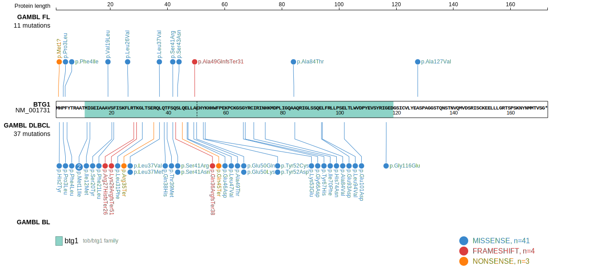
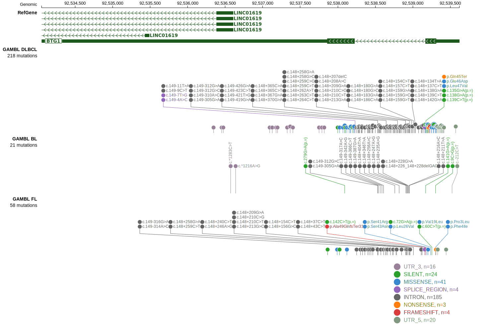

# BTG1
## Overview
BTG1 is one of [a number of genes](https://github.com/morinlab/LLMPP/wiki/ashm) affected by aberrant somatic hypermutation in B-cell lymphomas, which complicates the interpretation of mutations at this locus. These mutations are a feature of the MCD genetic subgroup of DLBCL.1  Mutations in the BTG1 gene have been implicated in the pathogenesis and progression of diffuse large B-cell lymphoma (DLBCL) through functional exploration in vivo. Knock-out of BTG1 did not lead to spontaneous lymphomagenesis but enhanced the lymphoproliferation induced by VavP-BCL2 and promoted lymphoma dissemination in xenotransplantation experiments.2  Another study demonstrated that specific BTG1 mutations afford germinal center (GC) B cells with a fitness advantage relative to un-mutated counterparts.3 

## Relevance tier by entity

|Entity|Tier|Description                           |
|:------:|:----:|--------------------------------------|
|DLBCL |1-a | aSHM target and high-confidence DLBCL gene            |
|FL    |1-a | aSHM target and high-confidence FL gene               |
|BL    |2-a | aSHM target; Although recurrent, the relevance of mutations in BL is tenuous |

## Mutation incidence in large patient cohorts (GAMBL reanalysis)

|Entity|source               |frequency (%)|
|:------:|:---------------------:|:-------------:|
|DLBCL |GAMBL genomes        |10.13        |
|DLBCL |Schmitz cohort       |14.47        |
|DLBCL |Reddy cohort         | 7.51        |
|DLBCL |Chapuy cohort        |14.53        |
|FL    |GAMBL genomes        | 6.47        |
|BL    |GAMBL genomes+capture| 0.46        |
|BL    |Thomas cohort        |   0        |
|BL    |Panea cohort         |   0        |

## Mutation pattern and selective pressure estimates

|Entity|aSHM|Significant selection|dN/dS (missense)|dN/dS (nonsense)|
|:------:|:----:|:---------------------:|:----------------:|:----------------:|
|BL    |Yes |No                   |0.000           |0.000           |
|DLBCL |Yes |No                   |0.498           |1.085           |
|FL    |Yes |No                   |4.407           |6.147           |

## aSHM regions

|chr_name|hg19_start|hg19_end|region                                                                                    |regulatory_comment|
|:--------:|:----------:|:--------:|:------------------------------------------------------------------------------------------:|:------------------:|
|chr12   |92537999  |92539598|[TSS](https://genome.ucsc.edu/s/rdmorin/GAMBL%20hg19?position=chr12%3A92537999%2D92539598)|active_promoter   |

> [!NOTE]
> First described in BL in 2022 by [Burkhardt B](https://pubmed.ncbi.nlm.nih.gov/35794096). First described in DLBCL in 2011 by [Morin RD](https://pubmed.ncbi.nlm.nih.gov/21796119)

 ## BTG1 Hotspots

*Q36H* Conditional knock-in mouse models expressing the BTG1 Q36H mutation in B cells have shown that these mutations lead to earlier onset of lymphoma, shorter survival, and dysplastic B cell infiltration into non-lymphoid organs. These findings reinforce the role of BTG1 mutations in enhancing lymphoma aggressiveness.3

*L26P, G66D, and I115V* Have each been shown to be unable to rescue wild-type BTG1 activity in a xenotransplantation model, suggesting that they impair BTG1 function.2

| Chromosome |Coordinate (hg19) | ref>alt | HGVSp | 
 | :---:| :---: | :--: | :---: |
| chr12 | 92539221 | G>A | L31F |
| chr12 | 92539209 | G>A | R35* |
| chr12 | 92539204 | C>G | Q36H |
| chr12 | 92539203 | G>T | L37M |
| chr12 | 92539203 | G>C | L37V |
| chr12 | 92539198 | C>A | Q38H |
| chr12 | 92539195 | GG>CA | T39M |
| chr12 | 92539190 | C>T | S41N |
| chr12 | 92539189 | G>C | S41R |
| chr12 | 92539184 | C>T | S43N |
| chr12 | 92539179 | G>A | Q45* |
| chr12 | 92539174 | C>G | E46D |
| chr12 | 92539173 | G>C | L47V |
| chr12 | 92539167 | C>T | A49T |
| chr12 | 92539164 | C>T | E50K |
| chr12 | 92539164 | C>G | E50Q |
| chr12 | 92538218 | A>C | Y52D |
| chr12 | 92538217 | T>C | Y52C |
| chr12 | 92538215 | T>C | K53E |

View coding variants in ProteinPaint [hg19](https://morinlab.github.io/LLMPP/GAMBL/BTG1_protein.html)  or [hg38](https://morinlab.github.io/LLMPP/GAMBL/BTG1_protein_hg38.html)

View all variants in GenomePaint [hg19](https://morinlab.github.io/LLMPP/GAMBL/BTG1.html)  or [hg38](https://morinlab.github.io/LLMPP/GAMBL/BTG1_hg38.html)

## References
1. *Wright GW, Huang DW, Phelan JD, Coulibaly ZA, Roulland S, Young RM, Wang JQ, Schmitz R, Morin RD, Tang J, Jiang A, Bagaev A, Plotnikova O, Kotlov N, Johnson CA, Wilson WH, Scott DW, Staudt LM. A Probabilistic Classification Tool for Genetic Subtypes of Diffuse Large B Cell Lymphoma with Therapeutic Implications. Cancer Cell. 2020 Apr 13;37(4):551-568.e14. doi: 10.1016/j.ccell.2020.03.015. PMID: 32289277; PMCID: PMC8459709.*
2. *Delage L, Lambert M, Bardel É, Kundlacz C, Chartoire D, Conchon A, Peugnet AL, Gorka L, Auberger P, Jacquel A, Soussain C, Destaing O, Delecluse HJ, Delecluse S, Merabet S, Traverse-Glehen A, Salles G, Bachy E, Billaud M, Ghesquières H, Genestier L, Rouault JP, Sujobert P. BTG1 inactivation drives lymphomagenesis and promotes lymphoma dissemination through activation of BCAR1. Blood. 2023 Mar 9;141(10):1209-1220. doi: 10.1182/blood.2022016943. PMID: 36375119.*
3. *Mlynarczyk C, Teater M, Pae J, Chin CR, Wang L, Arulraj T, Barisic D, Papin A, Hoehn KB, Kots E, Ersching J, Bandyopadhyay A, Barin E, Poh HX, Evans CM, Chadburn A, Chen Z, Shen H, Isles HM, Pelzer B, Tsialta I, Doane AS, Geng H, Rehman MH, Melnick J, Morgan W, Nguyen DTT, Elemento O, Kharas MG, Jaffrey SR, Scott DW, Khelashvili G, Meyer-Hermann M, Victora GD, Melnick A. BTG1 mutation yields supercompetitive B cells primed for malignant transformation. Science. 2023 Jan 20;379(6629):eabj7412. doi: 10.1126/science.abj7412. Epub 2023 Jan 20. PMID: 36656933; PMCID: PMC10515739.*
