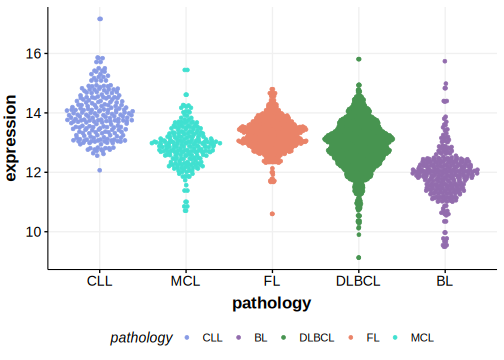

[[_TOC_]]

## Overview

BTG1 is one of [a number of genes](https://github.com/morinlab/LLMPP/wiki/ashm) affected by aberrant somatic hypermutation in B-cell lymphomas, which complicates the interpretation of mutations at this locus. 
These mutations are a feature of the MCD genetic subgroup of DLBCL.  

## Experimental Evidence 

Mutations in the BTG1 gene have been implicated in the pathogenesis and progression of diffuse large B-cell lymphoma (DLBCL) through functional exploration in vivo. Knock-out of BTG1 did not lead to spontaneous lymphomagenesis but enhanced the lymphoproliferation induced by VavP-BCL2 and promoted lymphoma dissemination in xenotransplantation experiments.[@delageBTG1InactivationDrives2023]
Another study demonstrated that specific BTG1 mutations afford germinal center (GC) B cells with a fitness advantage relative to un-mutated counterparts.[@mlynarczykBTG1MutationYields2023]

## Relevance tier by entity

[[include:table1_BTG1.md]]

## Mutation incidence in large patient cohorts (GAMBL reanalysis)

### DLBCL
[[include:DLBCL_BTG1.md]]

### FL
[[include:FL_BTG1.md]]

### BL
[[include:BL_BTG1.md]]

## Mutation pattern and selective pressure estimates

[[include:dnds_BTG1.md]]

## aSHM regions

|chr_name|hg19_start|hg19_end|region                                                                                    |regulatory_comment|
|:--------:|:----------:|:--------:|:------------------------------------------------------------------------------------------:|:------------------:|
|chr12   |92537999  |92539598|[TSS](https://genome.ucsc.edu/s/rdmorin/GAMBL%20hg19?position=chr12%3A92537999%2D92539598)|active_promoter   |

## BTG1 Hotspots

*Q36H* Conditional knock-in mouse models expressing the BTG1 Q36H mutation in B cells have shown that these mutations lead to earlier onset of lymphoma, shorter survival, and dysplastic B cell infiltration into non-lymphoid organs. These findings reinforce the role of BTG1 mutations in enhancing lymphoma aggressiveness.[@sarkozyMutationalLandscapeGray2021]

*L26P, G66D, and I115V* Have each been shown to be unable to rescue wild-type BTG1 activity in a xenotransplantation model, suggesting that they impair BTG1 function.[@mlynarczykBTG1MutationYields2023]

| Chromosome |Coordinate (hg19) | ref>alt | HGVSp | 
 | :---:| :---: | :--: | :---: |
| chr12 | 92539221 | G>A | L31F |
| chr12 | 92539209 | G>A | R35* |
| chr12 | 92539204 | C>G | Q36H |
| chr12 | 92539203 | G>T | L37M |
| chr12 | 92539203 | G>C | L37V |
| chr12 | 92539198 | C>A | Q38H |
| chr12 | 92539195 | GG>CA | T39M |
| chr12 | 92539190 | C>T | S41N |
| chr12 | 92539189 | G>C | S41R |
| chr12 | 92539184 | C>T | S43N |
| chr12 | 92539179 | G>A | Q45* |
| chr12 | 92539174 | C>G | E46D |
| chr12 | 92539173 | G>C | L47V |
| chr12 | 92539167 | C>T | A49T |
| chr12 | 92539164 | C>T | E50K |
| chr12 | 92539164 | C>G | E50Q |
| chr12 | 92538218 | A>C | Y52D |
| chr12 | 92538217 | T>C | Y52C |
| chr12 | 92538215 | T>C | K53E |

[[include:browser_BTG1.md]]

## Expression

<!-- ORIGIN: morinFrequentMutationHistonemodifying2011 -->
<!-- DLBCL: morinFrequentMutationHistonemodifying2011 -->
<!-- BL: burkhardtClinicalRelevanceMolecular2022b -->
<!-- BL: burkhardtClinicalRelevanceMolecular2022b -->

[[include:mermaid_BTG1.md]]

## References

<!-- PMBL: sarkozyMutationalLandscapeGray2021a -->
