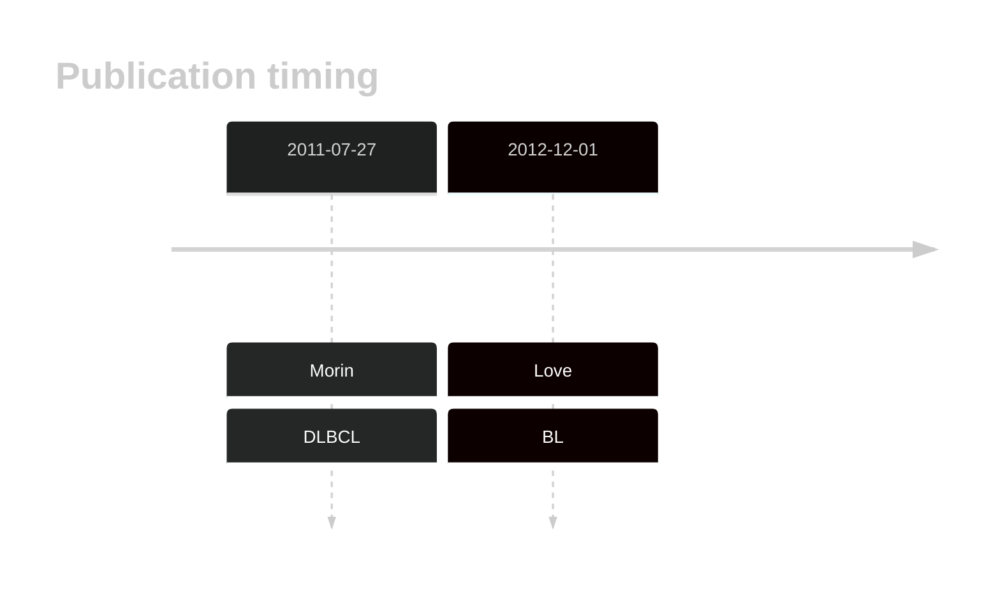

# BTG2

## Overview
BTG2 is one of [a number of genes](https://github.com/morinlab/LLMPP/wiki/ashm) affected by aberrant somatic hypermutation in B-cell lymphomas, which complicates the interpretation of mutations at this locus. Mutations in the BTG2 gene have been implicated in the pathogenesis of diffuse large B-cell lymphoma (DLBCL), contributing to the development and progression of the disease. These mutations are a feature of the MCD genetic subgroup of DLBCL. The biological function of BTG2 mutations and their role in lymphomagenesis remains poorly understood. Due to [minimal support](BTG2#representative-mutations) in the original primary data and very few mutations reported in subsequent studies, this gene is very unlikely to be relevant in BL. 

## History

## Relevance tier by entity

|Entity|Tier|Description                           |
|:------:|:----:|--------------------------------------|
|    |2-a | aSHM target; Although recurrent, the relevance of mutations in BL is tenuous [@loveGeneticLandscapeMutations2012]|
| |1-a | aSHM target and high-confidence DLBCL gene            [@morinFrequentMutationHistonemodifying2011]|
|    |1-a | aSHM target and high-confidence FL gene               [@morinFrequentMutationHistonemodifying2011]|

## Mutation incidence in large patient cohorts (GAMBL reanalysis)

|Entity|source               |frequency (%)|
|:------:|:---------------------:|:-------------:|
|BL    |GAMBL genomes+capture| 4.85        |
|BL    |Thomas cohort        | 4.20        |
|BL    |Panea cohort         | 9.90        |
|DLBCL |GAMBL genomes        |13.38        |
|DLBCL |Schmitz cohort       |17.23        |
|DLBCL |Reddy cohort         | 9.21        |
|DLBCL |Chapuy cohort        | 5.98        |
|FL    |GAMBL genomes        | 4.39        |

## Mutation pattern and selective pressure estimates

|Entity|aSHM|Significant selection|dN/dS (missense)|dN/dS (nonsense)|
|:------:|:----:|:---------------------:|:----------------:|:----------------:|
|BL    |Yes |No                   |6.152           |42.280          |
|DLBCL |Yes |Yes                  |3.562           |10.265          |
|FL    |Yes |No                   |6.073           | 0.000          |

## aSHM regions

|chr_name|hg19_start|hg19_end |region                                                                                        |regulatory_comment|
|:--------:|:----------:|:---------:|:----------------------------------------------------------------------------------------------:|:------------------:|
|chr1    |203274698 |203275778|[intron](https://genome.ucsc.edu/s/rdmorin/GAMBL%20hg19?position=chr1%3A203274698%2D203275778)|active_promoter   |

View coding variants in ProteinPaint [hg19](https://morinlab.github.io/LLMPP/GAMBL/BTG2_protein.html)  or [hg38](https://morinlab.github.io/LLMPP/GAMBL/BTG2_protein_hg38.html)

View all variants in GenomePaint [hg19](https://morinlab.github.io/LLMPP/GAMBL/BTG2.html)  or [hg38](https://morinlab.github.io/LLMPP/GAMBL/BTG2_hg38.html)

## BTG2 Expression

## Representative Mutations

### BL[@loveGeneticLandscapeMutations2012]

**Rating**
&starf; &star; &star; &star; &star;

## All Mutations

### BL[@loveGeneticLandscapeMutations2012]

[1065](https://www.bcgsc.ca/downloads/morinlab/GAMBL/Love/1065_reports.html)
[1098](https://www.bcgsc.ca/downloads/morinlab/GAMBL/Love/1098_reports.html)
[321](https://www.bcgsc.ca/downloads/morinlab/GAMBL/Love/321_reports.html)
[323](https://www.bcgsc.ca/downloads/morinlab/GAMBL/Love/323_reports.html)
[323](https://www.bcgsc.ca/downloads/morinlab/GAMBL/Love/323_reports.html)

## References

<!-- ORIGIN: morinFrequentMutationHistonemodifying2011 -->
<!-- DLBCL: morinFrequentMutationHistonemodifying2011 -->
<!-- BL: loveGeneticLandscapeMutations2012 -->
<!-- FL: morinFrequentMutationHistonemodifying2011 -->
