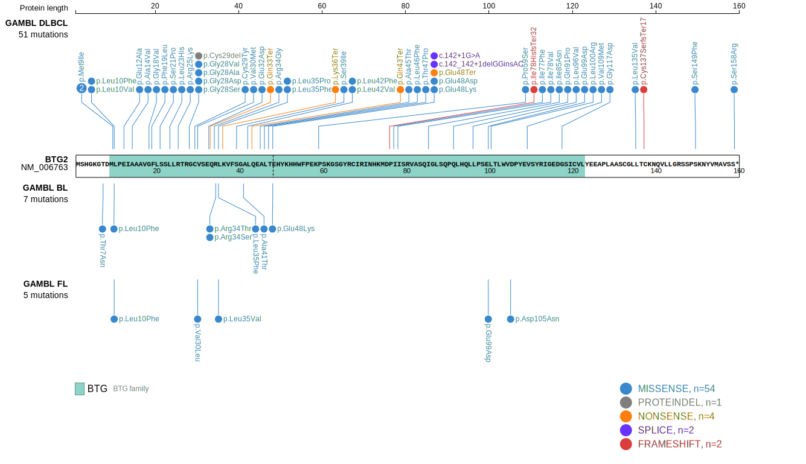
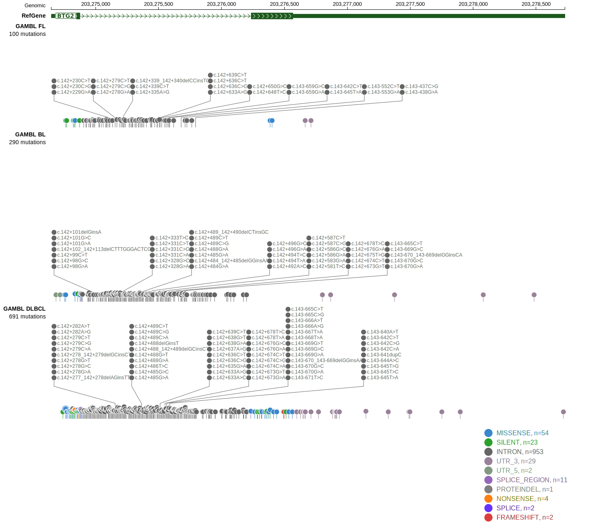
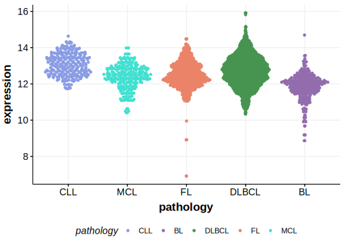

# BTG2
## Overview
BTG2 is one of [a number of genes](https://github.com/morinlab/LLMPP/wiki/ashm) affected by aberrant somatic hypermutation in B-cell lymphomas, which complicates the interpretation of mutations at this locus. Mutations in the BTG2 gene have been implicated in the pathogenesis of diffuse large B-cell lymphoma (DLBCL), contributing to the development and progression of the disease. These mutations are a feature of the MCD genetic subgroup of DLBCL.1 The biological function of BTG2 mutations and their role in lymphomagenesis remains poorly understood. A potential prognostic association with BTG2 mutations in primary testicular DLBCL has been reported but this has not yet been reproduced.2

## Relevance tier by entity

|Entity|Tier|Description                           |
|:------:|:----:|--------------------------------------|
|    |2-a | aSHM target; Although recurrent, the relevance of mutations in BL is tenuous |
| |1-a | aSHM target and high-confidence DLBCL gene            |
|    |1-a | aSHM target and high-confidence FL gene               |

## Mutation incidence in large patient cohorts (GAMBL reanalysis)

|Entity|source               |frequency (%)|
|:------:|:---------------------:|:-------------:|
|BL    |GAMBL genomes+capture| 4.85        |
|BL    |Thomas cohort        | 4.20        |
|BL    |Panea cohort         | 9.90        |
|DLBCL |GAMBL genomes        |13.38        |
|DLBCL |Schmitz cohort       |17.23        |
|DLBCL |Reddy cohort         | 9.21        |
|DLBCL |Chapuy cohort        | 5.98        |
|FL    |GAMBL genomes        | 4.39        |

## Mutation pattern and selective pressure estimates

|Entity|aSHM|Significant selection|dN/dS (missense)|dN/dS (nonsense)|
|:------:|:----:|:---------------------:|:----------------:|:----------------:|
|BL    |Yes |No                   |6.152           |42.280          |
|DLBCL |Yes |Yes                  |3.562           |10.265          |
|FL    |Yes |No                   |6.073           | 0.000          |

## aSHM regions

|chr_name|hg19_start|hg19_end |region                                                                                        |regulatory_comment|
|:--------:|:----------:|:---------:|:----------------------------------------------------------------------------------------------:|:------------------:|
|chr1    |203274698 |203275778|[intron](https://genome.ucsc.edu/s/rdmorin/GAMBL%20hg19?position=chr1%3A203274698%2D203275778)|active_promoter   |

> [!NOTE]
> First described in BL in 2019 by [Panea RI](https://pubmed.ncbi.nlm.nih.gov/31558468). First described in DLBCL in 2011 by [Morin RD](https://pubmed.ncbi.nlm.nih.gov/21796119). First described in FL in 2011 by [Morin RD](https://pubmed.ncbi.nlm.nih.gov/21796119)

View coding variants in ProteinPaint [hg19](https://morinlab.github.io/LLMPP/GAMBL/BTG2_protein.html)  or [hg38](https://morinlab.github.io/LLMPP/GAMBL/BTG2_protein_hg38.html)

View all variants in GenomePaint [hg19](https://morinlab.github.io/LLMPP/GAMBL/BTG2.html)  or [hg38](https://morinlab.github.io/LLMPP/GAMBL/BTG2_hg38.html)

## BTG2 Expression

## References
1. *Wright GW, Huang DW, Phelan JD, Coulibaly ZA, Roulland S, Young RM, Wang JQ, Schmitz R, Morin RD, Tang J, Jiang A, Bagaev A, Plotnikova O, Kotlov N, Johnson CA, Wilson WH, Scott DW, Staudt LM. A Probabilistic Classification Tool for Genetic Subtypes of Diffuse Large B Cell Lymphoma with Therapeutic Implications. Cancer Cell. 2020 Apr 13;37(4):551-568.e14. doi: 10.1016/j.ccell.2020.03.015. PMID: 32289277; PMCID: PMC8459709.*
2. *Guo D, Hong L, Ji H, Jiang Y, Lu L, Wang X, Huang H. The Mutation of BTG2 Gene Predicts a Poor Outcome in Primary Testicular Diffuse Large B-Cell Lymphoma. J Inflamm Res. 2022 Mar 10;15:1757-1769. doi: 10.2147/JIR.S341355. PMID: 35300216; PMCID: PMC8923029.*
3. *Morin RD, Mendez-Lago M, Mungall AJ, Goya R, Mungall KL, Corbett RD, Johnson NA, Severson TM, Chiu R, Field M, Jackman S, Krzywinski M, Scott DW, Trinh DL, Tamura-Wells J, Li S, Firme MR, Rogic S, Griffith M, Chan S, Yakovenko O, Meyer IM, Zhao EY, Smailus D, Moksa M, Chittaranjan S, Rimsza L, Brooks-Wilson A, Spinelli JJ, Ben-Neriah S, Meissner B, Woolcock B, Boyle M, McDonald H, Tam A, Zhao Y, Delaney A, Zeng T, Tse K, Butterfield Y, Birol I, Holt R, Schein J, Horsman DE, Moore R, Jones SJ, Connors JM, Hirst M, Gascoyne RD, Marra MA. Frequent mutation of histone-modifying genes in non-Hodgkin lymphoma. Nature. 2011 Jul 27;476(7360):298-303. doi: 10.1038/nature10351. PMID: 21796119; PMCID: PMC3210554.*
<!-- ORIGIN: morinFrequentMutationHistonemodifying2011 -->
<!-- DLBCL: morinFrequentMutationHistonemodifying2011 -->
<!-- BL: loveGeneticLandscapeMutations2012 -->
<!-- FL: morinFrequentMutationHistonemodifying2011 -->
