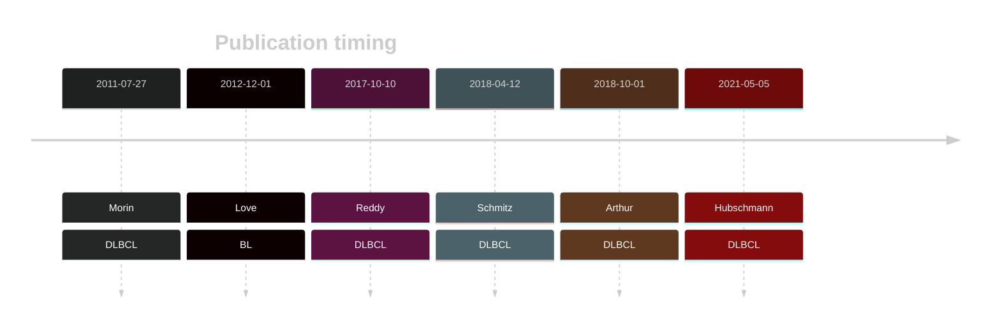
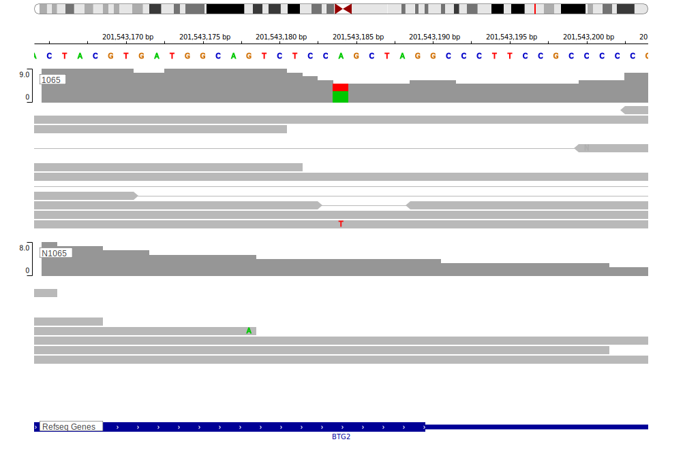

# BTG2

## Overview
BTG2 is one of [a number of genes](https://github.com/morinlab/LLMPP/wiki/ashm) affected by aberrant somatic hypermutation in B-cell lymphomas, which complicates the interpretation of mutations at this locus. Mutations in the BTG2 gene have been implicated in the pathogenesis of diffuse large B-cell lymphoma (DLBCL), contributing to the development and progression of the disease. These mutations are a feature of the MCD genetic subgroup of DLBCL. The biological function of BTG2 mutations and their role in lymphomagenesis remains poorly understood. Due to [minimal support](BTG2#representative-mutations) in the original primary data and very few mutations reported in subsequent studies, this gene is very unlikely to be relevant in BL. 

<<Warn("The variants reported in this gene in BL failed QC")>>

## History

## Relevance tier by entity

|Entity|Tier|Description                           |
|:------:|:----:|--------------------------------------|
|    |3 | Retired, Failed QC[@loveGeneticLandscapeMutations2012]|
| |1 | aSHM target and high-confidence DLBCL gene            [@morinFrequentMutationHistonemodifying2011]|
|    |1 | aSHM target and high-confidence FL gene               [@morinFrequentMutationHistonemodifying2011]|

## Mutation incidence in large patient cohorts (GAMBL reanalysis)

[[include:DLBCL_BTG2.md]]
[[include:FL_BTG2.md]]

## Mutation pattern and selective pressure estimates

[[include:dnds_BTG2.md]]

## aSHM regions

|chr_name|hg19_start|hg19_end |region                                                                                        |regulatory_comment|
|:--------:|:----------:|:---------:|:----------------------------------------------------------------------------------------------:|:------------------:|
|chr1    |203274698 |203275778|[intron](https://genome.ucsc.edu/s/rdmorin/GAMBL%20hg19?position=chr1%3A203274698%2D203275778)|active_promoter   |

View coding variants in ProteinPaint [hg19](https://morinlab.github.io/LLMPP/GAMBL/BTG2_protein.html)  or [hg38](https://morinlab.github.io/LLMPP/GAMBL/BTG2_protein_hg38.html)

View all variants in GenomePaint [hg19](https://morinlab.github.io/LLMPP/GAMBL/BTG2.html)  or [hg38](https://morinlab.github.io/LLMPP/GAMBL/BTG2_hg38.html)

## BTG2 Expression

## Representative Mutations

### BL[@loveGeneticLandscapeMutations2012]

**Rating**
&starf; &starf; &star; &star; &star;

## All Mutations

### BL[@loveGeneticLandscapeMutations2012]

[1065](https://www.bcgsc.ca/downloads/morinlab/GAMBL/Love/1065_reports.html)
[1098](https://www.bcgsc.ca/downloads/morinlab/GAMBL/Love/1098_reports.html)
[321](https://www.bcgsc.ca/downloads/morinlab/GAMBL/Love/321_reports.html)
[323](https://www.bcgsc.ca/downloads/morinlab/GAMBL/Love/323_reports.html)
[323](https://www.bcgsc.ca/downloads/morinlab/GAMBL/Love/323_reports.html)

## References

<!-- ORIGIN: morinFrequentMutationHistonemodifying2011 -->
<!-- DLBCL: morinFrequentMutationHistonemodifying2011 -->
<!-- BL: loveGeneticLandscapeMutations2012 -->
<!-- FL: morinFrequentMutationHistonemodifying2011 -->
