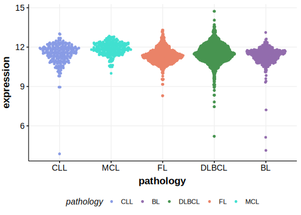

[[_TOC_]]
One study reported BTK mutations in approximately 7% of FL and 11% of transformed FL cases.[@krysiakRecurrentSomaticMutations2017] Another showed these mutations were more common, and typically co-occur in tumours with BCL2 translocations. Despite the known role of certain BTK mutations in acquired resistance to BTK inhibitors, these mutations were found in BTK inhibitor-naïve patients.[@albuquerqueEnhancingKnowledgeDiscovery2017] These mutations often occur in treatment-naive patients and lead to inactivation of the BTK protein through destabilization or by altering key residues involved in enzymatic activity.[@krysiakRecurrentSomaticMutations2017] The mutation pattern in DLBCL and FL implies the preferential accumulation of *inactivating mutations*[@huFollicularLymphomaassociatedBTK2021; @schejbelInactivatingBTKMutations2022]. No notable hot spots have been described in this gene in the context of the cancers listed below. 

## Experimental Evidence

Driver mutations affecting this gene in FL/DLBCL have been experimentally demonstrated to cause a reduction or loss of function (LOF).[@huFollicularLymphomaassociatedBTK2021]

## Relevance tier by entity

[[include:table1_BTK.md]]

## Mutation incidence in large patient cohorts (GAMBL reanalysis)

### DLBCL
[[include:DLBCL_BTK.md]]

### FL
[[include:FL_BTK.md]]

## Mutation pattern and selective pressure estimates

[[include:dnds_BTK.md]]

[[include:browser_BTK.md]]

## Expression

<!-- ORIGIN: albuquerqueEnhancingKnowledgeDiscovery2017a -->
<!-- FL: krysiakRecurrentSomaticMutations2017b -->
<!-- DLBCL: albuquerqueEnhancingKnowledgeDiscovery2017a -->

[[include:mermaid_BTK.md]]

## References

