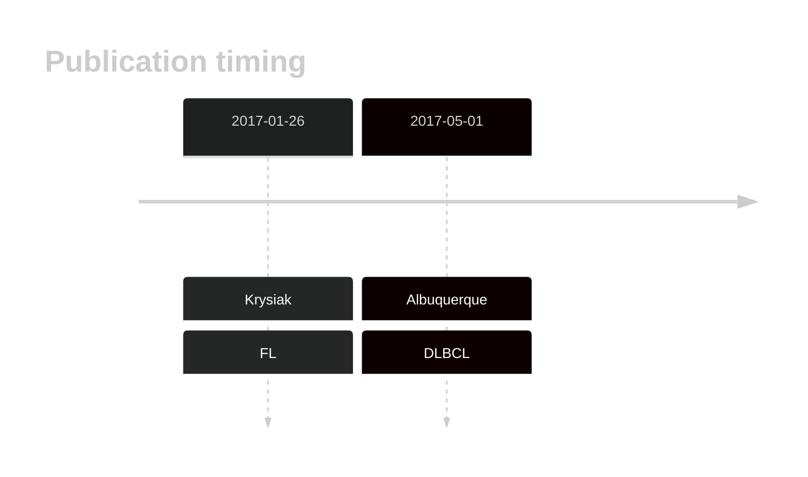
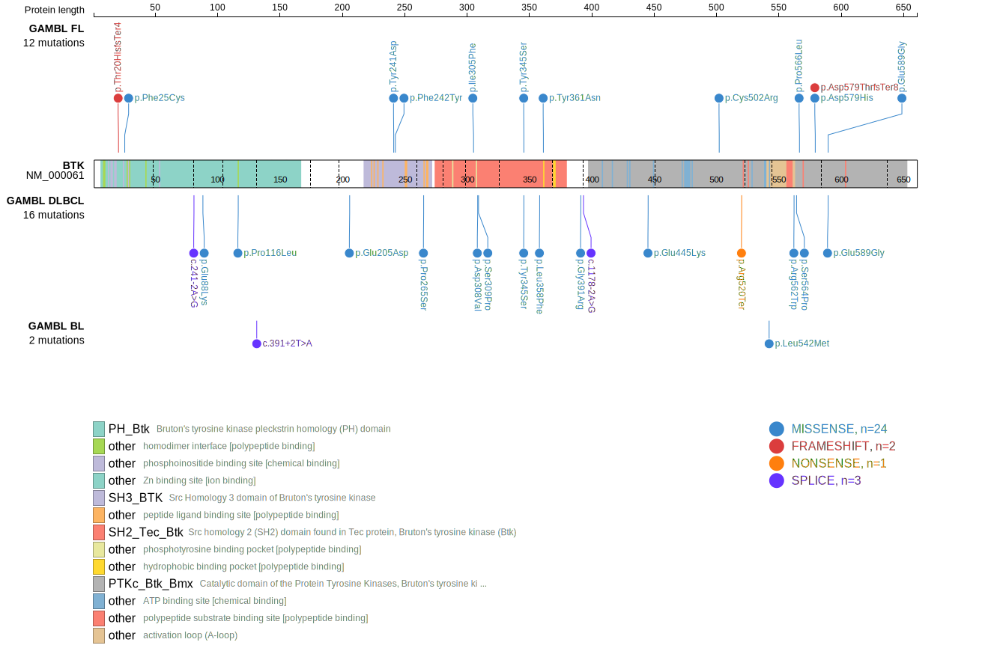

# BTK
One study reported BTK mutations in approximately 7% of FL and 11% of transformed FL cases.1 Another showed these mutations were more common, and typically co-occur in tumours with BCL2 translocations. Despite the known role of certain BTK mutations in acquired resistance to BTK inhibitors, these mutations were found in BTK inhibitor-naïve patients.2 These mutations often occur in treatment-naive patients and lead to inactivation of the BTK protein through destabilization or by altering key residues involved in enzymatic activity.1 The mutation pattern in DLBCL and FL implies the preferential accumulation of *inactivating mutations*. No notable hot spots have been described in this gene in the context of the cancers listed below. 

## History

## Relevance tier by entity

|Entity|Tier|Description               |
|:------:|:----:|--------------------------|
| |1   |high-confidence DLBCL gene[@albuquerqueEnhancingKnowledgeDiscovery2017a]|
|    |1   |high-confidence FL gene   [@krysiakRecurrentSomaticMutations2017b]|

## Mutation incidence in large patient cohorts (GAMBL reanalysis)

|Entity|source        |frequency (%)|
|:------:|:--------------:|:-------------:|
|DLBCL |GAMBL genomes |6.88         |
|DLBCL |Schmitz cohort|3.40         |
|DLBCL |Reddy cohort  |3.10         |
|DLBCL |Chapuy cohort |2.14         |
|FL    |GAMBL genomes |6.93         |

## Mutation pattern and selective pressure estimates

|Entity|aSHM|Significant selection|dN/dS (missense)|dN/dS (nonsense)|
|:------:|:----:|:---------------------:|:----------------:|:----------------:|
|BL    |No  |No                   | 0.964          | 8.202          |
|DLBCL |No  |Yes                  |18.082          |28.027          |
|FL    |No  |Yes                  |39.808          |35.548          |

View coding variants in ProteinPaint [hg19](https://morinlab.github.io/LLMPP/GAMBL/BTK_protein.html)  or [hg38](https://morinlab.github.io/LLMPP/GAMBL/BTK_protein_hg38.html)

View all variants in GenomePaint [hg19](https://morinlab.github.io/LLMPP/GAMBL/BTK.html)  or [hg38](https://morinlab.github.io/LLMPP/GAMBL/BTK_hg38.html)

## BTK Expression

<!-- ORIGIN: albuquerqueEnhancingKnowledgeDiscovery2017a -->
<!-- FL: krysiakRecurrentSomaticMutations2017b -->
<!-- DLBCL: albuquerqueEnhancingKnowledgeDiscovery2017a -->

## References
1.  Krysiak K, Gomez F, White BS, Matlock M, Miller CA, Trani L, Fronick CC, Fulton RS, Kreisel F, Cashen AF, Carson KR, Berrien-Elliott MM, Bartlett NL, Griffith M, Griffith OL, Fehniger TA. Recurrent somatic mutations affecting B-cell receptor signaling pathway genes in follicular lymphoma. Blood. 2017 Jan 26;129(4):473–483. PMCID: PMC5270390
2.  Albuquerque MA, Grande BM, Ritch EJ, Pararajalingam P, Jessa S, Krzywinski M, Grewal JK, Shah SP, Boutros PC, Morin RD. Enhancing knowledge discovery from cancer genomics data with Galaxy. Gigascience. 2017 May 1;6(5):1–13. PMCID: PMC5437943

3. *Hu N, Wang F, Sun T, Xu Z, Zhang J, Bernard D, Xu S, Wang S, Kaminski M, Devata S, Phillips T, Malek SN. Follicular Lymphoma-associated BTK Mutations are Inactivating Resulting in Augmented AKT Activation. Clin Cancer Res. 2021 Apr 15;27(8):2301-2313. doi: 10.1158/1078-0432.CCR-20-3741. Epub 2021 Jan 8. PMID: 33419778; PMCID: PMC8046715.*
4. *Schejbel L, Breinholt MF, Gang AO, Nielsen TH, Pedersen LM, Høgdall E, Nørgaard P. Inactivating BTK mutations in large B-cell lymphoma in a real-world cohort: Strong correlation with BCL2 translocation. EJHaem. 2022 Jun 24;3(3):936-939. doi: 10.1002/jha2.489. PMID: 36051027; PMCID: PMC9421985.*
