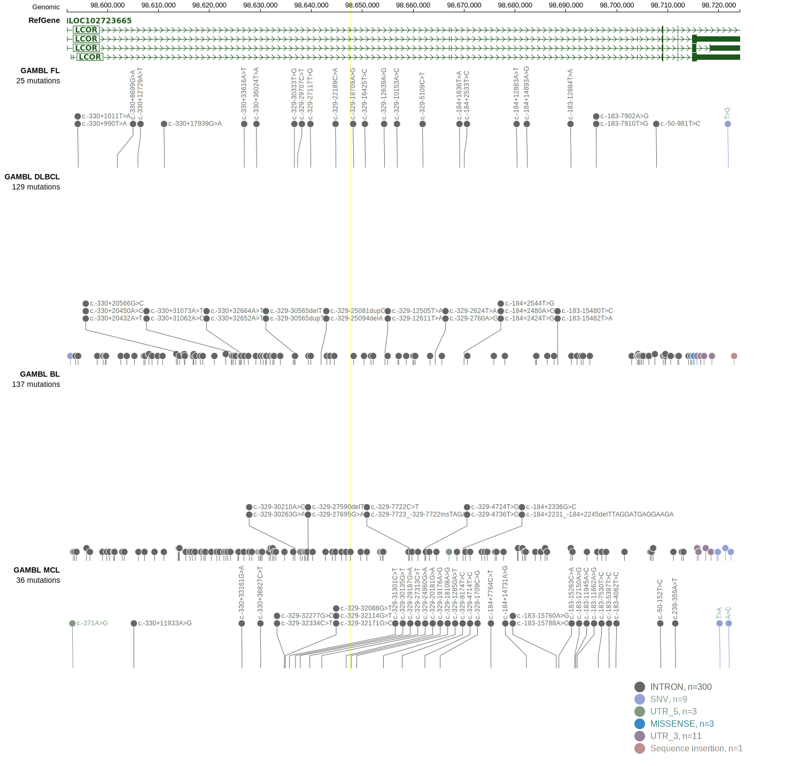

# [C10orf12]

## Mutation tier

|Entity|Tier|Description                           |
|:------:|:----:|--------------------------------------|
|BL    |2   |relevance in BL not firmly established|
## Mutation incidence

|Entity|source               |frequency (%)|
|:------:|:---------------------:|:-------------:|
|BL    |GAMBL genomes+capture|3.46         |
|BL    |Thomas cohort        |0.00         |
|BL    |Panea cohort         |  NA         |

## Mutation pattern

|Entity|aSHM|Significant selection|dN/dS (missense)|dN/dS (nonsense)|
|:------:|:----:|:---------------------:|:----------------:|:----------------:|
|BL    |No  |No                   |1.452           |27.236          |
|DLBCL |No  |Yes                  |1.140           |38.506          |
|FL    |No  |Yes                  |3.190           |81.421          |

View coding variants in ProteinPaint [hg19](https://www.bcgsc.ca/downloads/morinlab/GAMBL/test/genes/C10orf12_protein.html)  or [hg38](https://www.bcgsc.ca/downloads/morinlab/GAMBL/test/genes/C10orf12_protein_hg38.html)

View all variants in GenomePaint [hg19](https://www.bcgsc.ca/downloads/morinlab/GAMBL/test/genes/C10orf12.html)  or [hg38](https://www.bcgsc.ca/downloads/morinlab/GAMBL/test/genes/C10orf12_hg38.html)

