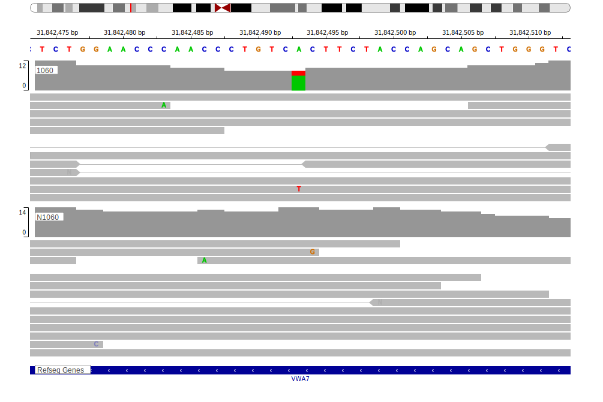

[[_TOC_]]

## Overview

Due to [minimal support](C6orf27#representative-mutation) in the original primary data and very few mutations reported in subsequent studies, this gene is very unlikely to be relevant in BL. 

## Relevance tier by entity

[[include:table1_C6orf27.md]]

## Warnings

<<Warn("The variants reported in this gene failed QC")>>

## Mutation incidence in large patient cohorts (GAMBL reanalysis)

[[include:tables/BL_C6orf27.md]]

[[include:browser_C6orf27.md]]

<!-- ORIGIN: loveGeneticLandscapeMutations2012 -->
<!-- BL: loveGeneticLandscapeMutations2012 -->

## Representative Mutations

**Rating** 
&starf; &star; &star; &star; &star;

**Although well supported in the data, this mutation is clearly germline**

## All Mutations

[1060](https://www.bcgsc.ca/downloads/morinlab/GAMBL/Love/1060_reports.html)
[1102](https://www.bcgsc.ca/downloads/morinlab/GAMBL/Love/1102_reports.html)
[322](https://www.bcgsc.ca/downloads/morinlab/GAMBL/Love/322_reports.html)

[[include:tables/mermaid_C6orf27.md]]

## References
