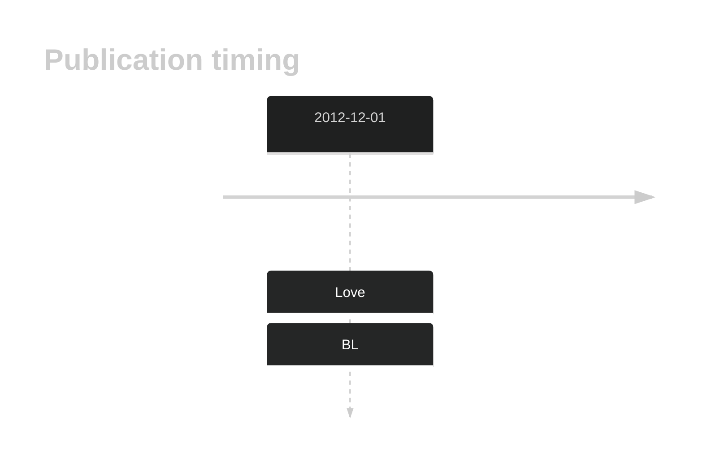
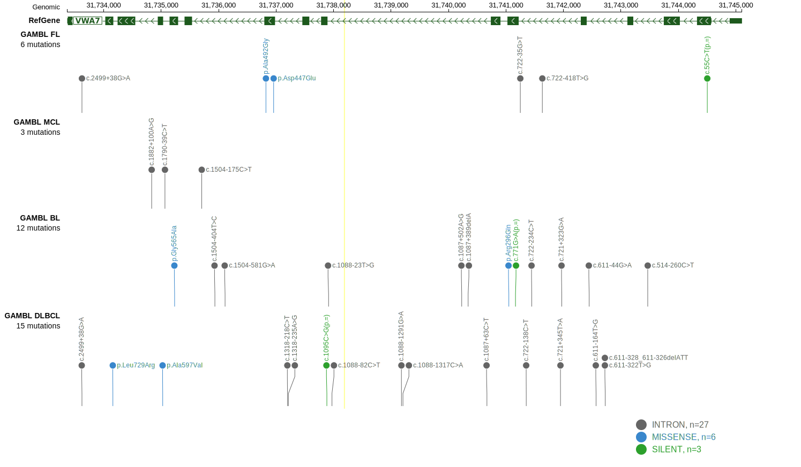

# C6orf27

## Overview

Due to [minimal support](C6orf27#representative-mutation) in the original primary data and very few mutations reported in subsequent studies, this gene is very unlikely to be relevant in BL. 

<<Warn("The variants reported in this gene failed QC")>>

## History

## Relevance tier by entity

|Entity|Tier|Description                           |
|:------:|:----:|--------------------------------------|
|    |2-F   |Failed QC[@loveGeneticLandscapeMutations2012]|

## Mutation incidence in large patient cohorts (GAMBL reanalysis)

|Entity|source               |frequency (%)|
|:------:|:---------------------:|:-------------:|
|BL    |GAMBL genomes+capture|NA           |
|BL    |Thomas cohort        |NA           |
|BL    |Panea cohort         |NA           |

## Mutation pattern and selective pressure estimates

|

View coding variants in ProteinPaint [hg19](https://morinlab.github.io/LLMPP/GAMBL/C6orf27_protein.html)  or [hg38](https://morinlab.github.io/LLMPP/GAMBL/C6orf27_protein_hg38.html)

View all variants in GenomePaint [hg19](https://morinlab.github.io/LLMPP/GAMBL/C6orf27.html)  or [hg38](https://morinlab.github.io/LLMPP/GAMBL/C6orf27_hg38.html)

<!-- ORIGIN: loveGeneticLandscapeMutations2012 -->
<!-- BL: loveGeneticLandscapeMutations2012 -->

## Representative Mutations

**Rating** 
&starf; &star; &star; &star; &star;

**Although well supported in the data, this mutation is clearly germline**

## All Mutations

[1060](https://www.bcgsc.ca/downloads/morinlab/GAMBL/Love/1060_reports.html)
[1102](https://www.bcgsc.ca/downloads/morinlab/GAMBL/Love/1102_reports.html)
[322](https://www.bcgsc.ca/downloads/morinlab/GAMBL/Love/322_reports.html)

## References
