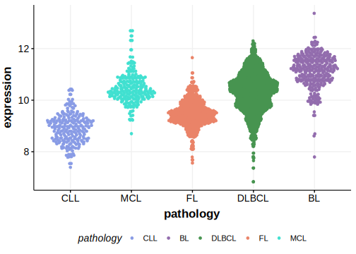

# CAD

## Relevance tier by entity

|Entity|Tier|Description                           |
|:------:|:----:|--------------------------------------|
|BL    |2   |relevance in BL not firmly established|

## Mutation incidence in large patient cohorts (GAMBL reanalysis)

|Entity|source               |frequency (%)|
|:------:|:---------------------:|:-------------:|
|BL    |GAMBL genomes+capture|3.93         |
|BL    |Thomas cohort        |  NA         |
|BL    |Panea cohort         |  NA         |

## Mutation pattern and selective pressure estimates

|Entity|aSHM|Significant selection|dN/dS (missense)|dN/dS (nonsense)|
|:------:|:----:|:---------------------:|:----------------:|:----------------:|
|BL    |No  |No                   |0.965           |0               |
|DLBCL |No  |No                   |1.949           |0               |
|FL    |No  |No                   |0.000           |0               |

> [!NOTE]
> First described in BL in 2012 by [Love C](https://pubmed.ncbi.nlm.nih.gov/23143597)

 ## CAD Hotspots

| Chromosome |Coordinate (hg19) | ref>alt | HGVSp | 
 | :---:| :---: | :--: | :---: |
| chr2 | 27455966 | T>A | Y983* |

View coding variants in ProteinPaint [hg19](https://morinlab.github.io/LLMPP/GAMBL/CAD_protein.html)  or [hg38](https://morinlab.github.io/LLMPP/GAMBL/CAD_protein_hg38.html)

View all variants in GenomePaint [hg19](https://morinlab.github.io/LLMPP/GAMBL/CAD.html)  or [hg38](https://morinlab.github.io/LLMPP/GAMBL/CAD_hg38.html)

## CAD Expression

<!-- ORIGIN: loveGeneticLandscapeMutations2012 -->
<!-- BL: loveGeneticLandscapeMutations2012 -->
