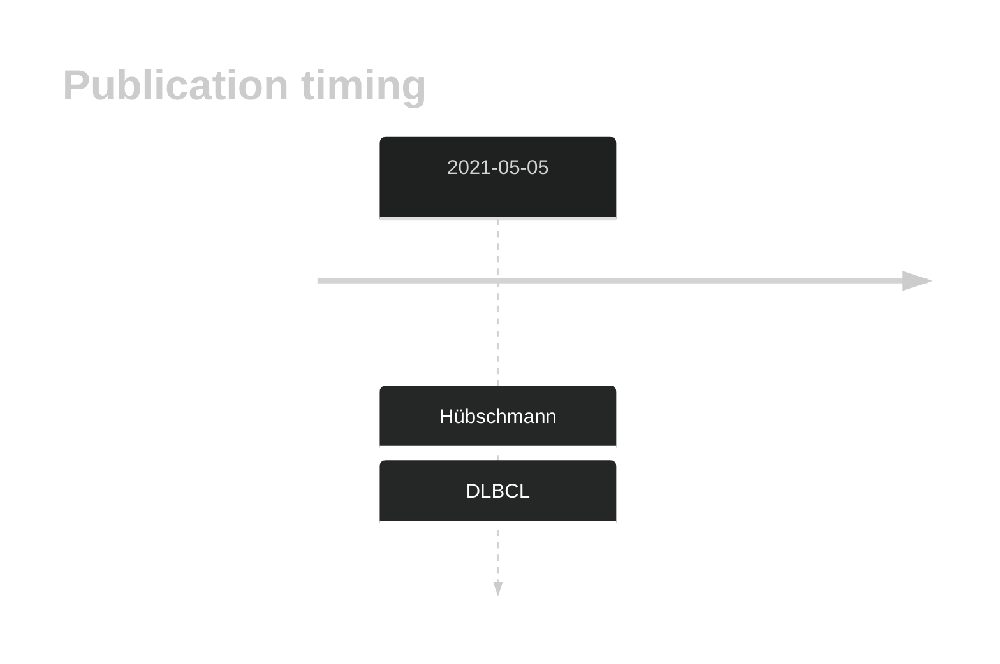
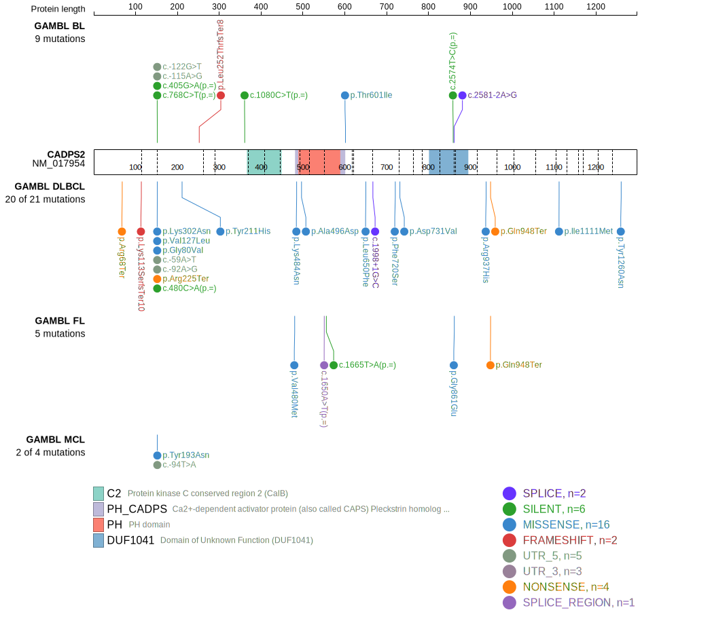
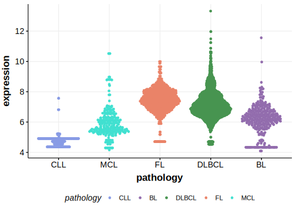

# CADPS2

## History
Mutations in this gene were first described in DLBCL in 2021 by Hübschmann et al.1

## Relevance tier by entity

|Entity|Tier|Description                              |
|:------:|:----:|-----------------------------------------|
| |2   |relevance in DLBCL not firmly established[@hubschmannMutationalMechanismsShaping2021b]|

## Mutation incidence in large patient cohorts (GAMBL reanalysis)

|Entity|source        |frequency (%)|
|:------:|:--------------:|:-------------:|
|DLBCL |GAMBL genomes |3.63         |
|DLBCL |Schmitz cohort|6.38         |
|DLBCL |Reddy cohort  |4.30         |
|DLBCL |Chapuy cohort |1.71         |

## Mutation pattern and selective pressure estimates

|Entity|aSHM|Significant selection|dN/dS (missense)|dN/dS (nonsense)|
|:------:|:----:|:---------------------:|:----------------:|:----------------:|
|BL    |No  |No                   |0.311           |2.676           |
|DLBCL |No  |No                   |1.217           |1.199           |
|FL    |No  |No                   |0.921           |0.000           |

View coding variants in ProteinPaint [hg19](https://morinlab.github.io/LLMPP/GAMBL/CADPS2_protein.html)  or [hg38](https://morinlab.github.io/LLMPP/GAMBL/CADPS2_protein_hg38.html)

View all variants in GenomePaint [hg19](https://morinlab.github.io/LLMPP/GAMBL/CADPS2.html)  or [hg38](https://morinlab.github.io/LLMPP/GAMBL/CADPS2_hg38.html)

## CADPS2 Expression

## All Mutations

[SP116697](https://www.bcgsc.ca/downloads/morinlab/GAMBL/MALY/SP116697.html)
[SP116690](https://www.bcgsc.ca/downloads/morinlab/GAMBL/MALY/SP116690.html)
[SP116668](https://www.bcgsc.ca/downloads/morinlab/GAMBL/MALY/SP116668.html)
[SP59460](https://www.bcgsc.ca/downloads/morinlab/GAMBL/MALY/SP59460.html)
[SP59372](https://www.bcgsc.ca/downloads/morinlab/GAMBL/MALY/SP59372.html)
[SP192997](https://www.bcgsc.ca/downloads/morinlab/GAMBL/MALY/SP192997.html)
[SP124971](https://www.bcgsc.ca/downloads/morinlab/GAMBL/MALY/SP124971.html)
[SP192970](https://www.bcgsc.ca/downloads/morinlab/GAMBL/MALY/SP192970.html)

## References

<!-- ORIGIN: hubschmannMutationalMechanismsShaping2021b -->

<!-- DLBCL: hubschmannMutationalMechanismsShaping2021b -->
