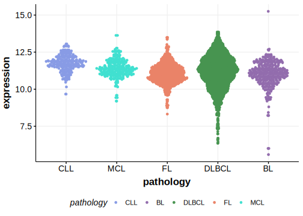

[[_TOC_]]

## Overview

Mutations in CARD11 were initially described as enriched in the ABC subgroup of DLBCL.[@lenzOncogenicCARD11Mutations2008]
More recent data contradicts this association and has implicated CARD11 in FL and additional B-cell lymphomas including FL and MCL.[@morinFrequentMutationHistonemodifying2011; @wuGeneticHeterogeneityPrimary2016]

## Experimental Evidence

The functional effect of CARD11 mutations in DLBCL was explored in the original study.[@lenzOncogenicCARD11Mutations2008]

## Relevance tier by entity

[[include:table1_CARD11.md]]

## Mutation incidence in large patient cohorts (GAMBL reanalysis)

[[include:DLBCL_CARD11.md]]
[[include:FL_CARD11.md]]

## Mutation pattern and selective pressure estimates

[[include:dnds_CARD11.md]]

## CARD11 Hotspots

| Chromosome |Coordinate (hg19) | ref>alt | HGVSp | 
 | :---:| :---: | :--: | :---: |
| chr7 | 2979522 | T>C | E242G |
| chr7 | 2979521 | T>A | E242D |
| chr7 | 2979513 | A>G | L245P |
| chr7 | 2979508 | T>C | R247G |
| chr7 | 2979501 | T>G | Q249P |
| chr7 | 2979499 | A>G | S250P |
| chr7 | 2979495 | A>G | L251P |
| chr7 | 2979493 | T>A | K252* |
| chr7 | 2979486 | T>C | K254R |
| chr7 | 2979481 | C>T | D256N |
| chr7 | 2977614 | T>C | D357G |
| chr7 | 2977614 | T>A | D357V |
| chr7 | 2977604 | C>A | M360I |
| chr7 | 2977602 | T>G | Y361S |
| chr7 | 2977602 | T>C | Y361C |

[[include:browser_CARD11.md]]

## Expression

<!-- ORIGIN: lenzOncogenicCARD11Mutations2008 -->
<!-- FL: morinFrequentMutationHistonemodifying2011 -->
<!-- MCL: wuGeneticHeterogeneityPrimary2016 -->
<!-- MZL: yanBCRTLRSignaling2012a -->
<!-- DLBCL: lenzOncogenicCARD11Mutations2008 -->

[[include:mermaid_CARD11.md]]

## References
