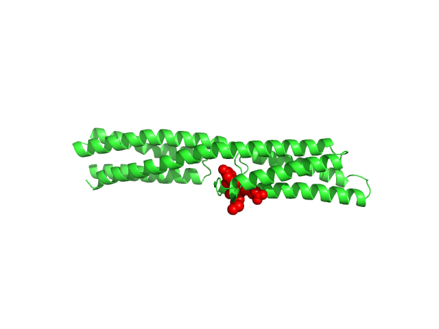
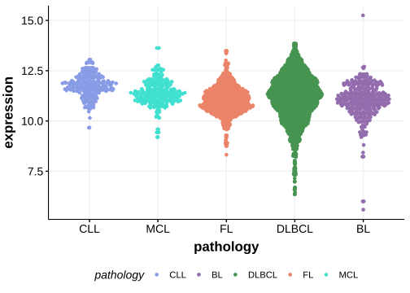

[[_TOC_]]

## Overview

Mutations in CARD11 were initially described as enriched in the ABC subgroup of DLBCL.[@lenzOncogenicCARD11Mutations2008]
More recent data contradicts this association and has implicated CARD11 in FL and additional B-cell lymphomas including FL and MCL.[@morinFrequentMutationHistonemodifying2011; @wuGeneticHeterogeneityPrimary2016]

## Experimental Evidence

The functional effect of CARD11 mutations in DLBCL was explored in the original study.[@lenzOncogenicCARD11Mutations2008]

## Relevance tier by entity

[[include:tables/table1_CARD11.md]]

## Mutation incidence in large patient cohorts (GAMBL reanalysis)

### DLBCL
[[include:tables/DLBCL_CARD11.md]]

### MCL
[[include:tables/MCL_CARD11.md]]

### FL
[[include:tables/FL_CARD11.md]]

## Mutation pattern and selective pressure estimates

[[include:tables/dnds_CARD11.md]]

[[include:tables/hotspots_CARD11.md]]

[[include:tables/browser_CARD11.md]]

## Expression

<!-- ORIGIN: lenzOncogenicCARD11Mutations2008 -->
<!-- FL: morinFrequentMutationHistonemodifying2011 -->
<!-- MCL: wuGeneticHeterogeneityPrimary2016 -->
<!-- MZL: yanBCRTLRSignaling2012a -->
<!-- DLBCL: lenzOncogenicCARD11Mutations2008 -->

[[include:tables/mermaid_CARD11.md]]

## References
