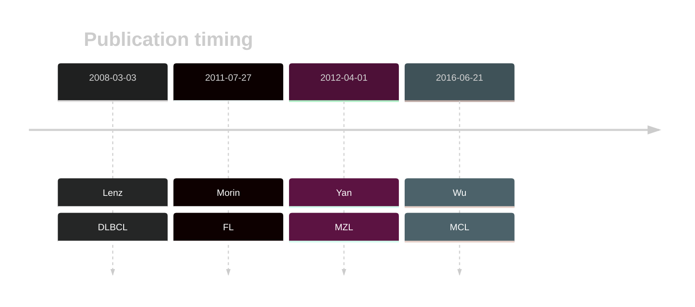

# CARD11

## History

## Relevance tier by entity

|Entity|Tier|Description                           |
|:------:|:----:|--------------------------------------|
||1|high-confidence MZL gene[@yanBCRTLRSignaling2012a]|
| |1   |high-confidence DLBCL gene            [@lenzOncogenicCARD11Mutations2008]|
|    |1   |high-confidence FL gene               [@morinFrequentMutationHistonemodifying2011]|
|   |1   |high-confidence MCL gene              [@wuGeneticHeterogeneityPrimary2016]|

## Mutation incidence in large patient cohorts (GAMBL reanalysis)

|Entity|source               |frequency (%)|
|:------:|:---------------------:|:-------------:|
|BL    |GAMBL genomes+capture| 4.16        |
|BL    |Thomas cohort        | 1.70        |
|BL    |Panea cohort         |10.90        |
|DLBCL |GAMBL genomes        |11.28        |
|DLBCL |Schmitz cohort       |15.32        |
|DLBCL |Reddy cohort         | 7.81        |
|DLBCL |Chapuy cohort        | 8.12        |
|FL    |GAMBL genomes        |14.78        |
|MCL   |GAMBL genomes        | 1.42        |

## Mutation pattern and selective pressure estimates

|Entity|aSHM|Significant selection|dN/dS (missense)|dN/dS (nonsense)|
|:------:|:----:|:---------------------:|:----------------:|:----------------:|
|BL    |No  |No                   | 5.307          | 0.000          |
|DLBCL |No  |Yes                  |16.898          | 0.000          |
|FL    |No  |Yes                  |28.329          |27.096          |

## CARD11 Hotspots

| Chromosome |Coordinate (hg19) | ref>alt | HGVSp | 
 | :---:| :---: | :--: | :---: |
| chr7 | 2979522 | T>C | E242G |
| chr7 | 2979521 | T>A | E242D |
| chr7 | 2979513 | A>G | L245P |
| chr7 | 2979508 | T>C | R247G |
| chr7 | 2979501 | T>G | Q249P |
| chr7 | 2979499 | A>G | S250P |
| chr7 | 2979495 | A>G | L251P |
| chr7 | 2979493 | T>A | K252* |
| chr7 | 2979486 | T>C | K254R |
| chr7 | 2979481 | C>T | D256N |
| chr7 | 2977614 | T>C | D357G |
| chr7 | 2977614 | T>A | D357V |
| chr7 | 2977604 | C>A | M360I |
| chr7 | 2977602 | T>G | Y361S |
| chr7 | 2977602 | T>C | Y361C |

View coding variants in ProteinPaint [hg19](https://morinlab.github.io/LLMPP/GAMBL/CARD11_protein.html)  or [hg38](https://morinlab.github.io/LLMPP/GAMBL/CARD11_protein_hg38.html)

View all variants in GenomePaint [hg19](https://morinlab.github.io/LLMPP/GAMBL/CARD11.html)  or [hg38](https://morinlab.github.io/LLMPP/GAMBL/CARD11_hg38.html)

## CARD11 Expression

<!-- ORIGIN: lenzOncogenicCARD11Mutations2008 -->
<!-- FL: morinFrequentMutationHistonemodifying2011 -->
<!-- MCL: wuGeneticHeterogeneityPrimary2016 -->
<!-- MZL: yanBCRTLRSignaling2012a -->
<!-- DLBCL: lenzOncogenicCARD11Mutations2008 -->

## References
