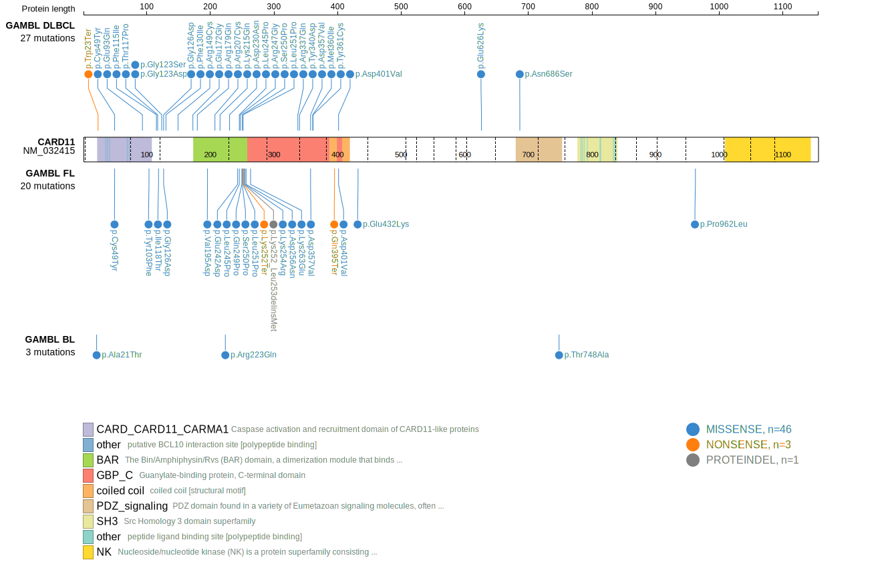

# CARD11
## History

## Relevance tier by entity

|Entity|Tier|Description                           |
|:------:|:----:|--------------------------------------|
||1|high-confidence MZL gene|
|    |2   |relevance in BL not firmly established|
| |1   |high-confidence DLBCL gene            |
|    |1   |high-confidence FL gene               |
|   |1   |high-confidence MCL gene              |

## Mutation incidence in large patient cohorts (GAMBL reanalysis)

|Entity|source               |frequency (%)|
|:------:|:---------------------:|:-------------:|
|BL    |GAMBL genomes+capture| 4.16        |
|BL    |Thomas cohort        | 1.70        |
|BL    |Panea cohort         |10.90        |
|DLBCL |GAMBL genomes        |11.28        |
|DLBCL |Schmitz cohort       |15.32        |
|DLBCL |Reddy cohort         | 7.81        |
|DLBCL |Chapuy cohort        | 8.12        |
|FL    |GAMBL genomes        |14.78        |
|MCL   |GAMBL genomes        | 1.42        |

## Mutation pattern and selective pressure estimates

|Entity|aSHM|Significant selection|dN/dS (missense)|dN/dS (nonsense)|
|:------:|:----:|:---------------------:|:----------------:|:----------------:|
|BL    |No  |No                   | 5.307          | 0.000          |
|DLBCL |No  |Yes                  |16.898          | 0.000          |
|FL    |No  |Yes                  |28.329          |27.096          |

 ## CARD11 Hotspots

| Chromosome |Coordinate (hg19) | ref>alt | HGVSp | 
 | :---:| :---: | :--: | :---: |
| chr7 | 2979522 | T>C | E242G |
| chr7 | 2979521 | T>A | E242D |
| chr7 | 2979513 | A>G | L245P |
| chr7 | 2979508 | T>C | R247G |
| chr7 | 2979501 | T>G | Q249P |
| chr7 | 2979499 | A>G | S250P |
| chr7 | 2979495 | A>G | L251P |
| chr7 | 2979493 | T>A | K252* |
| chr7 | 2979486 | T>C | K254R |
| chr7 | 2979481 | C>T | D256N |
| chr7 | 2977614 | T>C | D357G |
| chr7 | 2977614 | T>A | D357V |
| chr7 | 2977604 | C>A | M360I |
| chr7 | 2977602 | T>G | Y361S |
| chr7 | 2977602 | T>C | Y361C |

View coding variants in ProteinPaint [hg19](https://morinlab.github.io/LLMPP/GAMBL/CARD11_protein.html)  or [hg38](https://morinlab.github.io/LLMPP/GAMBL/CARD11_protein_hg38.html)

View all variants in GenomePaint [hg19](https://morinlab.github.io/LLMPP/GAMBL/CARD11.html)  or [hg38](https://morinlab.github.io/LLMPP/GAMBL/CARD11_hg38.html)

## CARD11 Expression

<!-- ORIGIN: lenzOncogenicCARD11Mutations2008 -->
<!-- FL: morinFrequentMutationHistonemodifying2011 -->
<!-- MCL: wuGeneticHeterogeneityPrimary2016 -->
<!-- MZL: yanBCRTLRSignaling2012a -->
<!-- DLBCL: lenzOncogenicCARD11Mutations2008 -->
## References
1.  Lenz G, Davis RE, Ngo VN, Lam L, George TC, Wright GW, Dave SS, Zhao H, Xu W, Rosenwald A, Ott G, Müller-Hermelink HK, Gascoyne RD, Connors JM, Rimsza LM, Campo E, Jaffe ES, Delabie J, Smeland EB, Fisher RI, Chan WC, Staudt LM. Oncogenic CARD11 mutations in human diffuse large B cell lymphoma. Science. 2008 Mar;319(5870):1676–1679. 
2.  Morin RD, Mendez-Lago M, Mungall AJ, Goya R, Mungall KL, Corbett RD, Johnson NA, Severson TM, Chiu R, Field M, Jackman S, Krzywinski M, Scott DW, Trinh DL, Tamura-Wells J, Li S, Firme MR, Rogic S, Griffith M, Chan S, Yakovenko O, Meyer IM, Zhao EY, Smailus D, Moksa M, Chittaranjan S, Rimsza L, Brooks-Wilson A, Spinelli JJ, Ben-Neriah S, Meissner B, Woolcock B, Boyle M, McDonald H, Tam A, Zhao Y, Delaney A, Zeng T, Tse K, Butterfield Y, Birol I, Holt R, Schein J, Horsman DE, Moore R, Jones SJM, Connors JM, Hirst M, Gascoyne RD, Marra MA. Frequent mutation of histone-modifying genes in non-Hodgkin lymphoma. Nature. 2011 Jul 27;476(7360):298–303. PMCID: PMC3210554
3.  Yan Q, Huang Y, Watkins AJ, Kocialkowski S, Zeng N, Hamoudi RA, Isaacson PG, de Leval L, Wotherspoon A, Du MQ. BCR and TLR signaling pathways are recurrently targeted by genetic changes in splenic marginal zone lymphomas. Haematologica. 2012 Apr;97(4):595–598. PMCID: PMC3347666
4.  Wu C, de Miranda NF, Chen L, Wasik AM, Mansouri L, Jurczak W, Galazka K, Dlugosz-Danecka M, Machaczka M, Zhang H, Peng R, Morin RD, Rosenquist R, Sander B, Pan-Hammarström Q. Genetic heterogeneity in primary and relapsed mantle cell lymphomas: Impact of recurrent CARD11 mutations. Oncotarget. 2016 Jun 21;7(25):38180–38190. PMCID: PMC5122381
5.  Panea R, Love C, Shingleton JR, Reddy A, Bailey J, Moormann A, Otieno J, Ong’echa J, Oduor C, Schroêder K, Masalu N, Chao N, Agajanian M, Major M, Fedoriw Y, Richards K, Rymkiewicz G, Miles R, Alobeid B, Bhagat G, Flowers C, Ondrejka S, Hsi E, Choi W, Au-Yeung R, Hartmann W, Lenz G, Meyerson H, Lin YY, Zhuang Y, Luftig M, Waldrop A, Dave T, Thakkar D, Sahay H, Li G, Palus B, Seshadri V, Kim S, Gascoyne R, Levy S, Mukhopadhyay M, Dunson D, Dave S. The whole genome landscape of Burkitt lymphoma subtypes. Blood. 2019; 
