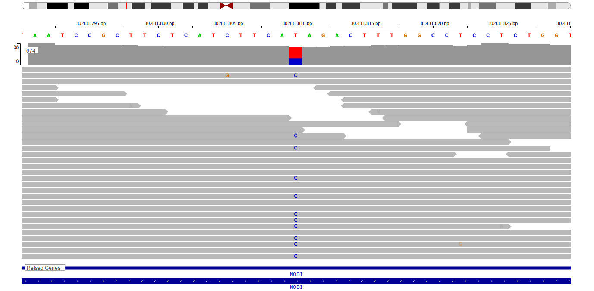

[[_TOC_]]

## Overview

*CARD4 is now known as NOD1.*

## Relevance tier by entity

[[include:table1_CARD4.md]]

## Mutation incidence in large patient cohorts (GAMBL reanalysis)

|Entity|source               |frequency (%)|
|:------:|:---------------------:|:-------------:|
|BL    |GAMBL genomes+capture|NA           |
|BL    |Thomas cohort        |NA           |
|BL    |Panea cohort         |NA           |

[[include:browser_CARD4.md]]

<!-- ORIGIN: loveGeneticLandscapeMutations2012 -->
<!-- BL: loveGeneticLandscapeMutations2012 -->

## Representative Mutations

**Rating**
&starf; &starf; &starf; &starf; &star;

## All Mutations

[1092](https://www.bcgsc.ca/downloads/morinlab/GAMBL/Love/1092_reports.html)
[674](https://www.bcgsc.ca/downloads/morinlab/GAMBL/Love/674_reports.html)
[747](https://www.bcgsc.ca/downloads/morinlab/GAMBL/Love/747_reports.html)

[[include:tables/mermaid_CARD4.md]]

## References
