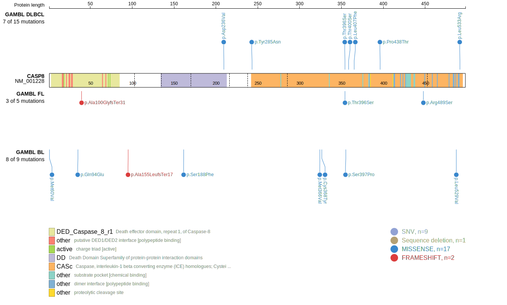
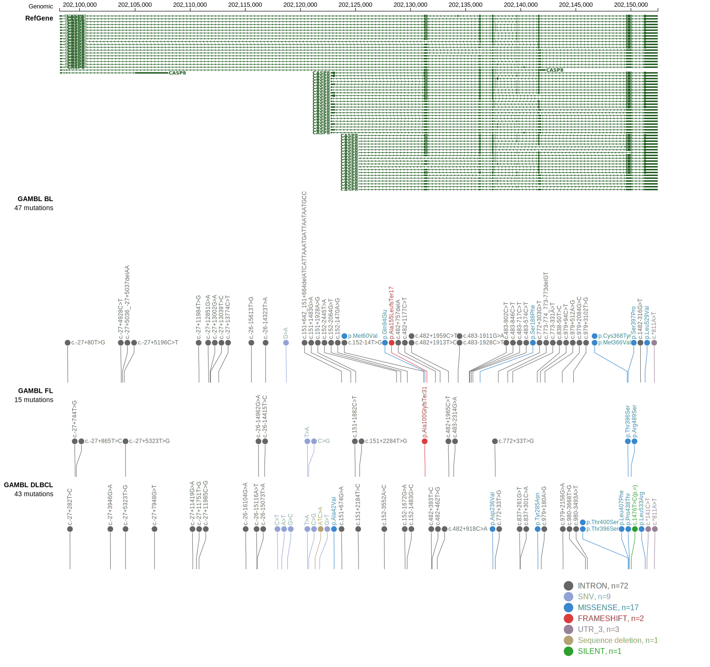
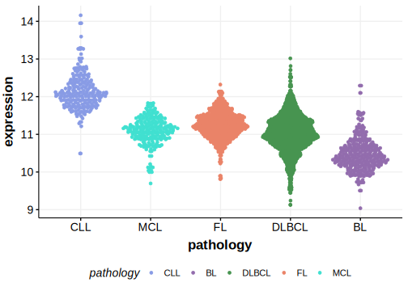

# CASP8

## Overview

Caspase-8 mutations are relatively rare but have been documented in various non-Hodgkin lymphomas (NHLs). One study found no CASP8 mutations in gastrointestinal lymphomas, suggesting that these mutations may not be prevalent in all lymphoma types.1 Due to the rarity of these mutations, their role remains poorly understood. Loss of caspase-8 may promote lymphomagenesis by impairing cytokinesis and increasing chromosomal aberrations.2 

## Relevance tier by entity

|Entity|Tier|Description               |
|:------:|:----:|--------------------------|
|DLBCL |1   |high-confidence DLBCL gene|

## Mutation incidence in large patient cohorts (GAMBL reanalysis)

|Entity|source        |frequency (%)|
|:------:|:--------------:|:-------------:|
|DLBCL |GAMBL genomes |2.68         |
|DLBCL |Schmitz cohort|1.06         |
|DLBCL |Reddy cohort  |1.20         |
|DLBCL |Chapuy cohort |1.28         |

## Mutation pattern and selective pressure estimates

|Entity|aSHM|Significant selection|dN/dS (missense)|dN/dS (nonsense)|
|:------:|:----:|:---------------------:|:----------------:|:----------------:|
|BL    |No  |No                   |12.972          |0               |
|DLBCL |No  |No                   | 6.371          |0               |
|FL    |No  |No                   | 8.788          |0               |

> [!NOTE]
> First described in DLBCL in 2017 by [Reddy A](https://pubmed.ncbi.nlm.nih.gov/28985567)

View coding variants in ProteinPaint [hg19](https://morinlab.github.io/LLMPP/GAMBL/CASP8_protein.html)  or [hg38](https://morinlab.github.io/LLMPP/GAMBL/CASP8_protein_hg38.html)

View all variants in GenomePaint [hg19](https://morinlab.github.io/LLMPP/GAMBL/CASP8.html)  or [hg38](https://morinlab.github.io/LLMPP/GAMBL/CASP8_hg38.html)

## References

1. *Yoo NJ, Soung YH, Lee SH, Kim KM, Lee SH. Absence of CASP7 and CASP8 mutation in gastrointestinal lymphomas. Eur J Haematol. 2007 Jul;79(1):86-7. doi: 10.1111/j.1600-0609.2007.00865.x. Epub 2007 May 28. PMID: 17532763.*
2. *Hakem A, El Ghamrasni S, Maire G, Lemmers B, Karaskova J, Jurisicova A, Sanchez O, Squire J, Hakem R. Caspase-8 is essential for maintaining chromosomal stability and suppressing B-cell lymphomagenesis. Blood. 2012 Apr 12;119(15):3495-502. doi: 10.1182/blood-2011-07-367532. Epub 2012 Feb 16. PMID: 22343728.*
## CASP8 Expression

<!-- ORIGIN: reddyGeneticFunctionalDrivers2017 -->
